# AAST Room Booking System - Layer Decomposition Architecture Diagram

## Desktop App Architecture with Design Patterns

```mermaid
graph TB
    subgraph Presentation["🎨 Presentation Layer (UI/Views)"]
        direction TB
        
        subgraph Phase3["Phase 3: Dashboards & Navigation"]
            DashboardFactory["🏭 DashboardFactory<br/>(Factory Pattern)"]
            BaseDashboard["📋 BaseDashboardController<br/>(Template Method)"]
            AdminDash["Admin Dashboard"]
            EmployeeDash["Employee Dashboard"]
            ManagerDash["Manager Dashboard"]
            
            DashboardFactory -->|creates| BaseDashboard
            BaseDashboard -->|implements| AdminDash
            BaseDashboard -->|implements| EmployeeDash
            BaseDashboard -->|implements| ManagerDash
        end
        
        subgraph Phase8["Phase 8: Statistics & UI Control"]
            UIMediator["⚖️ UIMediator<br/>(Mediator Pattern)"]
            DatePicker["📅 DatePicker"]
            TableView["📊 TableView"]
            ChartView["📈 Chart"]
            IconCache["🎨 IconCache<br/>(Flyweight Pattern)"]
            
            DatePicker -->|notifies| UIMediator
            TableView -->|notifies| UIMediator
            ChartView -->|notifies| UIMediator
            UIMediator -->|coordinates| DatePicker
            UIMediator -->|coordinates| TableView
            UIMediator -->|coordinates| ChartView
            UIMediator -->|uses| IconCache
        end
        
        subgraph Phase9["Phase 9: Settings & Preferences"]
            SettingsForm["⚙️ Settings Form"]
            ThemeManager["🎨 Theme Manager<br/>(Bridge Pattern)"]
            MementoCaretaker["📸 Memento Caretaker<br/>(Memento Pattern)"]
            
            SettingsForm -->|restores/saves| MementoCaretaker
            ThemeManager -->|manages| SettingsForm
        end
        
        AdminDash -.->|uses| UIMediator
        EmployeeDash -.->|uses| UIMediator
        ManagerDash -.->|uses| UIMediator
    end
    
    subgraph Security["🔐 Authentication & Security Layer"]
        direction TB
        
        subgraph Phase2["Phase 2: Login & Authentication"]
            LoginScreen["🔑 Login Screen"]
            AuthProxy["🚪 AuthProxy<br/>(Proxy Pattern)"]
            StateManager["🔄 StateManager<br/>(State Pattern)"]
            
            LoginScreen -->|verifies| AuthProxy
            AuthProxy -->|manages| StateManager
        end
        
        AuthProxy -->|controls access| Presentation
    end
    
    subgraph BusinessLogic["💼 Business Logic Layer"]
        direction TB
        
        subgraph Phase1["Phase 1: Core Architecture"]
            Singleton["🔒 Singleton<br/>(Session Manager)"]
            DBConnection["🗄️ DB Connection<br/>(Singleton)"]
            ConfigManager["⚙️ Config Manager<br/>(Singleton)"]
            Facade["🎭 BookingSystemFacade<br/>(Facade Pattern)"]
            
            Singleton -->|manages| Session["Current Session"]
            DBConnection -->|manages| DB["Database Connection"]
            ConfigManager -->|manages| Config["App Configuration"]
            Facade -->|coordinates| Singleton
            Facade -->|coordinates| DBConnection
        end
        
        subgraph Phase4["Phase 4: Room Management & Booking"]
            BookingBuilder["🏗️ BookingBuilder<br/>(Builder Pattern)"]
            PrototypeBooking["📋 PrototypeBooking<br/>(Prototype Pattern)"]
            RoomDecorator["🎁 Room Decorators<br/>(Decorator Pattern)"]
            
            BookingBuilder -->|builds| Booking["Booking Object"]
            PrototypeBooking -->|clones| Booking
            RoomDecorator -->|enhances| Room["Room Object"]
            RoomDecorator -->|dynamic cost| CostCalculator["Cost Calculation"]
        end
        
        subgraph Phase5["Phase 5: Advanced Search"]
            SearchStrategy["🔎 Search Strategies<br/>(Strategy Pattern)"]
            RoomIterator["🔄 Room Iterator<br/>(Iterator Pattern)"]
            
            SearchStrategy -->|filters| RoomCollection["Room Collection"]
            RoomIterator -->|iterates| RoomCollection
            RoomIterator -->|pagination| PaginationEngine["Pagination Engine"]
        end
        
        subgraph Phase6["Phase 6: Admin Requests & Logs"]
            ChainHandler["⛓️ Approval Chain<br/>(Chain of Responsibility)"]
            SecretaryHandler["📝 Secretary Handler"]
            ManagerHandler["👔 Manager Handler"]
            AdminHandler["👑 Admin Handler"]
            CommandExecutor["💾 Command Executor<br/>(Command Pattern)"]
            AuditLog["📋 Audit Log"]
            
            ChainHandler -->|processes| SecretaryHandler
            SecretaryHandler -->|passes to| ManagerHandler
            ManagerHandler -->|passes to| AdminHandler
            CommandExecutor -->|logs all actions| AuditLog
            ChainHandler -.->|uses| CommandExecutor
        end
        
        subgraph Phase7["Phase 7: Notifications"]
            NotificationSubject["📢 Notification Subject<br/>(Observer Pattern)"]
            BookingObserver["👁️ Booking Observer"]
            UIObserver["👁️ UI Observer"]
            EmailObserver["👁️ Email Observer"]
            
            NotificationSubject -->|notifies| BookingObserver
            NotificationSubject -->|notifies| UIObserver
            NotificationSubject -->|notifies| EmailObserver
        end
        
        Facade -->|uses| BookingBuilder
        Facade -->|uses| SearchStrategy
        Facade -->|uses| ChainHandler
        Facade -->|uses| NotificationSubject
    end
    
    subgraph Integration["🔗 Integration & Hierarchy Layer"]
        direction TB
        
        subgraph Phase10["Phase 10: Integration & Hierarchy"]
            OrgAdapter["🔌 Organization Adapter<br/>(Adapter Pattern)"]
            CompositeOrg["🌳 Composite Organization<br/>(Composite Pattern)"]
            
            OrgAdapter -->|adapts| LegacySystems["Legacy Systems<br/>(Student DB, HR DB)"]
            CompositeOrg -->|builds tree| College["College"]
            CompositeOrg -->|builds tree| Department["Department"]
            CompositeOrg -->|builds tree| Employee["Employee"]
            
            College -->|contains| Department
            Department -->|contains| Employee
        end
    end
    
    subgraph DataAccess["🗄️ Data Access Layer"]
        direction TB
        DatabaseLayer["💾 Database Layer"]
        RepositoryPattern["📦 Repository Pattern"]
        CacheLayer["⚡ Cache Layer"]
        
        RepositoryPattern -->|reads/writes| DatabaseLayer
        CacheLayer -->|optimizes| RepositoryPattern
    end
    
    subgraph Infrastructure["🛠️ Infrastructure & Support Layer"]
        direction TB
        Logger["📝 Logger"]
        ErrorHandler["❌ Error Handler"]
        EventBus["📡 Event Bus"]
        
        Logger -.->|logs| AuditLog
        ErrorHandler -.->|catches| BusinessLogic
        EventBus -.->|broadcasts| NotificationSubject
    end
    
    %% Cross-layer relationships
    Presentation -->|calls| Security
    Security -->|grants access| BusinessLogic
    BusinessLogic -->|uses| DataAccess
    BusinessLogic -->|uses| Infrastructure
    DataAccess -->|uses| Infrastructure
    Integration -->|extends| BusinessLogic
    
    style Presentation fill:#e1f5ff
    style Security fill:#fff3e0
    style BusinessLogic fill:#f3e5f5
    style DataAccess fill:#e8f5e9
    style Infrastructure fill:#fce4ec
    style Integration fill:#f1f8e9
    
    style Phase1 fill:#c8e6c9
    style Phase2 fill:#ffe0b2
    style Phase3 fill:#bbdefb
    style Phase4 fill:#e1bee7
    style Phase5 fill:#f8bbd0
    style Phase6 fill:#b2dfdb
    style Phase7 fill:#fff9c4
    style Phase8 fill:#ffccbc
    style Phase9 fill:#d1c4e9
    style Phase10 fill:#c5e1a5
```

---

## Architecture Overview

### **Layer 1: Presentation Layer (UI/Views)**
- **Phase 3**: Dashboards routing using Factory & Template Method patterns
- **Phase 8**: Complex UI interactions using Mediator & Flyweight patterns
- **Phase 9**: Settings management using Bridge & Memento patterns

### **Layer 2: Authentication & Security**
- **Phase 2**: Login & Authentication using Proxy & State patterns
- Controls access to sensitive resources and manages user state

### **Layer 3: Business Logic Layer**
- **Phase 1**: Core architecture with Singleton, Facade patterns
- **Phase 4**: Room booking using Builder, Prototype, Decorator patterns
- **Phase 5**: Advanced search using Strategy, Iterator patterns
- **Phase 6**: Admin workflows using Chain of Responsibility & Command patterns
- **Phase 7**: Notifications using Observer pattern

### **Layer 4: Data Access Layer**
- Handles all database operations
- Repository pattern for data persistence
- Cache layer for performance optimization

### **Layer 5: Integration & Hierarchy**
- **Phase 10**: System integration using Adapter & Composite patterns
- Connects with legacy systems and organizational hierarchies

### **Layer 6: Infrastructure & Support**
- Logging, error handling, and event bus
- Supports all other layers with cross-cutting concerns

---

## Design Patterns Summary

| Phase | Layer | Patterns | Purpose |
|-------|-------|----------|---------|
| 1 | Core | Singleton, Facade | Foundation & unified interface |
| 2 | Security | Proxy, State | Authentication & user state |
| 3 | Presentation | Factory, Template Method | Dashboard creation & consistency |
| 4 | Business Logic | Builder, Prototype, Decorator | Complex booking object creation |
| 5 | Business Logic | Strategy, Iterator | Flexible search & pagination |
| 6 | Business Logic | Chain of Responsibility, Command | Approval workflows & audit logs |
| 7 | Business Logic | Observer | Event-driven notifications |
| 8 | Presentation | Mediator, Flyweight | UI coordination & memory efficiency |
| 9 | Presentation | Memento, Bridge | Settings persistence & abstraction |
| 10 | Integration | Adapter, Composite | Legacy system integration & hierarchies |

---

## Key Interactions

1. **User Login**: LoginScreen → AuthProxy → StateManager → Presentation Layer
2. **Create Booking**: BookingBuilder → Facade → ChainHandler → AuditLog
3. **Search Rooms**: SearchStrategy → Iterator → PaginationEngine → UI
4. **Update State**: NotificationSubject → Observers → UI Update
5. **Manage Settings**: SettingsForm → Memento → MementoCaretaker (save/restore)
6. **Complex UI**: UIMediator → Coordinates (DatePicker, TableView, Chart)

