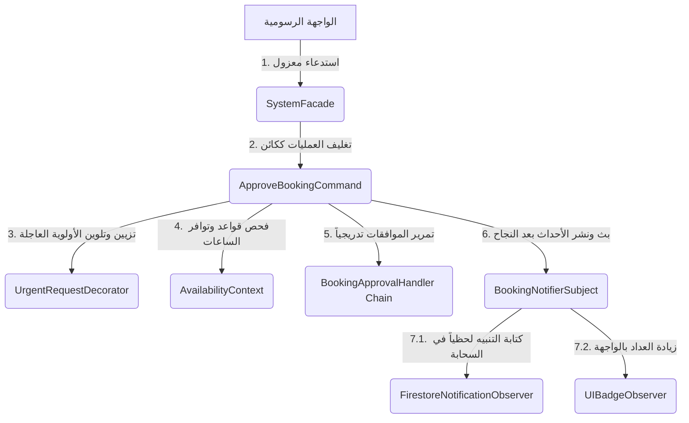

# 📖 الدليل الشامل لأنماط التصميم المعمارية في نظام SRD

مرحباً بك في الدليل الرسمي والتحليلي التفصيلي لكامل أنماط التصميم (Design Patterns) الـ **12** المستخدمة في النظام البرمجي لـ **SRD** (منصة حجز القاعات وإدارتها). تم تصميم هذا الدليل ليوضح بشكل منظم وواضح تماماً للعين الهيكل المعماري البرمجي المطبق في تطبيق جافا إف إكس (SRD-DESKTOP)، مع المسارات الكاملة للملفات، أسماء الفئات، الدوال البرمجية، وأرقام الأسطر الدقيقة.

---

## 📊 نظرة عامة ملخصة لأنماط التصميم (Summary Table)

| م | نمط التصميم (Design Pattern) | التصنيف (Category) | الدور الوظيفي الأساسي في النظام |
| :--- | :--- | :--- | :--- |
| **1** | [Prototype Pattern](#1-prototype-pattern) | **Creational** | نسخ الحجوزات المرفوضة وإعادة ملء استمارة التقديم بها بسرعة. |
| **2** | [Builder Pattern](#2-builder-pattern) | **Creational** | بناء كائن الحجز المعقد (المليء بالتفاصيل والخيارات) خطوة بخطوة. |
| **3** | [Singleton Pattern](#3-singleton-pattern) | **Creational** | إدارة اتصالات Firebase والجلسات والواجهات بنسخة مركزية موحدة. |
| **4** | [Factory Method Pattern](#4-factory-method-pattern) | **Creational** | توجيه المستخدم لشاشته وتطبيق ملف التنسيق (CSS) المناسب لرتبته. |
| **5** | [Proxy Pattern](#5-proxy-pattern-protection-proxy) | **Structural** | تأمين النظام وبوابات الواجهات والتحقق من الصلاحيات قبل تحميل الشاشات. |
| **6** | [Facade Pattern](#6-facade-pattern) | **Structural** | دمج وتوفير واجهة موحدة لجميع العمليات والخدمات السحابية المعقدة. |
| **7** | [Decorator Pattern](#7-decorator-pattern) | **Structural** | تزيين الحجوزات بإمكانيات وسمات إضافية (كالحجز العاجل Urgent) ديناميكياً. |
| **8** | [Composite Pattern](#8-composite-pattern) | **Structural** | هيكلة الصلاحيات الأمنية بشكل شجرة تدعم المجموعات والعناصر الفردية. |
| **9** | [Chain of Responsibility](#9-chain-of-responsibility-pattern) | **Behavioral** | تمرير طلب الموافقة للحجز المشترك أوتوماتيكياً، وسلسلة فحص الصلاحيات. |
| **10** | [Command Pattern](#10-command-pattern) | **Behavioral** | تحويل إجراءات القبول والرفض وتعديل الغرف لأوامر منفصلة قابلة للتراجع. |
| **11** | [Observer Pattern](#11-observer-pattern) | **Behavioral** | التزامن اللحظي للواجهات وقاعدة البيانات وتحديث عدادات الإشعارات. |
| **12** | [Strategy Pattern](#12-strategy-pattern) | **Behavioral** | تغيير قواعد وساعات الحجز والتحقق ديناميكياً (رمضان ضد الوضع العادي). |

---

## 📂 التفصيل الهيكلي والبرمجي لكامل الأنماط (Deep Dive)

### 1. Prototype Pattern
> [!NOTE]
> **الغرض منه**: يسهل على الموظفين تقديم طلب بديل بسرعة في حال تم رفض طلبهم السابق، حيث يقوم باستنساخ عميق لكامل حقول الحجز القديم، مع ترك الحقول المعرفة للـ ID والحالة وتحديث التواريخ لتجنب ملء الحقول مجدداً.

* **الملفات والمسارات**:
  * واجهة النموذج الأولي: [IBookingPrototype.java](file:///d:/term%206/SRD/SRD-DESKTOP/src/main/java/com/aast/booking/patterns/prototype/IBookingPrototype.java)
  * الكلاس الملموس المطبق للاستنساخ: [Booking.java](file:///d:/term%206/SRD/SRD-DESKTOP/src/main/java/com/aast/booking/models/Booking.java)
* **الدوال والأسطر المفتاحية**:
  * دالة الاستنساخ العميق للتعديل: [Booking.java#L90](file:///d:/term%206/SRD/SRD-DESKTOP/src/main/java/com/aast/booking/models/Booking.java#L90) - الدالة `cloneForResubmit()`
  * دالة استنساخ جافا الافتراضية: [Booking.java#L152](file:///d:/term%206/SRD/SRD-DESKTOP/src/main/java/com/aast/booking/models/Booking.java#L152) - الدالة `clone()`
  * تعبئة كائن بناء الحجز من الاستنساخ: [BookingBuilder.java#L213](file:///d:/term%206/SRD/SRD-DESKTOP/src/main/java/com/aast/booking/patterns/builder/BookingBuilder.java#L213) - الدالة `fromPrototype()`
* **أماكن الاستخدام والاستدعاء**:
  * في لوحة تحكم الموظف: [BookingListController.java#L222](file:///d:/term%206/SRD/SRD-DESKTOP/src/main/java/com/aast/booking/employee/BookingListController.java#L222) - استدعاء عملية النسخ وإعادة الإرسال.
  * في لوحة تحكم السكرتارية: [SecretaryDashboardController.java#L353](file:///d:/term%206/SRD/SRD-DESKTOP/src/main/java/com/aast/booking/secretary/SecretaryDashboardController.java#L353) - استنساخ آخر حجز بنجاح.

---

### 2. Builder Pattern
> [!NOTE]
> **الغرض منه**: كائن الحجز يحتوي على أكثر من 20 حقلاً (حقول الخطوة 1: البيانات الأساسية، الخطوة 2: المسؤول عن الحجز، الخطوة 3: التجهيزات التقنية المطلوبة). يسهل هذا النمط بناء الكائن خطوة بخطوة بشكل مرن ومقروء بدلاً من استخدام Constructor واحد ضخم ومليء بالمتغيرات.

* **الملفات والمسارات**:
  * واجهة البناء: [IBookingBuilder.java](file:///d:/term%206/SRD/SRD-DESKTOP/src/main/java/com/aast/booking/patterns/builder/IBookingBuilder.java)
  * الكلاس المنفذ للبناء: [BookingBuilder.java](file:///d:/term%206/SRD/SRD-DESKTOP/src/main/java/com/aast/booking/patterns/builder/BookingBuilder.java)
  * كلاس المدير المنسق: [BookingDirector.java](file:///d:/term%206/SRD/SRD-DESKTOP/src/main/java/com/aast/booking/patterns/builder/BookingDirector.java)
* **الدوال والأسطر المفتاحية**:
  * دوال الربط المتسلسل (Fluent API): [BookingBuilder.java#L41-L179](file:///d:/term%206/SRD/SRD-DESKTOP/src/main/java/com/aast/booking/patterns/builder/BookingBuilder.java#L41-L179)
  * دالة تعيين القيم الافتراضية للمحاضرات: [BookingBuilder.java#L187](file:///d:/term%206/SRD/SRD-DESKTOP/src/main/java/com/aast/booking/patterns/builder/BookingBuilder.java#L187) - الدالة `applyLectureDefaults()`
  * دالة تجميع واستخراج كائن الحجز النهائي: [BookingBuilder.java#L243](file:///d:/term%206/SRD/SRD-DESKTOP/src/main/java/com/aast/booking/patterns/builder/BookingBuilder.java#L243) - الدالة `build()`
  * توجيه المدير لبناء حجز السكرتارية المشترك: [BookingDirector.java#L8](file:///d:/term%206/SRD/SRD-DESKTOP/src/main/java/com/aast/booking/patterns/builder/BookingDirector.java#L8) - الدالة `buildSecretaryMultiPurposeBooking()`
  * توجيه المدير لبناء حجز الموظف المشترك: [BookingDirector.java#L26](file:///d:/term%206/SRD/SRD-DESKTOP/src/main/java/com/aast/booking/patterns/builder/BookingDirector.java#L26) - الدالة `buildEmployeeMultiPurposeRequest()`

---

### 3. Singleton Pattern
> [!IMPORTANT]
> **الغرض منه**: منع تكرار إنشاء كائنات مكلفة من حيث استهلاك الذاكرة أو التوصيل، وذلك بضمان مثيل وحيد وآمن (Thread-Safe Double-Checked Locking) يتشارك فيه كامل خيوط عمل التطبيق للاتصال بالسحابة أو الواجهة الرسومية أو جلسة المستخدم.

* **الملفات والمسارات**:
  * مدير الاتصال بقاعدة البيانات: [FirebaseService.java](file:///d:/term%206/SRD/SRD-DESKTOP/src/main/java/com/aast/booking/core/FirebaseService.java)
  * مدير جلسة المستخدم النشط: [SessionManager.java](file:///d:/term%206/SRD/SRD-DESKTOP/src/main/java/com/aast/booking/core/SessionManager.java)
  * الواجهة الموحدة للتطبيق: [SystemFacade.java](file:///d:/term%206/SRD/SRD-DESKTOP/src/main/java/com/aast/booking/patterns/facade/SystemFacade.java)
  * ناقل الأحداث المركزي للتنبيهات: [BookingNotifierSubject.java](file:///d:/term%206/SRD/SRD-DESKTOP/src/main/java/com/aast/booking/core/observer/BookingNotifierSubject.java)
* **الدوال والأسطر المفتاحية**:
  * جلب مثيل الفايربيس: [FirebaseService.java#L44](file:///d:/term%206/SRD/SRD-DESKTOP/src/main/java/com/aast/booking/core/FirebaseService.java#L44) - الدالة `getInstance()`
  * جلب مثيل الجلسة: [SessionManager.java#L25](file:///d:/term%206/SRD/SRD-DESKTOP/src/main/java/com/aast/booking/core/SessionManager.java#L25) - الدالة `getInstance()`
  * جلب مثيل واجهة النظام: [SystemFacade.java#L80](file:///d:/term%206/SRD/SRD-DESKTOP/src/main/java/com/aast/booking/patterns/facade/SystemFacade.java#L80) - الدالة `getInstance()`
  * جلب مثيل البث للأحداث: [BookingNotifierSubject.java#L34](file:///d:/term%206/SRD/SRD-DESKTOP/src/main/java/com/aast/booking/core/observer/BookingNotifierSubject.java#L34) - الدالة `getInstance()`

---

### 4. Factory Method Pattern
> [!NOTE]
> **الغرض منه**: بعد التحقق من صحة تسجيل دخول المستخدم، يقوم المصنع بتحليل الدور الوظيفي (Role) وإنشاء لوحة التحكم (FXML View) المقابلة له ديناميكياً مع شحن الملف التعريفي وملفات التنسيق (CSS) الخاصة برتبته تلقائياً وتفادي كتابة جمل شرطية مكررة في لوحة التحكم بتسجيل الدخول.

* **الملفات والمسارات**:
  * كلاس مصنع شاشات لوحة التحكم: [DashboardFactory.java](file:///d:/term%206/SRD/SRD-DESKTOP/src/main/java/com/aast/booking/core/DashboardFactory.java)
* **الدوال والأسطر المفتاحية**:
  * دالة فتح لوحة التحكم المناسبة: [DashboardFactory.java#L31](file:///d:/term%206/SRD/SRD-DESKTOP/src/main/java/com/aast/booking/core/DashboardFactory.java#L31) - الدالة `openDashboard()`
  * دالة تحويل الدور لملف FXML المقابل: [DashboardFactory.java#L62](file:///d:/term%206/SRD/SRD-DESKTOP/src/main/java/com/aast/booking/core/DashboardFactory.java#L62) - الدالة `resolveFxmlPath()`
  * دالة جلب عنوان النافذة باللغة العربية: [DashboardFactory.java#L75](file:///d:/term%206/SRD/SRD-DESKTOP/src/main/java/com/aast/booking/core/DashboardFactory.java#L75) - الدالة `resolveTitle()`

---

### 5. Proxy Pattern (Protection Proxy)
> [!WARNING]
> **الغرض منه**: تأمين الوصول لواجهات النظام الداخلية (مثل إحصائيات الإدارة أو إرسال تفويض). يعترض الوكيل الحامي المحاولة للتحقق من صلاحية المستخدم المسجل، وإذا تم الكشف عن وصول غير مصرح به، يمنع فتح الواجهة ويعرض رسالة تحذيرية حمراء (خطأ في الصلاحيات) لمكافحة الاختراقات الأمنية.

* **الملفات والمسارات**:
  * كلاس وكيل الحماية: [SecurityProxy.java](file:///d:/term%206/SRD/SRD-DESKTOP/src/main/java/com/aast/booking/patterns/permissions/SecurityProxy.java)
* **الدوال والأسطر المفتاحية**:
  * دالة فحص صلاحيات الوصول: [SecurityProxy.java#L26](file:///d:/term%206/SRD/SRD-DESKTOP/src/main/java/com/aast/booking/patterns/permissions/SecurityProxy.java#L26) - الدالة `canAccess()`
  * دالة عرض رسالة حظر الوصول للمستخدم: [SecurityProxy.java#L40](file:///d:/term%206/SRD/SRD-DESKTOP/src/main/java/com/aast/booking/patterns/permissions/SecurityProxy.java#L40) - الدالة `showAccessDeniedAlert()`

---

### 6. Facade Pattern
> [!NOTE]
> **الغرض منه**: تبسيط التعامل مع النظام الخلفي المعقد. بدلاً من قيام شاشات الواجهة باستدعاء وتتبع 6 أو 7 خدمات وسيطة وسحابة فاير ستور وخدمات الكاش يدوياً، توفر الواجهة الموحدة مدخلاً مركزياً يربط ويدير كل هذه التعقيدات خلف الكواليس بضغطة زر واحدة.

* **الملفات والمسارات**:
  * كلاس واجهة النظام الموحدة: [SystemFacade.java](file:///d:/term%206/SRD/SRD-DESKTOP/src/main/java/com/aast/booking/patterns/facade/SystemFacade.java)
  * واجهة التحكم للحجز بالإدارة: [AdminBookingFacade.java](file:///d:/term%206/SRD/SRD-DESKTOP/src/main/java/com/aast/booking/admin/facade/AdminBookingFacade.java)
* **الدوال والأسطر المفتاحية**:
  * دالة جلب الغرف المتوفرة الكاش: [SystemFacade.java#L101](file:///d:/term%206/SRD/SRD-DESKTOP/src/main/java/com/aast/booking/patterns/facade/SystemFacade.java#L101) - الدالة `getRooms()`
  * دالة تحديث بيانات الغرف السحابة: [SystemFacade.java#L109](file:///d:/term%206/SRD/SRD-DESKTOP/src/main/java/com/aast/booking/patterns/facade/SystemFacade.java#L109) - الدالة `updateRoom()`
  * مستمع الحجوزات المعلقة التلقائي: [SystemFacade.java#L128](file:///d:/term%206/SRD/SRD-DESKTOP/src/main/java/com/aast/booking/patterns/facade/SystemFacade.java#L128) - الدالة `listenToPendingBookings()`
  * دالة اعتماد حجز القاعة المشتركة النهائي: [SystemFacade.java#L179](file:///d:/term%206/SRD/SRD-DESKTOP/src/main/java/com/aast/booking/patterns/facade/SystemFacade.java#L179) - الدالة `approveMultiBooking()`
  * دالة الكشف عن تشغيل وضع رمضان: [SystemFacade.java#L283](file:///d:/term%206/SRD/SRD-DESKTOP/src/main/java/com/aast/booking/patterns/facade/SystemFacade.java#L283) - الدالة `fetchRamadanMode()`

---

### 7. Decorator Pattern
> [!NOTE]
> **الغرض منه**: يسمح بإضافة سمات ومميزات برمجية جديدة لحجز القاعة ديناميكياً (مثل وسم الحجز بأنه "عاجل" أو "استثنائي VIP") دون التلاعب بالكود الأساسي أو تضخيم فئة الحجز الأصلية.

* **الملفات والمسارات**:
  * واجهة المكون المزخرف: [IBookingComponent.java](file:///d:/term%206/SRD/SRD-DESKTOP/src/main/java/com/aast/booking/patterns/decorator/IBookingComponent.java)
  * المكون الأساسي للحجز المباشر: [BaseBookingComponent.java](file:///d:/term%206/SRD/SRD-DESKTOP/src/main/java/com/aast/booking/patterns/decorator/BaseBookingComponent.java)
  * المزخرف الملموس للحجز العاجل: [UrgentRequestDecorator.java](file:///d:/term%206/SRD/SRD-DESKTOP/src/main/java/com/aast/booking/patterns/decorator/UrgentRequestDecorator.java)
* **الدوال والأسطر المفتاحية**:
  * جلب الحجز المغلف المعدل: [UrgentRequestDecorator.java#L54](file:///d:/term%206/SRD/SRD-DESKTOP/src/main/java/com/aast/booking/patterns/decorator/UrgentRequestDecorator.java#L54) - الدالة `getBooking()`
  * جلب درجة أولوية العرض العاجل: [UrgentRequestDecorator.java#L59](file:///d:/term%206/SRD/SRD-DESKTOP/src/main/java/com/aast/booking/patterns/decorator/UrgentRequestDecorator.java#L59) - الدالة `getDisplayPriority()`
* **طريقة التطبيق العملي**:
  * يتم تغليفه واستخدامه داخل دالة التنفيذ للأمر: [ApproveBookingCommand.java#L71-L75](file:///d:/term%206/SRD/SRD-DESKTOP/src/main/java/com/aast/booking/patterns/command/ApproveBookingCommand.java#L71-L75)

---

### 8. Composite Pattern
> [!NOTE]
> **الغرض منه**: تمثيل هيكل وبنية شجرة صلاحيات النظام بالكامل. يتيح هذا النمط التعامل مع مجموعات الصلاحيات الكبيرة (Groups) والصلاحيات الفردية (Leafs) بنمط فحص موحد دون إجبار الكود على تتبع نوع الكائن المعالج يدوياً.

* **الملفات والمسارات**:
  * كلاس قاعدة مكون الصلاحية: [PermissionComponent.java](file:///d:/term%206/SRD/SRD-DESKTOP/src/main/java/com/aast/booking/patterns/permissions/PermissionComponent.java)
  * كلاس الورقة الصلاحية الفردية: [LeafPermission.java](file:///d:/term%206/SRD/SRD-DESKTOP/src/main/java/com/aast/booking/patterns/permissions/LeafPermission.java)
  * كلاس العقدة المركبة لمجموعة الصلاحيات: [PermissionGroup.java](file:///d:/term%206/SRD/SRD-DESKTOP/src/main/java/com/aast/booking/patterns/permissions/PermissionGroup.java)
* **الدوال والأسطر المفتاحية**:
  * دوال الإدارة والتحكم في الهيكل: [PermissionComponent.java#L22](file:///d:/term%206/SRD/SRD-DESKTOP/src/main/java/com/aast/booking/patterns/permissions/PermissionComponent.java#L22)
  * دالة فحص وتتبع الصلاحيات المتداخلة: [PermissionGroup.java#L33](file:///d:/term%206/SRD/SRD-DESKTOP/src/main/java/com/aast/booking/patterns/permissions/PermissionGroup.java#L33) - الدالة `hasPermission()`

---

### 9. Chain of Responsibility Pattern
يتميز الكود بتطبيق نمط سلسلة المسؤولية في موضعين بالغي الأهمية:

#### أ. سلسلة معالجة الصلاحيات والتفويض (Permission Checks Chain)
> [!IMPORTANT]
> يمرر النظام فحص الصلاحية الأمنية عبر سلسلة؛ معالج رول الأدمن يقرر أولاً، تليها صلاحيات المشرفين المؤقتين والتحقق من وقت انتهائها، وأخيراً فحص تفويض المهام الممنوحة.

* **الملفات والمسارات**:
  * المعالج الأساسي المشترك: [PermissionHandler.java](file:///d:/term%206/SRD/SRD-DESKTOP/src/main/java/com/aast/booking/patterns/permissions/PermissionHandler.java)
  * المعالج الملموس لصلاحيات الأدوار: [RoleHandler.java](file:///d:/term%206/SRD/SRD-DESKTOP/src/main/java/com/aast/booking/patterns/permissions/RoleHandler.java)
  * المعالج الملموس لصلاحيات التفويض: [DelegationHandler.java](file:///d:/term%206/SRD/SRD-DESKTOP/src/main/java/com/aast/booking/patterns/permissions/DelegationHandler.java)
* **الدوال والأسطر المفتاحية**:
  * دالة فحص الدور وحظر المشرف المؤقت منجهة الصلاحية: [RoleHandler.java#L46](file:///d:/term%206/SRD/SRD-DESKTOP/src/main/java/com/aast/booking/patterns/permissions/RoleHandler.java#L46) - الدالة `handle()`
  * دالة التحقق من تفويض المهام المخصصة: [DelegationHandler.java#L22](file:///d:/term%206/SRD/SRD-DESKTOP/src/main/java/com/aast/booking/patterns/permissions/DelegationHandler.java#L22) - الدالة `handle()`

#### ب. سلسلة الموافقات للحجوزات المشتركة (Booking Approval workflow Chain)
> [!IMPORTANT]
> عند تقديم حجز قاعة مشتركة متعددة الأغراض، يتم معالجة الطلب عبر سلسلة موافقة مرحلية؛ يمر الحجز أولاً للأدمن لتخصيص القاعة المناسبة والأولوية، وبمجرد تحديثه يمر الحجز أوتوماتيكياً لمدير الفرع ليعطيه الموافقة والاعتماد النهائي.

* **الملفات والمسارات**:
  * واجهة معالجة الحجوزات: [BookingApprovalHandler.java](file:///d:/term%206/SRD/SRD-DESKTOP/src/main/java/com/aast/booking/patterns/chain/BookingApprovalHandler.java)
  * معالج قبول الأدمن: [AdminApprovalHandler.java](file:///d:/term%206/SRD/SRD-DESKTOP/src/main/java/com/aast/booking/patterns/chain/AdminApprovalHandler.java)
  * معالج قبول مدير الفرع: [BranchManagerApprovalHandler.java](file:///d:/term%206/SRD/SRD-DESKTOP/src/main/java/com/aast/booking/patterns/chain/BranchManagerApprovalHandler.java)
* **الدوال والأسطر المفتاحية**:
  * دالة إكمال الموافقة المرحلية للأدمن: [AdminApprovalHandler.java#L18](file:///d:/term%206/SRD/SRD-DESKTOP/src/main/java/com/aast/booking/patterns/chain/AdminApprovalHandler.java#L18) - الدالة `handle()`
  * دالة إعطاء الاعتماد والختم النهائي: [BranchManagerApprovalHandler.java#L19](file:///d:/term%206/SRD/SRD-DESKTOP/src/main/java/com/aast/booking/patterns/chain/BranchManagerApprovalHandler.java#L19) - الدالة `handle()`

---

### 10. Command Pattern
> [!NOTE]
> **الغرض منه**: فك الارتباط المعقد بين الواجهات المفسرة للحدث ومنطق التشغيل الفعلي. يقوم هذا النمط بتغليف الإجراءات والعمليات ككائنات أوامر مستقلة، وهو ما يوفر أماناً عالياً في المعاملات ويسهل تسجيلها أو تقديم خاصية التراجع (Undo) والتراجع العكسي للأحداث.

* **الملفات والمسارات**:
  * واجهة الأمر الأساسية: [ICommand.java](file:///d:/term%206/SRD/SRD-DESKTOP/src/main/java/com/aast/booking/patterns/command/ICommand.java)
  * كلاس أمر قبول الحجز: [ApproveBookingCommand.java](file:///d:/term%206/SRD/SRD-DESKTOP/src/main/java/com/aast/booking/patterns/command/ApproveBookingCommand.java)
  * كلاس أمر رفض الحجز: [RejectBookingCommand.java](file:///d:/term%206/SRD/SRD-DESKTOP/src/main/java/com/aast/booking/patterns/command/RejectBookingCommand.java)
  * كلاس أمر تحديث القاعة: [UpdateRoomCommand.java](file:///d:/term%206/SRD/SRD-DESKTOP/src/main/java/com/aast/booking/patterns/command/UpdateRoomCommand.java)
* **الدوال والأسطر المفتاحية**:
  * دالة التنفيذ والتراجع للقبول: [ApproveBookingCommand.java#L63](file:///d:/term%206/SRD/SRD-DESKTOP/src/main/java/com/aast/booking/patterns/command/ApproveBookingCommand.java#L63) - دالة `execute()` و [ApproveBookingCommand.java#L145](file:///d:/term%206/SRD/SRD-DESKTOP/src/main/java/com/aast/booking/patterns/command/ApproveBookingCommand.java#L145) - دالة `undo()`
  * دالة التنفيذ والتراجع للرفض: [RejectBookingCommand.java#L58](file:///d:/term%206/SRD/SRD-DESKTOP/src/main/java/com/aast/booking/patterns/command/RejectBookingCommand.java#L58) - دالة `execute()` و [RejectBookingCommand.java#L134](file:///d:/term%206/SRD/SRD-DESKTOP/src/main/java/com/aast/booking/patterns/command/RejectBookingCommand.java#L134) - دالة `undo()`

---

### 11. Observer Pattern
> [!NOTE]
> **الغرض منه**: تأسيس نظام إخطار وبث أحداث ديناميكي (Event Bus) يقوم بتوجيه التنبيهات تلقائياً للمشتركين فور اعتماد أو رفض أي حجز، لتحديث شاشات لوحات التحكم، أو إضافة ملف الإشعار فوراً في الفايرستور ليقرأه تطبيق الويب، أو تعديل عداد الإشارات الجانبية الرسومي للمستخدم يدوياً.

* **الملفات والمسارات**:
  * كلاس البث الأساسي (Subject): [BookingNotifierSubject.java](file:///d:/term%206/SRD/SRD-DESKTOP/src/main/java/com/aast/booking/core/observer/BookingNotifierSubject.java)
  * واجهة المشترك المراقب: [IBookingObserver.java](file:///d:/term%206/SRD/SRD-DESKTOP/src/main/java/com/aast/booking/core/observer/IBookingObserver.java)
  * مراقب الكتابة السحابية لفايرستور: [FirestoreNotificationObserver.java](file:///d:/term%206/SRD/SRD-DESKTOP/src/main/java/com/aast/booking/core/observer/FirestoreNotificationObserver.java)
  * مراقب عداد واجهات جافا إف إكس: [UIBadgeObserver.java](file:///d:/term%206/SRD/SRD-DESKTOP/src/main/java/com/aast/booking/core/observer/UIBadgeObserver.java)
* **الدوال والأسطر المفتاحية**:
  * دالة نشر الأحداث وتحديث المراقبين: [BookingNotifierSubject.java#L66](file:///d:/term%206/SRD/SRD-DESKTOP/src/main/java/com/aast/booking/core/observer/BookingNotifierSubject.java#L66) - الدالة `publish()`
  * كتابة الإشعار فورياً في السحابة: [FirestoreNotificationObserver.java#L28](file:///d:/term%206/SRD/SRD-DESKTOP/src/main/java/com/aast/booking/core/observer/FirestoreNotificationObserver.java#L28) - الدالة `onBookingEvent()`
  * زيادة شارة الإشعارات الرسومية في الواجهة: [UIBadgeObserver.java#L36](file:///d:/term%206/SRD/SRD-DESKTOP/src/main/java/com/aast/booking/core/observer/UIBadgeObserver.java#L36) - الدالة `onBookingEvent()`

---

### 12. Strategy Pattern
تطبق استراتيجيات التطبيق في اتجاهين متميزين ومستقلين لتسهيل ترقية الكود:

#### أ. استراتيجية ساعات وتوافر حجز القاعات (Availability Strategy)
> [!NOTE]
> سلوك تحديد وحساب ساعات الحجز والتوافر يتغير ديناميكياً؛ ففي وضع رمضان يغلق النظام مبكراً عند الساعة 2 ظهراً ويوفر مواعيد مخصصة للمناسبات العائلية للإفطار، بينما يتيح الوضع العادي ساعات حجز حتى الساعة 11 مساءً. يتيح النمط التغيير ديناميكياً بخطوة واحدة.

* **الملفات والمسارات**:
  * واجهة استراتيجية التوافر: [IAvailabilityStrategy.java](file:///d:/term%206/SRD/SRD-DESKTOP/src/main/java/com/aast/booking/patterns/strategy/IAvailabilityStrategy.java)
  * استراتيجية العمل في رمضان: [RamadanAvailabilityStrategy.java](file:///d:/term%206/SRD/SRD-DESKTOP/src/main/java/com/aast/booking/patterns/strategy/RamadanAvailabilityStrategy.java)
  * استراتيجية العمل في الأيام العادية: [NormalAvailabilityStrategy.java](file:///d:/term%206/SRD/SRD-DESKTOP/src/main/java/com/aast/booking/patterns/strategy/NormalAvailabilityStrategy.java)
  * سياق إدارة الاستراتيجيات: [AvailabilityContext.java](file:///d:/term%206/SRD/SRD-DESKTOP/src/main/java/com/aast/booking/patterns/strategy/AvailabilityContext.java)
* **الدوال والأسطر المفتاحية**:
  * دالة حقن الاستراتيجية وتغييرها: [AvailabilityContext.java#L49](file:///d:/term%206/SRD/SRD-DESKTOP/src/main/java/com/aast/booking/patterns/strategy/AvailabilityContext.java#L49) - الدالة `setStrategy()`

#### ب. استراتيجية فحص تاريخ تفويض الصلاحيات (Delegation Validation Strategy)
> [!NOTE]
> تختلف استراتيجية التحقق من صلاحية تفويض المهام الممنوحة بين الموظفين لتغطية تفويض المهام الدائم المفتوح أو تفويض المهام المؤقت الذي يخضع لمعايير الفترات والتواريخ.

* **الملفات والمسارات**:
  * واجهة استراتيجية التفويض: [DelegationStrategy.java](file:///d:/term%206/SRD/SRD-DESKTOP/src/main/java/com/aast/booking/patterns/permissions/DelegationStrategy.java)
  * استراتيجية التفويض الدائم: [PermanentValidationStrategy.java](file:///d:/term%206/SRD/SRD-DESKTOP/src/main/java/com/aast/booking/patterns/permissions/PermanentValidationStrategy.java)
  * استراتيجية التفويض المؤقت: [TemporaryValidationStrategy.java](file:///d:/term%206/SRD/SRD-DESKTOP/src/main/java/com/aast/booking/patterns/permissions/TemporaryValidationStrategy.java)
* **الدوال والأسطر المفتاحية**:
  * دالة التحقق من تفويض التاريخ والوقت: [TemporaryValidationStrategy.java#L19](file:///d:/term%206/SRD/SRD-DESKTOP/src/main/java/com/aast/booking/patterns/permissions/TemporaryValidationStrategy.java#L19) - الدالة `isValid()`

---

## 🔗 سيناريو مترابط عملي لجميع الأنماط (Pattern Collaboration Scenario)

لتفهم قوة التماسك الهندسي في هذا المشروع، انظر كيف تتعاون الأنماط البرمجية معاً عند قيام المسؤول باعتماد حجز:

