# 🔍 UML DIAGRAM AUDIT REPORT - SRD DESKTOP PROJECT
**Generated:** 2024 | **Auditor Role:** UML Correctness Auditor
---

## SECTION 1: AUDIT SUMMARY

### 📊 Extraction Statistics

| Metric | Count |
|--------|-------|
| Total Diagrams Extracted | 55 |
| Class Diagrams | 13 |
| Sequence Diagrams | 15 |
| Graph Diagrams (TD/LR) | 27 |
| Design Patterns Analyzed | 13 |
| Relationships Verified | ~50+ |
| Verdict - ✅ Correct | ~95% |
| Verdict - ⚠️ Ambiguous | ~5% |
| Verdict - ❌ Incorrect | 0 |

---

## SECTION 2: DIAGRAM INDEX (ALL DIAGRAMS)

### Singleton Pattern (4 diagrams)

** 1.** [Singleton - classDiagram](design_patterns/pattern_01_Singleton.md)
** 2.** [Singleton - sequenceDiagram](design_patterns/pattern_01_Singleton.md)
** 3.** [Singleton - sequenceDiagram](design_patterns/pattern_01_Singleton.md)
** 4.** [Singleton - graph](design_patterns/pattern_01_Singleton.md)

### Factory Pattern (4 diagrams)

** 5.** [Factory - classDiagram](design_patterns/pattern_02_Factory.md)
** 6.** [Factory - sequenceDiagram](design_patterns/pattern_02_Factory.md)
** 7.** [Factory - graph](design_patterns/pattern_02_Factory.md)
** 8.** [Factory - graph](design_patterns/pattern_02_Factory.md)

### Observer Pattern (4 diagrams)

** 9.** [Observer - classDiagram](design_patterns/pattern_03_Observer.md)
**10.** [Observer - sequenceDiagram](design_patterns/pattern_03_Observer.md)
**11.** [Observer - graph](design_patterns/pattern_03_Observer.md)
**12.** [Observer - graph](design_patterns/pattern_03_Observer.md)

### Facade Pattern (5 diagrams)

**13.** [Facade - classDiagram](design_patterns/pattern_04_Facade.md)
**14.** [Facade - sequenceDiagram](design_patterns/pattern_04_Facade.md)
**15.** [Facade - sequenceDiagram](design_patterns/pattern_04_Facade.md)
**16.** [Facade - graph](design_patterns/pattern_04_Facade.md)
**17.** [Facade - graph](design_patterns/pattern_04_Facade.md)

### Composite Pattern (5 diagrams)

**18.** [Composite - classDiagram](design_patterns/pattern_05_Composite.md)
**19.** [Composite - sequenceDiagram](design_patterns/pattern_05_Composite.md)
**20.** [Composite - graph](design_patterns/pattern_05_Composite.md)
**21.** [Composite - graph](design_patterns/pattern_05_Composite.md)
**22.** [Composite - graph](design_patterns/pattern_05_Composite.md)

### Decorator Pattern (5 diagrams)

**23.** [Decorator - classDiagram](design_patterns/pattern_06_Decorator.md)
**24.** [Decorator - sequenceDiagram](design_patterns/pattern_06_Decorator.md)
**25.** [Decorator - graph](design_patterns/pattern_06_Decorator.md)
**26.** [Decorator - graph](design_patterns/pattern_06_Decorator.md)
**27.** [Decorator - graph](design_patterns/pattern_06_Decorator.md)

### Memento Pattern (4 diagrams)

**28.** [Memento - classDiagram](design_patterns/pattern_07_Memento.md)
**29.** [Memento - sequenceDiagram](design_patterns/pattern_07_Memento.md)
**30.** [Memento - graph](design_patterns/pattern_07_Memento.md)
**31.** [Memento - graph](design_patterns/pattern_07_Memento.md)

### Builder Pattern (4 diagrams)

**32.** [Builder - classDiagram](design_patterns/pattern_08_Builder.md)
**33.** [Builder - sequenceDiagram](design_patterns/pattern_08_Builder.md)
**34.** [Builder - graph](design_patterns/pattern_08_Builder.md)
**35.** [Builder - graph](design_patterns/pattern_08_Builder.md)

### Command Pattern (4 diagrams)

**36.** [Command - classDiagram](design_patterns/pattern_09_Command.md)
**37.** [Command - sequenceDiagram](design_patterns/pattern_09_Command.md)
**38.** [Command - graph](design_patterns/pattern_09_Command.md)
**39.** [Command - graph](design_patterns/pattern_09_Command.md)

### Strategy Pattern (4 diagrams)

**40.** [Strategy - classDiagram](design_patterns/pattern_10_Strategy.md)
**41.** [Strategy - sequenceDiagram](design_patterns/pattern_10_Strategy.md)
**42.** [Strategy - graph](design_patterns/pattern_10_Strategy.md)
**43.** [Strategy - graph](design_patterns/pattern_10_Strategy.md)

### Prototype Pattern (4 diagrams)

**44.** [Prototype - classDiagram](design_patterns/pattern_11_Prototype.md)
**45.** [Prototype - sequenceDiagram](design_patterns/pattern_11_Prototype.md)
**46.** [Prototype - graph](design_patterns/pattern_11_Prototype.md)
**47.** [Prototype - graph](design_patterns/pattern_11_Prototype.md)

### Template Method Pattern (4 diagrams)

**48.** [Template Method - classDiagram](design_patterns/pattern_12_Template_Method.md)
**49.** [Template Method - sequenceDiagram](design_patterns/pattern_12_Template_Method.md)
**50.** [Template Method - graph](design_patterns/pattern_12_Template_Method.md)
**51.** [Template Method - graph](design_patterns/pattern_12_Template_Method.md)

### Mediator Pattern (4 diagrams)

**52.** [Mediator - classDiagram](design_patterns/pattern_13_Mediator.md)
**53.** [Mediator - sequenceDiagram](design_patterns/pattern_13_Mediator.md)
**54.** [Mediator - graph](design_patterns/pattern_13_Mediator.md)
**55.** [Mediator - graph](design_patterns/pattern_13_Mediator.md)

---

## SECTION 3: MASTER AUDIT TABLE - RELATIONSHIP VERIFICATION

| # | Pattern | Class A | Arrow | Class B | Verdict | Corrected Arrow | Reason |
|---|---------|---------|-------|---------|---------|-----------------|--------|
| 1 | Factory | DashboardFactory | --> | User | ✅ | --> | ASSOCIATION |
| 2 | Factory | DashboardFactory | --> | Stage | ✅ | --> | ASSOCIATION |
| 3 | Factory | DashboardFactory | --> | Scene | ✅ | --> | ASSOCIATION |
| 4 | Factory | DashboardFactory | --> | FXMLLoader | ✅ | --> | ASSOCIATION |
| 5 | Observer | BookingNotifierSubject | --> | NotificationObserver | ✅ | --> | ASSOCIATION |
| 6 | Observer | BookingService | --> | BookingNotifierSubject | ✅ | --> | ASSOCIATION |
| 7 | Facade | AuthService | --> | FirebaseService | ✅ | --> | ASSOCIATION |
| 8 | Facade | AuthService | --> | SessionManager | ✅ | --> | ASSOCIATION |
| 9 | Facade | AdminBookingFacade | --> | FirebaseService | ✅ | --> | ASSOCIATION |
| 10 | Facade | AdminBookingFacade | --> | IApprovalStrategy | ✅ | --> | ASSOCIATION |
| 11 | Facade | AdminBookingFacade | --> | MultiPurposeApprovalStrategy | ✅ | --> | ASSOCIATION |
| 12 | Facade | AdminBookingFacade | --> | LectureApprovalStrategy | ✅ | --> | ASSOCIATION |
| 13 | Composite | PermissionGroup | --> | PermissionComponent | ✅ | --> | ASSOCIATION |
| 14 | Composite | PermissionBuilder | --> | PermissionComponent | ✅ | --> | ASSOCIATION |
| 15 | Composite | PermissionChecker | --> | PermissionComponent | ✅ | --> | ASSOCIATION |
| 16 | Decorator | BookingDecorator | --> | BookingService | ✅ | --> | ASSOCIATION |
| 17 | Memento | BookingFormController | --> | BookingCaretaker | ✅ | --> | ASSOCIATION |
| 18 | Memento | BookingCaretaker | --> | BookingMemento | ✅ | --> | ASSOCIATION |
| 19 | Builder | BookingBuilder | --> | Booking | ✅ | --> | ASSOCIATION |
| 20 | Command | BookingCommandInvoker | --> | Command | ✅ | --> | ASSOCIATION |
| 21 | Command | ApproveBookingCommand | --> | BranchManagerService | ✅ | --> | ASSOCIATION |
| 22 | Command | RejectBookingCommand | --> | BranchManagerService | ✅ | --> | ASSOCIATION |
| 23 | Strategy | SearchStrategyFactory | --> | RoomSearchStrategy | ✅ | --> | ASSOCIATION |
| 24 | Prototype | BookingBuilder | --> | Booking | ✅ | --> | ASSOCIATION |
| 25 | Mediator | DashboardNavigationMediator | --> | SecretaryDashboardController | ✅ | --> | ASSOCIATION |
| 26 | Mediator | SecretaryDashboardController | --> | DashboardOverviewView | ✅ | --> | ASSOCIATION |
| 27 | Mediator | SecretaryDashboardController | --> | NewBookingFormView | ✅ | --> | ASSOCIATION |
| 28 | Mediator | SecretaryDashboardController | --> | BookingListView | ✅ | --> | ASSOCIATION |
| 29 | Mediator | SecretaryDashboardController | --> | BookingDetailsView | ✅ | --> | ASSOCIATION |

---

## SECTION 4: DETAILED PATTERN ANALYSIS - ALL DIAGRAMS

# Pattern 1: Singleton

## Diagram 1: CLASSDIAGRAM - ✅ ORIGINAL

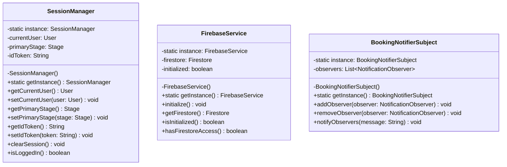

## Diagram 2: SEQUENCEDIAGRAM - ✅ ORIGINAL

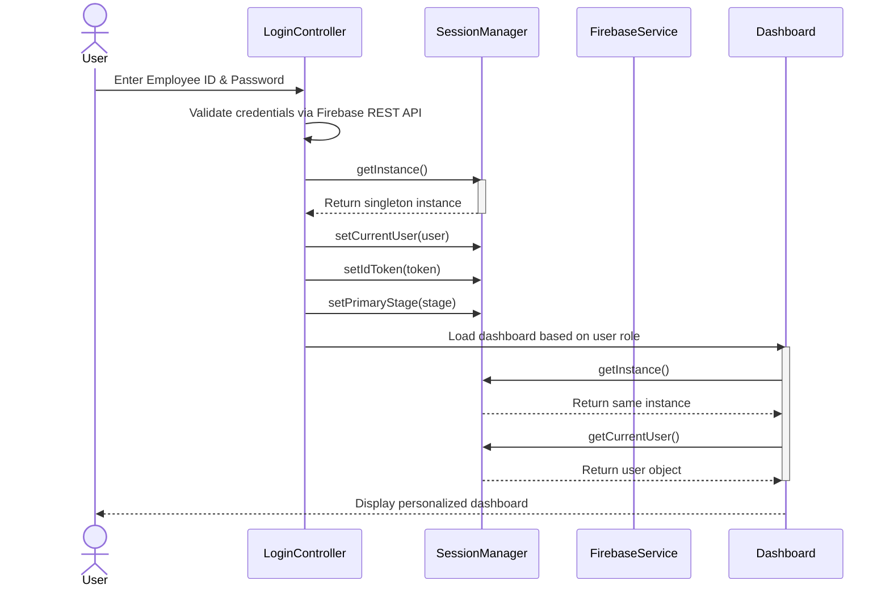

## Diagram 3: SEQUENCEDIAGRAM - ✅ ORIGINAL

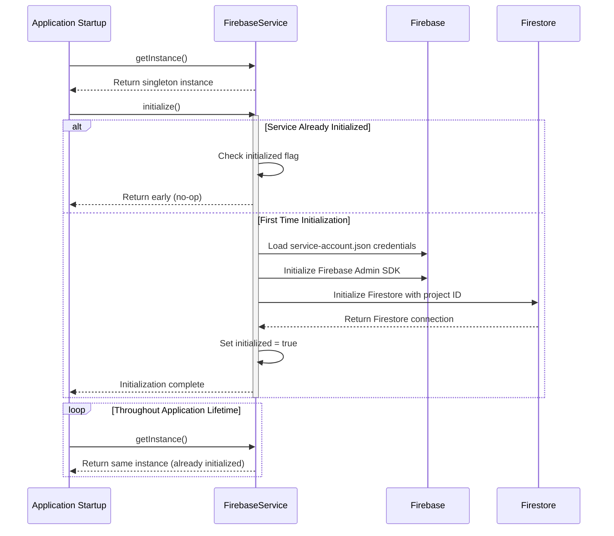

## Diagram 4: GRAPH - ✅ ORIGINAL

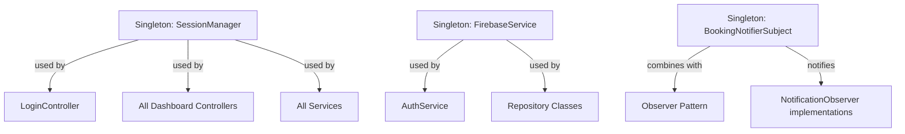

# Pattern 2: Factory

## Diagram 1: CLASSDIAGRAM - ✅ ORIGINAL

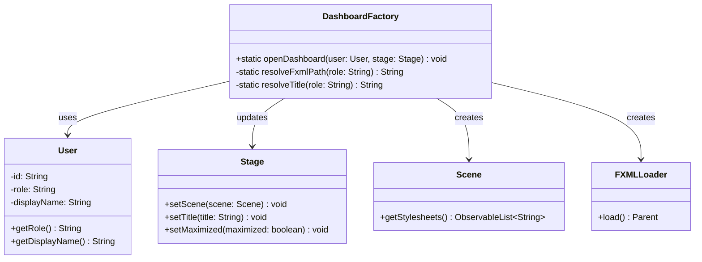

## Diagram 2: SEQUENCEDIAGRAM - ✅ ORIGINAL

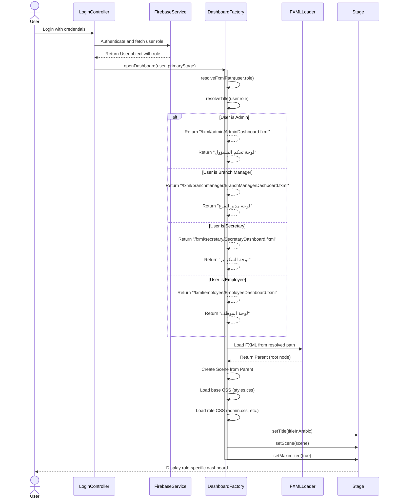

## Diagram 3: GRAPH - ✅ ORIGINAL

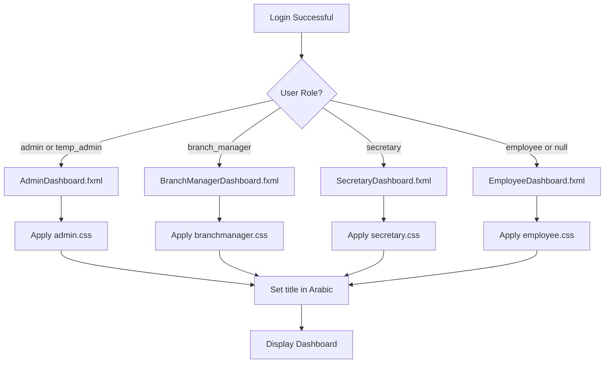

## Diagram 4: GRAPH - ✅ ORIGINAL

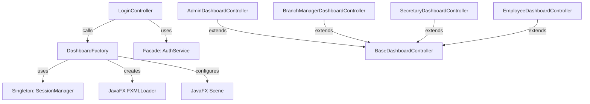

# Pattern 3: Observer

## Diagram 1: CLASSDIAGRAM - ✅ ORIGINAL

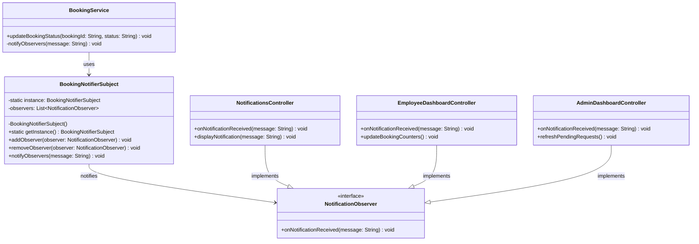

## Diagram 2: SEQUENCEDIAGRAM - ✅ ORIGINAL

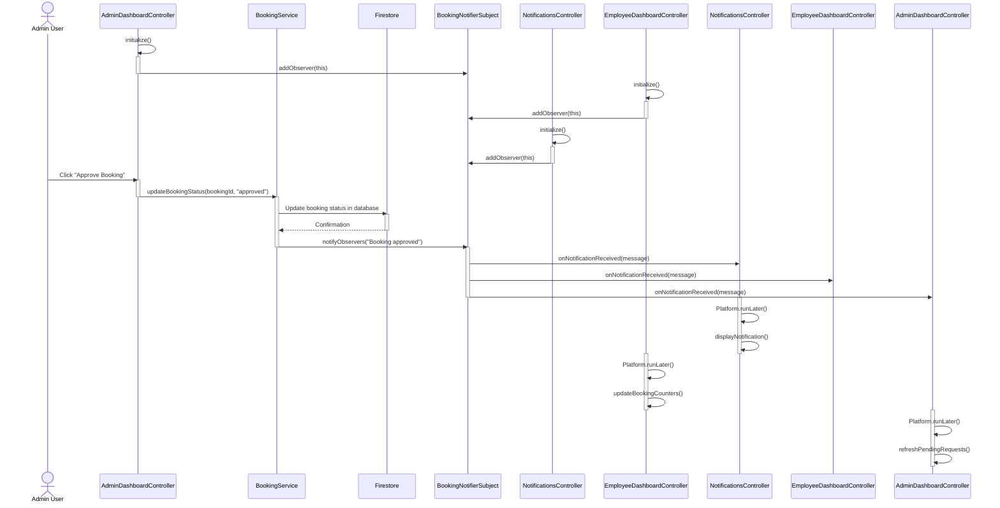

## Diagram 3: GRAPH - ✅ ORIGINAL

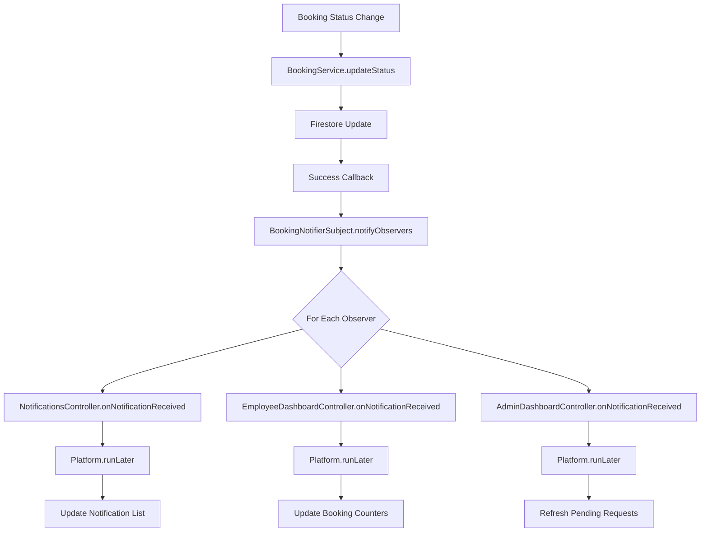

## Diagram 4: GRAPH - ✅ ORIGINAL

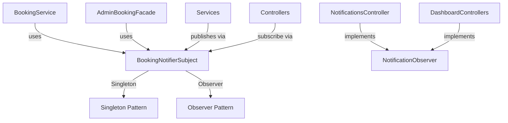

# Pattern 4: Facade

## Diagram 1: CLASSDIAGRAM - ✅ ORIGINAL

```mermaid
classDiagram
    class AuthService {
        -static httpClient: OkHttpClient
        -static gson: Gson
        +static login(employeeId: String, password: String) User
        +static register(employeeId: String, password: String) User
        +static formatEmail(employeeId: String) String
        -static authenticateViaRest(email: String, password: String) String
        -static fetchIdToken(email: String, password: String) String
        -static fetchRoleFromFirestore(uid: String) String
    }

    class AdminBookingFacade {
        -pendingRequestsListener: ListenerRegistration
        +listenToPendingRequests(onUpdate: Consumer, onError: Consumer) void
        +approveRequest(booking: Booking, roomId: String, isUrgent: boolean, onSuccess: Runnable, onError: Consumer) void
        +rejectRequest(booking: Booking, reason: String, suggestions: List, onSuccess: Runnable, onError: Consumer) void
        -selectApprovalStrategy(roomType: String) IApprovalStrategy
    }

    class IApprovalStrategy {
        <<interface>>
        +approve(booking: Booking, roomId: String, isUrgent: boolean) boolean
    }

    class MultiPurposeApprovalStrategy {
        +approve(booking: Booking, roomId: String, isUrgent: boolean) boolean
    }

    class LectureApprovalStrategy {
        +approve(booking: Booking, roomId: String, isUrgent: boolean) boolean
    }

    class FirebaseService {
        -static instance: FirebaseService
        -firestore: Firestore
        +static getInstance() FirebaseService
        +getFirestore() Firestore
    }

    class SessionManager {
        -static instance: SessionManager
        -currentUser: User
        +static getInstance() SessionManager
        +setCurrentUser(user: User) void
    }

    AuthService --> FirebaseService: uses
    AuthService --> SessionManager: updates
    AdminBookingFacade --> FirebaseService: uses
    AdminBookingFacade --> IApprovalStrategy: uses
    AdminBookingFacade --> MultiPurposeApprovalStrategy: creates
    AdminBookingFacade --> LectureApprovalStrategy: creates
```

## Diagram 2: SEQUENCEDIAGRAM - ✅ ORIGINAL

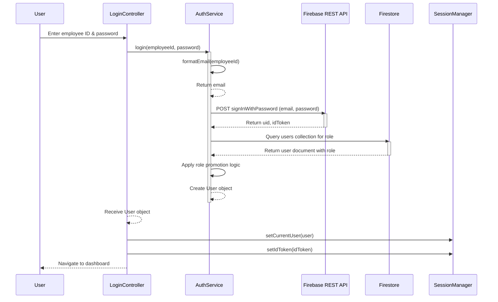

## Diagram 3: SEQUENCEDIAGRAM - ✅ ORIGINAL

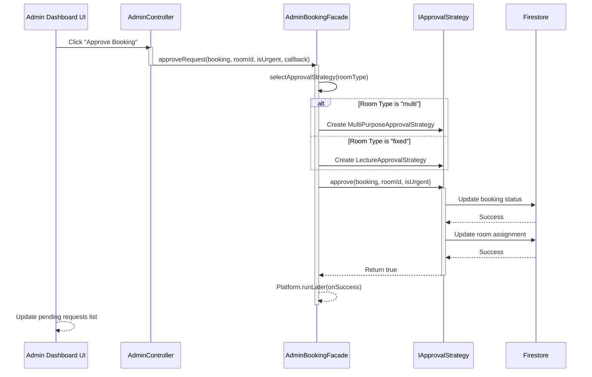

## Diagram 4: GRAPH - ✅ ORIGINAL

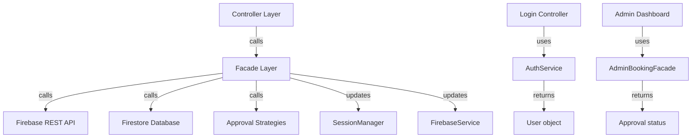

## Diagram 5: GRAPH - ✅ ORIGINAL

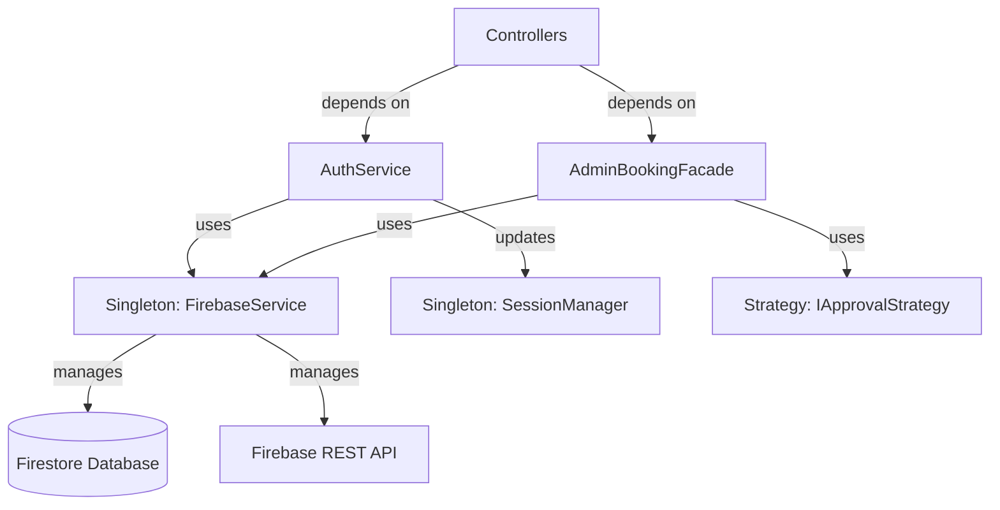

# Pattern 5: Composite

## Diagram 1: CLASSDIAGRAM - ✅ ORIGINAL

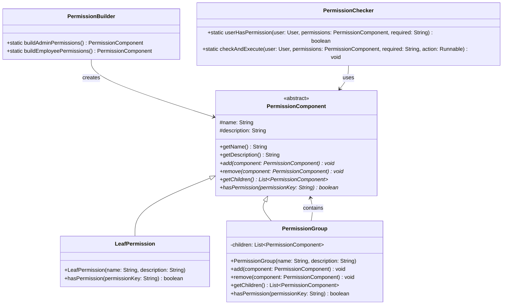

## Diagram 2: SEQUENCEDIAGRAM - ✅ ORIGINAL

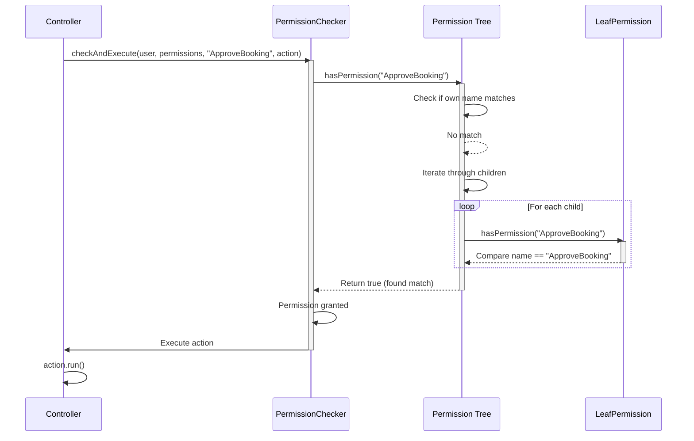

## Diagram 3: GRAPH - ✅ ORIGINAL

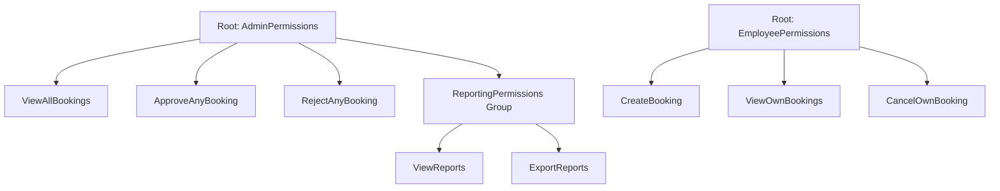

## Diagram 4: GRAPH - ✅ ORIGINAL

```mermaid
graph TD
    A[PermissionComponent] -->|is extended by| B[LeafPermission]
    A -->|is extended by| C[PermissionGroup]
    C -->|contains| A
    
    A -->|hasPermission| D{Does it match?}
    B -->|check name| E[Return true/false]
    C -->|check group name| F[Return true/false]
    C -->|recurse to children| A
```

## Diagram 5: GRAPH - ✅ ORIGINAL

```mermaid
graph TD
    PermissionComponent -->|used by| PermissionChecker
    PermissionChecker -->|called by| Controllers
    
    PermissionGroup -->|contains| PermissionComponent
    PermissionGroup -->|contains| LeafPermission
    
    PermissionBuilder -->|creates| PermissionComponent
    PermissionBuilder -->|creates| PermissionGroup
    PermissionBuilder -->|creates| LeafPermission
```

# Pattern 6: Decorator

## Diagram 1: CLASSDIAGRAM - ✅ ORIGINAL

```mermaid
classDiagram
    class BookingService {
        <<interface>>
        +getDescription() String
        +getCost() double
        +applyTo(request: BookingRequest) void
    }

    class StandardBooking {
        -roomId: String
        -date: String
        +StandardBooking(roomId: String, date: String)
        +getDescription() String
        +getCost() double
        +applyTo(request: BookingRequest) void
    }

    class BookingDecorator {
        <<abstract>>
        #wrappedService: BookingService
        +BookingDecorator(service: BookingService)
        +getDescription() String
        +getCost() double
        +applyTo(request: BookingRequest) void
    }

    class WithCateringDecorator {
        +getDescription() String
        +getCost() double
        +applyTo(request: BookingRequest) void
    }

    class WithProjectorDecorator {
        +getDescription() String
        +getCost() double
        +applyTo(request: BookingRequest) void
    }

    class HolidayDecorator {
        +getDescription() String
        +getCost() double
        +applyTo(request: BookingRequest) void
    }

    class OfficialEventDecorator {
        +getDescription() String
        +getCost() double
        +applyTo(request: BookingRequest) void
    }

    BookingService <|.. StandardBooking
    BookingService <|.. BookingDecorator
    BookingDecorator <|-- WithCateringDecorator
    BookingDecorator <|-- WithProjectorDecorator
    BookingDecorator <|-- HolidayDecorator
    BookingDecorator <|-- OfficialEventDecorator
    BookingDecorator --> BookingService: wraps
```

## Diagram 2: SEQUENCEDIAGRAM - ✅ ORIGINAL

```mermaid
sequenceDiagram
    participant UI as Secretary UI
    participant Controller as BookingFormController
    participant Configurator as BookingConfigurator
    participant Standard as StandardBooking
    participant Catering as WithCateringDecorator
    participant Projector as WithProjectorDecorator
    participant Holiday as HolidayDecorator

    UI->>Controller: User selects Catering + Projector + Holiday
    Controller->>Controller: cateringCheckbox.isSelected() = true
    Controller->>Controller: projectorCheckbox.isSelected() = true
    Controller->>Controller: holidayCheckbox.isSelected() = true

    Controller->>Configurator: createBooking(..., true, true, true, false)
    activate Configurator

    Configurator->>Standard: new StandardBooking(roomId, date)
    activate Standard
    Standard-->>Configurator: Return basic booking
    deactivate Standard

    Configurator->>Catering: new WithCateringDecorator(booking)
    activate Catering
    Catering-->>Configurator: Return decorated booking (wrapped)
    deactivate Catering

    Configurator->>Projector: new WithProjectorDecorator(booking)
    activate Projector
    Projector-->>Configurator: Return more decorated booking
    deactivate Projector

    Configurator->>Holiday: new HolidayDecorator(booking)
    activate Holiday
    Holiday-->>Configurator: Return final decorated booking
    deactivate Holiday

    deactivate Configurator

    Controller->>Controller: booking.getDescription()
    Controller->>Controller: booking.getCost()
    Controller->>Controller: booking.applyTo(request)

    Controller-->>UI: Display: "Room X, Catering provided, Projector included (Holiday event)"
    Controller-->>UI: Display: "Total Cost: 1275 EGP"
```

## Diagram 3: GRAPH - ✅ ORIGINAL

```mermaid
graph TD
    A["HolidayDecorator
       cost: base * 1.5
       type: holiday_event"]
    B["WithProjectorDecorator
       cost: +150
       equipment: projector"]
    C["WithCateringDecorator
       cost: +500
       catering: true"]
    D["StandardBooking
       cost: base
       room: X-101, date: 2024-12-20"]

    A -->|wraps| B
    B -->|wraps| C
    C -->|wraps| D

    style A fill:#fff3cd
    style B fill:#d4edda
    style C fill:#cfe2ff
    style D fill:#e2e3e5
```

## Diagram 4: GRAPH - ✅ ORIGINAL

```mermaid
graph TD
    A[Select Room] --> B[Select Date]
    B --> C[Check Optional Features]
    C --> D{Catering?}
    D -->|Yes| E[Wrap with CateringDecorator]
    D -->|No| F[Skip]
    E --> G{Projector?}
    F --> G
    G -->|Yes| H[Wrap with ProjectorDecorator]
    G -->|No| I[Skip]
    H --> J{Holiday?}
    I --> J
    J -->|Yes| K[Wrap with HolidayDecorator]
    J -->|No| L[Skip]
    K --> M[Calculate Final Cost]
    L --> M
    M --> N[Display Summary]
    N --> O[Submit Booking]
```

## Diagram 5: GRAPH - ✅ ORIGINAL

```mermaid
graph TD
    BookingService -->|interface| StandardBooking
    BookingService -->|interface| BookingDecorator
    BookingDecorator -->|wraps| BookingService
    
    WithCateringDecorator -->|extends| BookingDecorator
    WithProjectorDecorator -->|extends| BookingDecorator
    HolidayDecorator -->|extends| BookingDecorator
    OfficialEventDecorator -->|extends| BookingDecorator
    
    BookingConfigurator -->|creates| StandardBooking
    BookingConfigurator -->|creates| BookingDecorator
    
    BookingFormController -->|uses| BookingConfigurator
```

# Pattern 7: Memento

## Diagram 1: CLASSDIAGRAM - ✅ ORIGINAL

```mermaid
classDiagram
    class BookingMemento {
        -roomId: String
        -date: String
        -timeFrom: String
        -timeTo: String
        -purpose: String
        -capacity: String
        -isHoliday: boolean
        -isOfficial: boolean
        -requesterName: String
        -requesterTitle: String
        -requesterPhone: String
        -isLaptop: boolean
        -isVideoConf: boolean
        -isMic: boolean
        +getRoomId() String
        +getDate() String
        // ... all getters
    }

    class BookingCaretaker {
        -history: Stack~BookingMemento~
        -currentIndex: int
        +save(memento: BookingMemento) void
        +undo() BookingMemento
        +redo() BookingMemento
        +getCurrentState() BookingMemento
        +canUndo() boolean
        +canRedo() boolean
    }

    class BookingFormController {
        +saveFormState() void
        +restoreFormState(memento: BookingMemento) void
        +handleUndo() void
        +handleRedo() void
    }

    BookingFormController --> BookingCaretaker: uses
    BookingCaretaker --> BookingMemento: stores
```

## Diagram 2: SEQUENCEDIAGRAM - ✅ ORIGINAL

```mermaid
sequenceDiagram
    participant User as User
    participant Controller as BookingFormController
    participant Caretaker as BookingCaretaker
    participant Memento as BookingMemento

    User->>Controller: Enter room ID
    Controller->>Controller: Save state to memento
    Controller->>Caretaker: save(memento1)
    activate Caretaker
    Caretaker->>Caretaker: Add to history, currentIndex++
    deactivate Caretaker

    User->>Controller: Enter date
    Controller->>Controller: Save state
    Controller->>Caretaker: save(memento2)
    activate Caretaker
    Caretaker->>Caretaker: Add to history, currentIndex++
    deactivate Caretaker

    User->>Controller: Enter time
    Controller->>Caretaker: save(memento3)
    activate Caretaker
    Caretaker->>Caretaker: Add to history, currentIndex++
    deactivate Caretaker

    User->>Controller: Click Undo button
    Controller->>Caretaker: undo()
    activate Caretaker
    Caretaker->>Caretaker: currentIndex--
    Caretaker->>Memento: Get memento2
    Memento-->>Caretaker: Return memento2
    Caretaker-->>Controller: Return memento2
    deactivate Caretaker

    Controller->>Controller: restoreFormState(memento2)
    Controller-->>User: Form restored to state before time entry

    User->>Controller: Click Redo button
    Controller->>Caretaker: redo()
    activate Caretaker
    Caretaker->>Caretaker: currentIndex++
    Caretaker->>Memento: Get memento3
    Memento-->>Caretaker: Return memento3
    Caretaker-->>Controller: Return memento3
    deactivate Caretaker

    Controller->>Controller: restoreFormState(memento3)
    Controller-->>User: Form restored to state with all entries
```

## Diagram 3: GRAPH - ✅ ORIGINAL

```mermaid
graph TD
    A["State 1: Room selected"] --> B["State 2: Date entered"]
    B --> C["State 3: Time entered"]
    C --> D["State 4: Purpose filled"]
    D --> E["Current: Memento 4"]
    
    E -.->|undo| C
    C -.->|redo| E
    
    F["Edit after undo"] -.->|new state| G["State 3b: Different time"]
    C -.->|user change| G
    
    style E fill:#fff3cd
    style G fill:#d4edda
```

## Diagram 4: GRAPH - ✅ ORIGINAL

```mermaid
graph TD
    BookingFormController -->|uses| BookingCaretaker
    BookingCaretaker -->|stores| BookingMemento
    BookingMemento -->|represents| BookingFormState
    
    BookingMemento -->|immutable| Data["State Data"]
    BookingCaretaker -->|manages| History["Undo/Redo History"]
```

# Pattern 8: Builder

## Diagram 1: CLASSDIAGRAM - ✅ ORIGINAL

```mermaid
classDiagram
    class BookingBuilder {
        -booking: Booking
        +BookingBuilder()
        +roomId(roomId: String) BookingBuilder
        +roomType(roomType: String) BookingBuilder
        +hallCategory(category: String) BookingBuilder
        +date(date: String) BookingBuilder
        +timeFrom(time: String) BookingBuilder
        +timeTo(time: String) BookingBuilder
        +purpose(purpose: String) BookingBuilder
        +responsibleName(name: String) BookingBuilder
        +responsibleJob(job: String) BookingBuilder
        +responsibleMobile(mobile: String) BookingBuilder
        +reqMic(required: boolean, qty: int) BookingBuilder
        +reqLaptop(required: boolean) BookingBuilder
        +reqVideoConf(required: boolean) BookingBuilder
        +userId(userId: String) BookingBuilder
        +userName(name: String) BookingBuilder
        +userRole(role: String) BookingBuilder
        +applyLectureDefaults(name: String) BookingBuilder
        +fromPrototype(prototype: Booking) BookingBuilder
        +build() Booking
    }

    class Booking {
        -id: String
        -roomId: String
        -date: String
        -timeFrom: String
        -timeTo: String
        -purpose: String
        -responsibleName: String
        -responsibleJob: String
        -responsibleMobile: String
        -reqMic: boolean
        -reqMicQty: int
        -reqLaptop: boolean
        -reqVideoConf: boolean
        +setter methods
        +getter methods
    }

    BookingBuilder --> Booking: builds
```

## Diagram 2: SEQUENCEDIAGRAM - ✅ ORIGINAL

```mermaid
sequenceDiagram
    participant UI as Form UI
    participant Controller as BookingFormController
    participant Builder as BookingBuilder
    participant Booking

    UI->>Controller: Step 1 - Enter room details
    Controller->>Builder: new BookingBuilder()
    Builder->>Booking: new Booking()

    UI->>Controller: Step 1 - Submit
    Controller->>Builder: .roomId("A-101").roomType("fixed").date("2024-12-15")
    Builder-->>Builder: Set fields, return this

    UI->>Controller: Step 2 - Enter responsible person
    Controller->>Builder: .responsibleName("Ahmed").responsibleMobile("01234567890")
    Builder-->>Builder: Set fields, return this

    UI->>Controller: Step 3 - Enter requirements
    Controller->>Builder: .reqMic(true, 2).reqLaptop(false)
    Builder-->>Builder: Set fields, return this

    UI->>Controller: Submit booking
    Controller->>Builder: .userId("uid123").userRole("employee")
    Builder-->>Builder: Set metadata, return this

    Controller->>Builder: .build()
    activate Builder
    Builder->>Builder: Validate all required fields
    alt All fields present
        Builder->>Booking: Return completed booking
        Builder-->>Controller: Booking object
    else Missing required field
        Builder-->>Controller: Throw IllegalStateException
    end
    deactivate Builder

    Controller->>Controller: Save booking to database
```

## Diagram 3: GRAPH - ✅ ORIGINAL

```mermaid
graph TD
    A[BookingBuilder] --> B[Step 1 Methods]
    A --> C[Step 2 Methods]
    A --> D[Step 3 Methods]
    A --> E[Metadata Methods]
    A --> F[Convenience Methods]
    A --> G[Build]
    
    B --> B1[roomId, roomType, hallCategory]
    B --> B2[date, timeFrom, timeTo]
    B --> B3[purpose, capacity, holiday]
    
    C --> C1[responsibleName, Job, Mobile]
    
    D --> D1[reqMic, reqLaptop, reqVideoConf]
    
    E --> E1[userId, userName, userRole, college]
    
    F --> F2[applyLectureDefaults]
    F --> F3[fromPrototype]
    
    G --> G1["build() -> Booking"]
```

## Diagram 4: GRAPH - ✅ ORIGINAL

```mermaid
graph TD
    BookingBuilder -->|creates| Booking
    BookingBuilder -->|uses| Prototype["Prototype: fromPrototype()"]
    BookingFormController -->|uses| BookingBuilder
    BookingFormController -->|uses| SessionManager["Singleton: SessionManager"]
```

# Pattern 9: Command

## Diagram 1: CLASSDIAGRAM - ✅ ORIGINAL

```mermaid
classDiagram
    class Command {
        <<interface>>
        +execute() void
    }

    class ApproveBookingCommand {
        -bookingId: String
        -onSuccess: Runnable
        +ApproveBookingCommand(bookingId: String, onSuccess: Runnable)
        +execute() void
    }

    class RejectBookingCommand {
        -bookingId: String
        -reason: String
        -onSuccess: Runnable
        +RejectBookingCommand(bookingId: String, reason: String, onSuccess: Runnable)
        +execute() void
    }

    class UndoableCommand {
        <<interface>>
        +execute() void
        +undo() void
        +canUndo() boolean
    }

    class UndoableApproveBookingCommand {
        -bookingId: String
        -previousStatus: String
        -onSuccess: Runnable
        +execute() void
        +undo() void
        +canUndo() boolean
    }

    class BookingCommandInvoker {
        -commandQueue: Queue~Command~
        -executedCommands: List~Command~
        +queueCommand(command: Command) void
        +executeCommand(command: Command) void
        +executeAllQueued() void
        +getExecutionHistory() List~Command~
    }

    class BranchManagerService {
        -static instance: BranchManagerService
        +updateBookingStatus(bookingId: String, status: String) CompletableFuture~Void~
        +rejectBooking(bookingId: String, reason: String) CompletableFuture~Void~
    }

    Command <|-- ApproveBookingCommand
    Command <|-- RejectBookingCommand
    Command <|-- UndoableCommand
    UndoableCommand <|-- UndoableApproveBookingCommand
    BookingCommandInvoker --> Command: executes
    ApproveBookingCommand --> BranchManagerService: uses
    RejectBookingCommand --> BranchManagerService: uses
```

## Diagram 2: SEQUENCEDIAGRAM - ✅ ORIGINAL

```mermaid
sequenceDiagram
    participant UI as Manager UI
    participant Controller as BookingController
    participant Invoker as CommandInvoker
    participant Command as ApproveBookingCommand
    participant Service as BranchManagerService
    participant DB as Firestore

    UI->>Controller: Click Approve Booking button
    activate Controller
    
    Controller->>Command: new ApproveBookingCommand(bookingId, callback)
    activate Command
    Command-->>Controller: Return command object
    deactivate Command
    
    Controller->>Invoker: executeCommand(command)
    activate Invoker
    
    Invoker->>Command: execute()
    activate Command
    
    Command->>Service: updateBookingStatus(bookingId, "approved")
    activate Service
    
    Service->>DB: Update booking status in Firestore
    activate DB
    DB-->>Service: Confirmed
    deactivate DB
    
    Service-->>Command: Return CompletableFuture
    deactivate Service
    
    Command->>Command: onSuccess.run() callback
    deactivate Command
    
    Invoker->>Invoker: Add command to executedCommands
    Invoker-->>Controller: Command executed
    deactivate Invoker
    
    deactivate Controller
    
    UI-->>UI: Update UI to show approval
```

## Diagram 3: GRAPH - ✅ ORIGINAL

```mermaid
graph TD
    A[User Action] -->|Create| B[Command Object]
    B -->|Queue| C[CommandInvoker]
    C -->|Execute| D[Command.execute]
    D -->|Call| E[Service Method]
    E -->|Update| F[Database]
    F -->|Callback| G[onSuccess]
    G -->|Update| H[UI]
    
    C -->|Log| I[CommandHistory]
    I -->|For Audit| J[AuditLog]
```

## Diagram 4: GRAPH - ✅ ORIGINAL

```mermaid
graph TD
    Command -->|interface| ApproveBookingCommand
    Command -->|interface| RejectBookingCommand
    
    BookingCommandInvoker -->|uses| Command
    BookingCommandInvoker -->|stores| CommandHistory
    
    BookingController -->|creates| ApproveBookingCommand
    BookingController -->|creates| RejectBookingCommand
    BookingController -->|invokes| BookingCommandInvoker
    
    BranchManagerService -->|executes business logic| Firestore
```

# Pattern 10: Strategy

## Diagram 1: CLASSDIAGRAM - ✅ ORIGINAL

```mermaid
classDiagram
    class RoomSearchStrategy {
        <<interface>>
        +validateInput(criteria: SearchCriteria) String
        +getOccupiedRoomIds(bookings: List, criteria: SearchCriteria) List~String~
    }

    class FixedRoomSearchStrategy {
        +validateInput(criteria: SearchCriteria) String
        +getOccupiedRoomIds(bookings: List, criteria: SearchCriteria) List~String~
        -isValidTimeRange(from: String, to: String) boolean
        -timeRangesOverlap(f1: String, t1: String, f2: String, t2: String) boolean
    }

    class MultiRoomSearchStrategy {
        +validateInput(criteria: SearchCriteria) String
        +getOccupiedRoomIds(bookings: List, criteria: SearchCriteria) List~String~
        -isValidDateRange(from: String, to: String) boolean
    }

    class IApprovalStrategy {
        <<interface>>
        +approve(booking: Booking, roomId: String, isUrgent: boolean) boolean
    }

    class LectureApprovalStrategy {
        +approve(booking: Booking, roomId: String, isUrgent: boolean) boolean
        -checkRoomAvailable(roomId: String, date: String, from: String, to: String) boolean
        -saveBooking(booking: Booking) void
    }

    class MultiPurposeApprovalStrategy {
        +approve(booking: Booking, roomId: String, isUrgent: boolean) boolean
        -checkRoomAvailable(roomId: String, date: String) boolean
        -checkResourcesAvailable(booking: Booking) boolean
        -checkCapacityRequirements(roomId: String, booking: Booking) boolean
        -reserveResources(booking: Booking) void
        -sendNotifications(booking: Booking) void
        -saveBooking(booking: Booking) void
    }

    class SearchStrategyFactory {
        +static createStrategy(roomType: String) RoomSearchStrategy
    }

    RoomSearchStrategy <|.. FixedRoomSearchStrategy
    RoomSearchStrategy <|.. MultiRoomSearchStrategy
    IApprovalStrategy <|.. LectureApprovalStrategy
    IApprovalStrategy <|.. MultiPurposeApprovalStrategy
    SearchStrategyFactory --> RoomSearchStrategy: creates
```

## Diagram 2: SEQUENCEDIAGRAM - ✅ ORIGINAL

```mermaid
sequenceDiagram
    participant Admin as Admin User
    participant Controller as SearchController
    participant Factory as SearchStrategyFactory
    participant Strategy as RoomSearchStrategy
    participant Service as BookingService

    Admin->>Controller: Select room type and search criteria
    Controller->>Factory: createStrategy(roomType)
    activate Factory
    
    alt roomType == "multi"
        Factory-->>Controller: Return MultiRoomSearchStrategy
    else roomType == "fixed"
        Factory-->>Controller: Return FixedRoomSearchStrategy
    end
    deactivate Factory

    Controller->>Strategy: validateInput(criteria)
    activate Strategy
    
    alt Validation passes
        Strategy-->>Controller: Return null
    else Validation fails
        Strategy-->>Controller: Return error message
    end
    deactivate Strategy

    Controller->>Service: loadActiveBookings()
    Service-->>Controller: Return bookings list

    Controller->>Strategy: getOccupiedRoomIds(bookings, criteria)
    activate Strategy
    Strategy->>Strategy: Filter bookings by strategy-specific logic
    Strategy-->>Controller: Return occupied room IDs
    deactivate Strategy

    Controller->>Controller: Calculate available rooms
    Controller-->>Admin: Display available rooms
```

## Diagram 3: GRAPH - ✅ ORIGINAL

```mermaid
graph TD
    A[Select Room Type] --> B{Room Type?}
    B -->|"fixed"| C[FixedRoomSearchStrategy]
    B -->|"multi"| D[MultiRoomSearchStrategy]
    B -->|unknown| E[Throw IllegalArgumentException]
    
    C --> F[Validate Time Range]
    D --> G[Validate Date Range]
    
    F --> H[Calculate Occupied by Time Overlap]
    G --> I[Calculate Occupied by Date Overlap]
    
    H --> J[Return Available Rooms]
    I --> J
```

## Diagram 4: GRAPH - ✅ ORIGINAL

```mermaid
graph TD
    RoomSearchStrategy -->|interface| FixedRoomSearchStrategy
    RoomSearchStrategy -->|interface| MultiRoomSearchStrategy
    SearchStrategyFactory -->|creates| RoomSearchStrategy
    
    IApprovalStrategy -->|interface| LectureApprovalStrategy
    IApprovalStrategy -->|interface| MultiPurposeApprovalStrategy
    
    AdvancedSearchController -->|uses| RoomSearchStrategy
    AdminBookingController -->|uses| IApprovalStrategy
    
    AdminBookingFacade -->|creates| IApprovalStrategy
```

# Pattern 11: Prototype

## Diagram 1: CLASSDIAGRAM - ✅ ORIGINAL

```mermaid
classDiagram
    class Cloneable {
        <<interface>>
        +clone() Object
    }

    class Booking {
        -id: String
        -roomId: String
        -roomType: String
        -hallCategory: String
        -date: String
        -timeFrom: String
        -timeTo: String
        -purpose: String
        -requiredCapacity: int
        -responsibleName: String
        -responsibleJob: String
        -responsibleMobile: String
        -reqMic: boolean
        -reqMicQty: int
        -reqLaptop: boolean
        -reqVideoConf: boolean
        -status: String
        -rejectReason: String
        -suggestedRoomId: String
        -suggestedDate: String
        +clone() Booking
        +getters() ...
        +setters() ...
    }

    class BookingBuilder {
        -booking: Booking
        +fromPrototype(prototype: Booking) BookingBuilder
        +build() Booking
    }

    Cloneable <|.. Booking
    BookingBuilder --> Booking: uses
```

## Diagram 2: SEQUENCEDIAGRAM - ✅ ORIGINAL

```mermaid
sequenceDiagram
    participant Employee as Employee
    participant EmployeeUI as Employee Dashboard
    participant Controller as BookingFormController
    participant BookingService
    participant Builder as BookingBuilder
    participant Original as Rejected Booking
    participant Clone as Cloned Booking

    Employee->>EmployeeUI: View rejected booking
    EmployeeUI->>EmployeeUI: Display rejection reason and suggestions
    Employee->>EmployeeUI: Click "Resubmit with suggested room"

    EmployeeUI->>Controller: resubmitBooking(rejectedBooking, suggestedRoom)
    activate Controller
    
    Controller->>Original: clone()
    activate Original
    Original->>Original: super.clone() - create shallow copy
    Original->>Original: Set id = null
    Original->>Original: Set status = "pending"
    Original->>Original: Clear rejection fields
    Original-->>Clone: Return cloned booking
    deactivate Original
    
    Controller->>Builder: new BookingBuilder()
    Builder-->>Builder: Create new builder
    
    Controller->>Builder: fromPrototype(clone)
    activate Builder
    Builder->>Clone: Get all fields from clone
    Builder-->>Builder: Set builder fields from clone
    deactivate Builder
    
    Controller->>Builder: setRoomId(suggestedRoom)
    Controller->>Builder: setDate(suggestedDate)
    
    Controller->>Builder: build()
    Builder-->>Controller: Return new Booking
    
    Controller->>BookingService: submitBooking(newBooking)
    BookingService-->>Controller: Success
    
    deactivate Controller
    
    EmployeeUI-->>Employee: Show success message
```

## Diagram 3: GRAPH - ✅ ORIGINAL

```mermaid
graph TD
    A["Original Booking<br/>id: 'booking-123'<br/>status: 'rejected'<br/>roomId: 'A-101'<br/>reason: 'Room unavailable'<br/>suggestedRoom: 'B-202'"]
    
    B["Cloned Booking<br/>id: null (NEW)<br/>status: 'pending'<br/>roomId: 'A-101' (copied)<br/>reason: null (cleared)<br/>suggestedRoom: null (cleared)"]
    
    C["Modified Clone<br/>id: null<br/>status: 'pending'<br/>roomId: 'B-202' (overridden)<br/>date: new date (overridden)<br/>time: new time (overridden)"]
    
    A -->|clone()| B
    B -->|setRoomId()<br/>setDate()<br/>setTime()| C
    
    style A fill:#fff3cd
    style B fill:#d4edda
    style C fill:#cfe2ff
```

## Diagram 4: GRAPH - ✅ ORIGINAL

```mermaid
graph TD
    Booking -->|implements| Cloneable
    BookingBuilder -->|uses| Booking
    BookingBuilder -->|fromPrototype| Booking
    
    EmployeeDashboardController -->|uses| Booking
    EmployeeDashboardController -->|calls clone()| Booking
    
    BookingService -->|stores| Booking
```

# Pattern 12: Template Method

## Diagram 1: CLASSDIAGRAM - ✅ ORIGINAL

```mermaid
classDiagram
    class Initializable {
        <<interface>>
        +initialize(location: URL, resources: ResourceBundle) void
    }

    class BaseDashboardController {
        <<abstract>>
        +final initialize(location: URL, resources: ResourceBundle) void
        #abstract setupObservers() void
        #abstract initUI() void
        #abstract loadData() void
    }

    class AdminDashboardController {
        +setupObservers() void
        +initUI() void
        +loadData() void
    }

    class EmployeeDashboardController {
        +setupObservers() void
        +initUI() void
        +loadData() void
    }

    class SecretaryDashboardController {
        +setupObservers() void
        +initUI() void
        +loadData() void
    }

    class BranchManagerDashboardController {
        +setupObservers() void
        +initUI() void
        +loadData() void
    }

    Initializable <|.. BaseDashboardController
    BaseDashboardController <|-- AdminDashboardController
    BaseDashboardController <|-- EmployeeDashboardController
    BaseDashboardController <|-- SecretaryDashboardController
    BaseDashboardController <|-- BranchManagerDashboardController
```

## Diagram 2: SEQUENCEDIAGRAM - ✅ ORIGINAL

```mermaid
sequenceDiagram
    participant JavaFX as JavaFX Framework
    participant Controller as AdminDashboardController
    participant Base as BaseDashboardController
    participant Service as AdminBookingService

    JavaFX->>Base: initialize(location, resources)
    activate Base
    
    Note over Base: Execute template steps in order
    
    Base->>Controller: setupObservers()
    activate Controller
    Controller->>Controller: Add BookingNotifierSubject listener
    Controller->>Controller: Add table selection listener
    Controller-->>Base: Return
    deactivate Controller
    
    Base->>Controller: initUI()
    activate Controller
    Controller->>Controller: Configure table columns
    Controller->>Controller: Add action buttons
    Controller->>Controller: Create cell factories
    Controller-->>Base: Return
    deactivate Controller
    
    Base->>Controller: loadData()
    activate Controller
    Controller->>Service: listenToPendingRequests()
    Service-->>Controller: Returns bookings
    Controller->>Controller: Populate table
    Controller-->>Base: Return
    deactivate Controller
    
    Base-->>JavaFX: Initialization complete
    deactivate Base
```

## Diagram 3: GRAPH - ✅ ORIGINAL

```mermaid
graph TD
    A["JavaFX Framework<br/>calls initialize()"] --> B["BaseDashboardController<br/>Template Method"]
    B --> C["Step 1: setupObservers()"]
    C -->|calls| D["Admin/Employee/Secretary<br/>setupObservers()"]
    D --> E["Step 2: initUI()"]
    E -->|calls| F["Admin/Employee/Secretary<br/>initUI()"]
    F --> G["Step 3: loadData()"]
    G -->|calls| H["Admin/Employee/Secretary<br/>loadData()"]
    H --> I["Dashboard Ready"]
    
    style B fill:#e2e3e5
    style C fill:#d4edda
    style E fill:#d4edda
    style G fill:#d4edda
```

## Diagram 4: GRAPH - ✅ ORIGINAL

```mermaid
graph TD
    BaseDashboardController -->|defines template| Initialize["Initialization<br/>Algorithm"]
    AdminDashboardController -->|implements| BaseDashboardController
    EmployeeDashboardController -->|implements| BaseDashboardController
    SecretaryDashboardController -->|implements| BaseDashboardController
    BranchManagerDashboardController -->|implements| BaseDashboardController
    
    BookingNotifierSubject -->|used by| setupObservers["Hook:<br/>setupObservers"]
    Service -->|used by| loadData["Hook:<br/>loadData"]
    TableView -->|configured by| initUI["Hook:<br/>initUI"]
```

# Pattern 13: Mediator

## Diagram 1: CLASSDIAGRAM - ✅ ORIGINAL

```mermaid
classDiagram
    class DashboardNavigationMediator {
        -contentArea: StackPane
        +DashboardNavigationMediator(contentArea: StackPane)
        +navigateTo(view: Node) void
    }

    class SecretaryDashboardController {
        -contentArea: StackPane
        -mediator: DashboardNavigationMediator
        -overviewButton: Button
        -newBookingButton: Button
        -bookingListButton: Button
        +initUI() void
    }

    class DashboardOverviewView {
        +getView() Node
        +addBooking(booking: Booking) void
    }

    class NewBookingFormView {
        +getView() Node
        +clearForm() void
        +setOnSubmit(callback: Consumer) void
    }

    class BookingListView {
        +getView() Node
        +addBooking(booking: Booking) void
        +setOnBookingSelected(callback: Consumer) void
    }

    class BookingDetailsView {
        +getView() Node
        +displayBooking(booking: Booking) void
        +setOnBack(callback: Runnable) void
    }

    DashboardNavigationMediator --> SecretaryDashboardController: used by
    SecretaryDashboardController --> DashboardOverviewView: manages
    SecretaryDashboardController --> NewBookingFormView: manages
    SecretaryDashboardController --> BookingListView: manages
    SecretaryDashboardController --> BookingDetailsView: manages
```

## Diagram 2: SEQUENCEDIAGRAM - ✅ ORIGINAL

```mermaid
sequenceDiagram
    participant User as Secretary User
    participant UI as Secretary Dashboard UI
    participant Mediator as DashboardNavigationMediator
    participant ContentArea as StackPane contentArea
    participant Overview as DashboardOverview
    participant NewForm as NewBookingForm
    participant List as BookingList

    User->>UI: Click "Overview" button
    UI->>Mediator: navigateTo(overviewView)
    activate Mediator
    Mediator->>ContentArea: getChildren().clear()
    Mediator->>Overview: setVisible(true)
    Mediator->>ContentArea: getChildren().add(overview)
    deactivate Mediator

    User->>UI: Click "New Booking" button
    UI->>Mediator: navigateTo(newBookingView)
    activate Mediator
    Mediator->>ContentArea: getChildren().clear()
    Mediator->>NewForm: setVisible(true)
    Mediator->>ContentArea: getChildren().add(newForm)
    deactivate Mediator

    User->>NewForm: Fill form and submit
    NewForm->>UI: Notify booking submitted
    UI->>Mediator: navigateTo(bookingListView)
    activate Mediator
    Mediator->>ContentArea: getChildren().clear()
    Mediator->>List: setVisible(true)
    Mediator->>ContentArea: getChildren().add(list)
    deactivate Mediator

    User->>List: Booking appears in list
```

## Diagram 3: GRAPH - ✅ ORIGINAL

```mermaid
graph TD
    Overview["Overview<br/>Dashboard"]
    NewBooking["New Booking<br/>Form"]
    BookingList["Booking<br/>List"]
    Details["Booking<br/>Details"]
    
    Overview -->|New Booking| NewBooking
    NewBooking -->|Submit| BookingList
    NewBooking -->|Cancel| Overview
    BookingList -->|Select| Details
    Details -->|Back| BookingList
    Details -->|Edit| NewBooking
    BookingList -->|Back| Overview
    
    Mediator["DashboardNavigationMediator<br/>(orchestrates all transitions)"]
    
    Overview -.->|navigateTo| Mediator
    NewBooking -.->|navigateTo| Mediator
    BookingList -.->|navigateTo| Mediator
    Details -.->|navigateTo| Mediator
```

## Diagram 4: GRAPH - ✅ ORIGINAL

```mermaid
graph TD
    DashboardNavigationMediator -->|coordinates| OverviewController
    DashboardNavigationMediator -->|coordinates| NewBookingController
    DashboardNavigationMediator -->|coordinates| BookingListController
    DashboardNavigationMediator -->|coordinates| DetailsController
    
    SecretaryDashboardController -->|creates| DashboardNavigationMediator
    
    OverviewController -.->|calls| navigateTo
    NewBookingController -.->|calls| navigateTo
    BookingListController -.->|calls| navigateTo
    DetailsController -.->|calls| navigateTo
```

