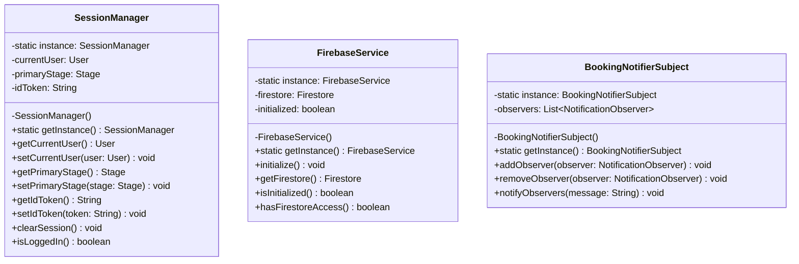
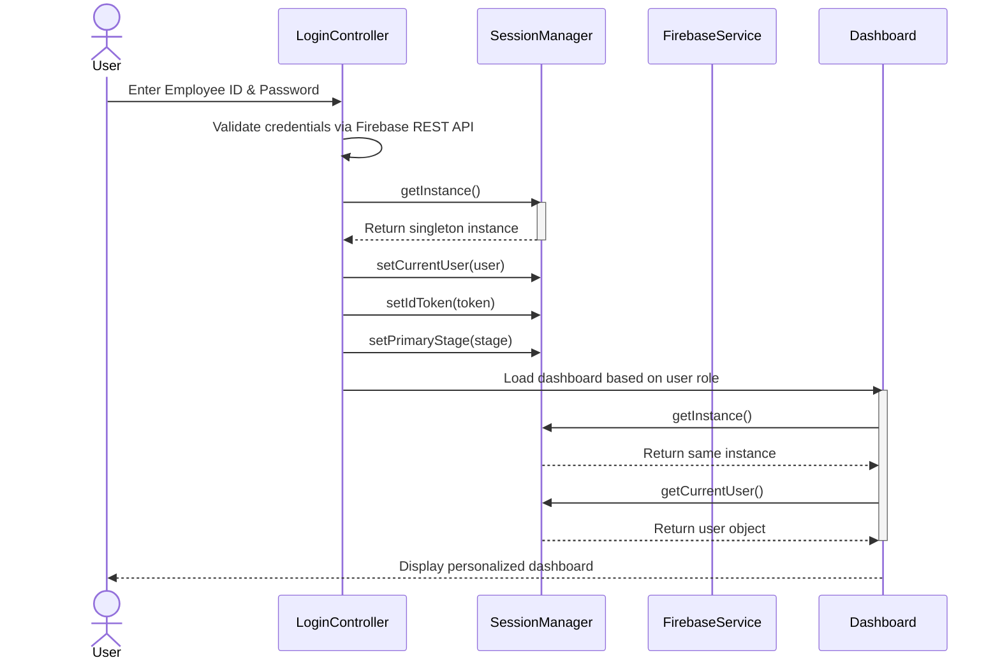
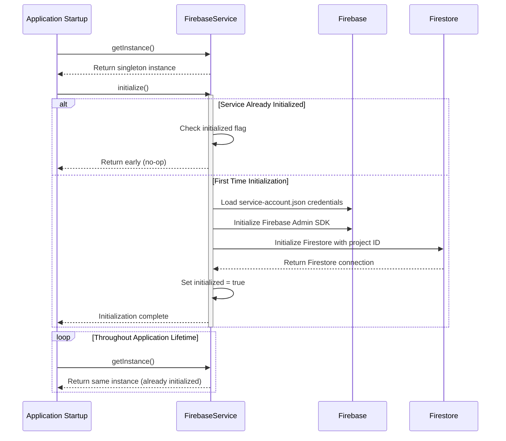
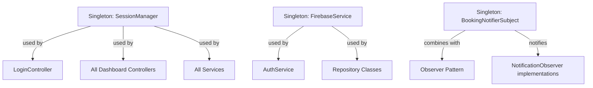

# Design Pattern: Singleton

## Pattern Overview
**Pattern Name:** Singleton  
**Category:** Creational Pattern  
**GoF Reference:** Ensure a class has only one instance and provide a global point of access to it.

---

## Problem This Pattern Solves

In the SRD Desktop application, several critical resources must be accessed globally and should never have multiple instances:

1. **User Session**: The currently logged-in user's data must be accessible from any controller
2. **Firebase Connection**: Multiple Firebase connections waste resources and cause authentication conflicts
3. **Event Notification Hub**: Booking notifications must flow through a single publisher to all subscribers

Without Singleton, these objects would either:
- Be passed as parameters through dozens of method calls (tight coupling)
- Be recreated multiple times, causing resource leaks and data inconsistency
- Require complex synchronization logic throughout the application

---

## Where It's Used in the Codebase

### 1. **SessionManager** - User Session Singleton
**Location:** `/src/main/java/com/aast/booking/core/SessionManager.java`

Holds the authenticated user's session data throughout the application lifecycle.

**Responsibilities:**
- Store the currently logged-in user (`User` object)
- Store the primary JavaFX stage for window management
- Store the Firebase ID token from REST API authentication
- Provide login status checking
- Support session logout

```java
public class SessionManager {
    private static SessionManager instance;
    private User currentUser;
    private Stage primaryStage;
    private String idToken;

    public static SessionManager getInstance() {
        if (instance == null) {
            synchronized (SessionManager.class) {
                if (instance == null) {
                    instance = new SessionManager();
                }
            }
        }
        return instance;
    }

    public void clearSession() {
        currentUser = null;
        idToken = null;
    }
}
```

### 2. **FirebaseService** - Database Connection Singleton
**Location:** `/src/main/java/com/aast/booking/core/FirebaseService.java`

Manages the single Firebase connection for the entire application using Firebase Admin SDK.

**Responsibilities:**
- Initialize Firebase Admin SDK with service account credentials
- Maintain the Firestore database connection (`Firestore` object)
- Manage initialization state to prevent double initialization
- Track whether Firestore access is available

```java
public class FirebaseService {
    private static FirebaseService instance;
    private Firestore firestore;
    private boolean initialized = false;

    public static FirebaseService getInstance() {
        if (instance == null) {
            synchronized (FirebaseService.class) {
                if (instance == null) {
                    instance = new FirebaseService();
                }
            }
        }
        return instance;
    }

    public void initialize() {
        if (initialized) return;
        // Initialize Firebase Admin SDK...
        initialized = true;
    }
}
```

### 3. **BookingNotifierSubject** - Event Publisher Singleton
**Location:** `/src/main/java/com/aast/booking/core/observer/BookingNotifierSubject.java`

Central event hub for booking notifications, combined with the Observer Pattern.

**Responsibilities:**
- Maintain a list of notification observers
- Broadcast booking events to all registered observers
- Provide observer registration/deregistration

```java
public class BookingNotifierSubject {
    private static BookingNotifierSubject instance;
    private final List<NotificationObserver> observers = new ArrayList<>();

    public static BookingNotifierSubject getInstance() {
        if (instance == null) {
            instance = new BookingNotifierSubject();
        }
        return instance;
    }

    public void notifyObservers(String message) {
        for (NotificationObserver observer : observers) {
            observer.onNotificationReceived(message);
        }
    }
}
```

---

## Implementation Details

### Thread-Safe Double-Checked Locking

All Singletons in this codebase use **double-checked locking** to ensure thread safety:

```java
public static synchronized getInstance() {
    if (instance == null) {  // 1st check (without lock)
        synchronized (ClassName.class) {
            if (instance == null) {  // 2nd check (with lock)
                instance = new ClassName();
            }
        }
    }
    return instance;
}
```

**Why this approach?**
- First null-check avoids acquiring lock on every call (performance)
- synchronized block ensures only one thread creates the instance (correctness)
- Works correctly with Java's memory model (visibility guaranteed)

### Private Constructor

All Singletons have a private constructor:
```java
private SessionManager() {}  // Prevents external instantiation
```

This prevents accidental creation of multiple instances via `new SessionManager()`.

---

## Mermaid Class Diagram



---

## Mermaid Sequence Diagram: SessionManager Usage Flow



---

## Mermaid Sequence Diagram: FirebaseService Initialization



---

## Code Examples from Real Usage

### Example 1: Accessing User in Any Controller

```java
// From EmployeeDashboardController.java
public class EmployeeDashboardController extends BaseDashboardController {
    @Override
    protected void initUI() {
        User currentUser = SessionManager.getInstance().getCurrentUser();
        displayNameLabel.setText(currentUser.getDisplayName());
    }
}
```

### Example 2: Checking Login Status

```java
// From LoginController.java
public void handleLogout() {
    SessionManager.getInstance().clearSession();
    navigateToLoginScreen();
}
```

### Example 3: Using Firestore from Any Service

```java
// From BookingService.java
public List<Booking> getApprovedBookings() {
    Firestore db = FirebaseService.getInstance().getFirestore();
    return db.collection("bookings")
        .whereEqualTo("status", "approved")
        .get()
        .get();
}
```

---

## Validation Checklist

- [ ] **Single Instance Only**: Verify that `getInstance()` always returns the same object reference
  - Test: `SessionManager.getInstance() == SessionManager.getInstance()` returns `true`
  
- [ ] **Private Constructor**: Ensure constructor is not public
  - Cannot create instances via `new SessionManager()`
  
- [ ] **Thread Safety**: Verify double-checked locking prevents race conditions
  - Test: Call `getInstance()` from multiple threads simultaneously
  
- [ ] **Initialization**: For FirebaseService, verify `initialize()` is called exactly once
  - Check: Application starts without multiple "Firebase initialized" logs
  
- [ ] **Lazy Initialization**: Verify instance is only created when first requested
  - FirebaseService and BookingNotifierSubject use lazy initialization
  
- [ ] **Session Cleanup**: Verify `clearSession()` properly resets all state
  - Test: After logout, `isLoggedIn()` returns `false`
  
- [ ] **No Memory Leaks**: Verify Singleton lifecycle matches application lifecycle
  - Singletons should persist for entire app duration, then garbage collected on exit

---

## Potential Issues & Mitigations

### Issue 1: Testing with Singletons
**Problem:** Unit tests may fail due to singleton state persisting between tests

**Mitigation:**
```java
// In test setup
SessionManager.getInstance().clearSession();
```

### Issue 2: Thread Safety in `BookingNotifierSubject`
**Problem:** The list of observers is not synchronized; concurrent modification errors possible

**Current Code:**
```java
private final List<NotificationObserver> observers = new ArrayList<>();  // Not thread-safe!
```

**Recommendation:**
```java
private final List<NotificationObserver> observers = 
    Collections.synchronizedList(new ArrayList<>());
```

### Issue 3: Lazy Initialization with Exceptions
**Problem:** If `initialize()` throws an exception, `initialized` is not marked as true

**Current Code:**
```java
public void initialize() {
    if (initialized) return;
    try {
        // Initialization code...
        initialized = true;  // Set after success
    } catch (IOException e) {
        System.err.println("Initialization failed");
        // initialized remains false, infinite retry loop possible
    }
}
```

**Current Mitigation:** File shows `initialized = true` in catch block, preventing infinite retries

---

## Design Pattern Relationships



---

## Notes on This Implementation

### Strengths
1. **Global Access Point**: Any class can access the singleton without dependency injection
2. **Resource Efficiency**: No duplicate Firebase connections or user session copies
3. **Thread-Safe**: Double-checked locking ensures safe multi-threaded access
4. **Lazy Initialization**: Resources created only when needed

### Weaknesses & Limitations
1. **Testing Complexity**: Singletons make unit testing harder; state persists between tests
2. **Hidden Dependencies**: Classes that use `getInstance()` don't declare their dependencies explicitly
3. **Static Access**: Using static methods can make code harder to understand (hidden coupling)
4. **Serialization Issues**: Singletons require special handling if object serialization is needed

### Alignment with Web Application
The web application (React) uses Context API and Redux to provide global state similarly:
- React Context ≈ Singleton concept
- Redux Store ≈ SessionManager concept
- Event Emitter ≈ BookingNotifierSubject concept

---

## Related Patterns in This Codebase

- **Factory Pattern**: `DashboardFactory` uses `SessionManager.getInstance()` to fetch user role
- **Observer Pattern**: `BookingNotifierSubject` extends Singleton with observer functionality
- **Facade Pattern**: `AuthService` and `AdminBookingFacade` use `FirebaseService.getInstance()`

---

## Recommended Best Practices

1. **Initialization at Startup**: Call `FirebaseService.getInstance().initialize()` in `Application.start()`
2. **Session Management**: Clear session in logout to prevent data leaks
3. **Observable Sessions**: Consider wrapping SessionManager with Observable properties for reactive UI updates
4. **Thread Pool**: Ensure database operations use daemon threads to avoid blocking application shutdown

---

**Last Updated:** 2024  
**Pattern Status:** ✅ Active - Used throughout codebase
