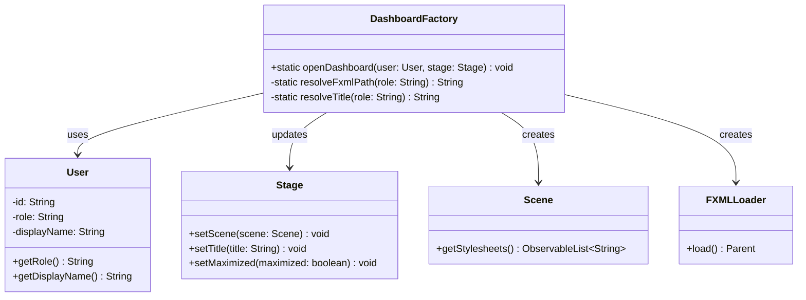
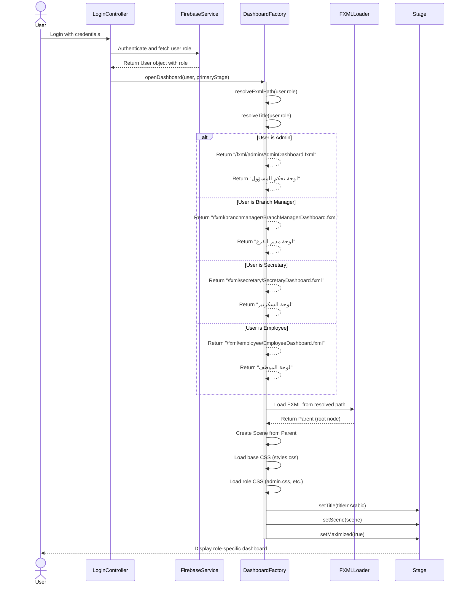
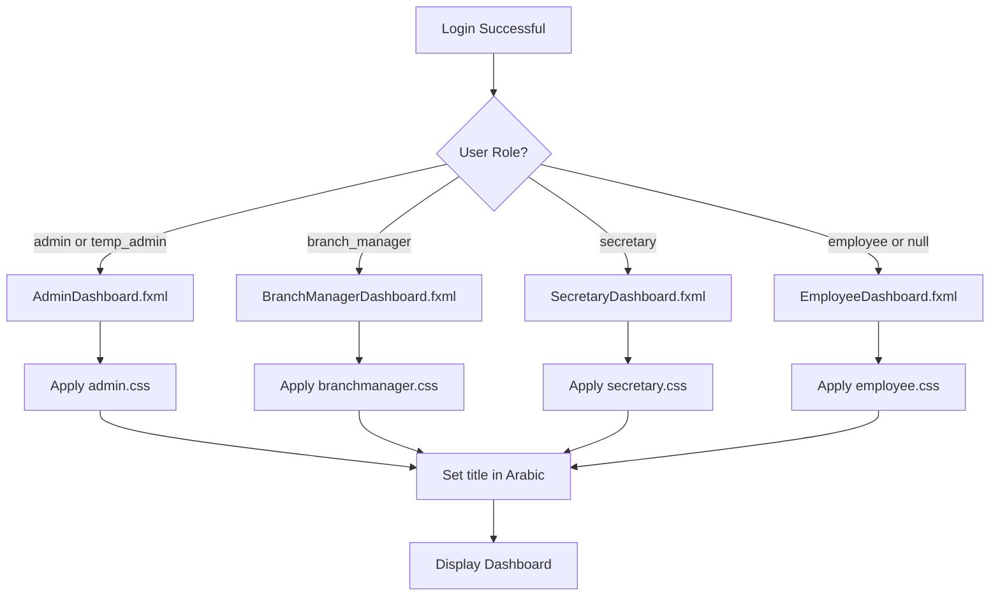
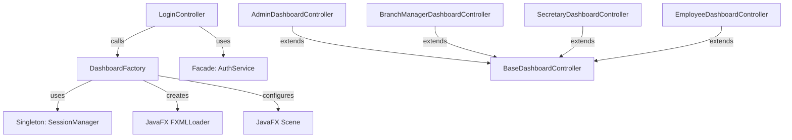

# Design Pattern: Factory

## Pattern Overview
**Pattern Name:** Factory Method  
**Category:** Creational Pattern  
**GoF Reference:** Define an interface for creating an object, but let subclasses decide which class to instantiate.

---

## Problem This Pattern Solves

The SRD application supports four different user roles, each with a completely different dashboard interface:
- **Employee**: Basic dashboard for room requests
- **Admin**: Administrative control panel
- **Branch Manager**: Management interface for branch approvals
- **Secretary**: Booking management interface

After login, the application needs to:
1. Load the correct FXML file for the user's role
2. Apply role-specific CSS styles
3. Set appropriate window titles in Arabic
4. Initialize role-specific UI components

**Without Factory Pattern:**
- LoginController would have massive if-else chains
- New roles would require modifying LoginController
- Role-to-resource mapping logic would be scattered throughout the code
- Testing different dashboard initialization would be difficult

**With Factory Pattern:**
- Role-to-dashboard mapping is centralized in one place
- Adding a new role only requires modifying the factory
- Other controllers don't need to know about role-specific logic

---

## Where It's Used in the Codebase

### **DashboardFactory** - Main Factory Implementation
**Location:** `/src/main/java/com/aast/booking/core/DashboardFactory.java`

Centralizes all role-to-dashboard routing logic.

**Responsibilities:**
1. Resolve the correct FXML file path based on role
2. Resolve the correct window title in Arabic based on role
3. Resolve the correct CSS stylesheet based on role
4. Create and display the dashboard scene

```java
public class DashboardFactory {
    
    public static void openDashboard(User user, Stage stage) throws IOException {
        String fxmlPath = resolveFxmlPath(user.getRole());
        String title    = resolveTitle(user.getRole());
        
        FXMLLoader loader = new FXMLLoader(
            DashboardFactory.class.getResource(fxmlPath)
        );
        
        Scene scene = new Scene(loader.load());
        // Load role-specific CSS...
        
        stage.setTitle(title + " - " + user.getDisplayName());
        stage.setScene(scene);
        stage.setMaximized(true);
    }
}
```

---

## Implementation Details

### Factory Method 1: FXML Path Resolution

```java
private static String resolveFxmlPath(String role) {
    if (role == null) role = "employee";
    return switch (role) {
        case "admin", "temp_admin" 
            -> "/fxml/admin/AdminDashboard.fxml";
        case "branch_manager"      
            -> "/fxml/branchmanager/BranchManagerDashboard.fxml";
        case "secretary"           
            -> "/fxml/secretary/SecretaryDashboard.fxml";
        default                    
            -> "/fxml/employee/EmployeeDashboard.fxml";
    };
}
```

**Key Design Decisions:**
- Null-safe: Defaults to "employee" if role is null
- Handles "temp_admin" role (temporary administrator, same dashboard as admin)
- Uses Java 14+ switch expressions for clean mapping

### Factory Method 2: Window Title Resolution

```java
private static String resolveTitle(String role) {
    if (role == null) role = "employee";
    return switch (role) {
        case "admin", "temp_admin" 
            -> "لوحة تحكم المسؤول";           // "Admin Control Panel"
        case "branch_manager"      
            -> "لوحة مدير الفرع";             // "Branch Manager Dashboard"
        case "secretary"           
            -> "لوحة السكرتير";               // "Secretary Dashboard"
        default                    
            -> "لوحة الموظف";                 // "Employee Dashboard"
    };
}
```

**Localization Approach:**
- All titles are hardcoded in Arabic (no resource bundle needed for now)
- Mirrors the web app's Arabic UI

### Factory Method 3: CSS Stylesheet Resolution

```java
String cssRole = switch (user.getRole() != null ? user.getRole() : "") {
    case "admin", "temp_admin" -> "/css/admin.css";
    case "branch_manager"      -> "/css/branchmanager.css";
    case "secretary"           -> "/css/secretary.css";
    default                    -> "/css/employee.css";
};
var roleUrl = DashboardFactory.class.getResource(cssRole);
if (roleUrl != null) scene.getStylesheets().add(roleUrl.toExternalForm());
```

**CSS Organization:**
- Base styles in `/css/styles.css`
- Role-specific overrides in role CSS files
- Graceful fallback if CSS file not found

---

## Mermaid Class Diagram



---

## Mermaid Sequence Diagram: Dashboard Creation Flow



---

## Role Mapping Reference Table

| Role | FXML File | Window Title (Arabic) | CSS File | Purpose |
|------|-----------|------------------------|----------|---------|
| `admin` | `/fxml/admin/AdminDashboard.fxml` | لوحة تحكم المسؤول | `/css/admin.css` | System administrator controls |
| `temp_admin` | `/fxml/admin/AdminDashboard.fxml` | لوحة تحكم المسؤول | `/css/admin.css` | Temporary admin (same as admin) |
| `branch_manager` | `/fxml/branchmanager/BranchManagerDashboard.fxml` | لوحة مدير الفرع | `/css/branchmanager.css` | Branch-level approvals |
| `secretary` | `/fxml/secretary/SecretaryDashboard.fxml` | لوحة السكرتير | `/css/secretary.css` | Booking management |
| `employee` (default) | `/fxml/employee/EmployeeDashboard.fxml` | لوحة الموظف | `/css/employee.css` | Regular employee bookings |

---

## Code Examples from Real Usage

### Example 1: Usage in LoginController

```java
public class LoginController {
    
    @FXML
    private void handleLoginSuccess(User user) {
        SessionManager.getInstance().setCurrentUser(user);
        SessionManager.getInstance().setPrimaryStage(primaryStage);
        
        try {
            DashboardFactory.openDashboard(user, primaryStage);
        } catch (IOException e) {
            showErrorAlert("Failed to load dashboard: " + e.getMessage());
        }
    }
}
```

### Example 2: Adding a New Role

To add a new role like `"department_head"`, only modify DashboardFactory:

```java
private static String resolveFxmlPath(String role) {
    if (role == null) role = "employee";
    return switch (role) {
        case "admin", "temp_admin" 
            -> "/fxml/admin/AdminDashboard.fxml";
        case "branch_manager"      
            -> "/fxml/branchmanager/BranchManagerDashboard.fxml";
        case "secretary"           
            -> "/fxml/secretary/SecretaryDashboard.fxml";
        case "department_head"     // NEW: Add here
            -> "/fxml/departmenthead/DepartmentHeadDashboard.fxml";
        default                    
            -> "/fxml/employee/EmployeeDashboard.fxml";
    };
}

// And in resolveTitle:
private static String resolveTitle(String role) {
    return switch (role) {
        // ... existing cases ...
        case "department_head"     // NEW: Add here
            -> "لوحة رئيس القسم";
        default                    
            -> "لوحة الموظف";
    };
}
```

---

## Validation Checklist

- [ ] **Role-to-FXML Mapping**: All roles correctly map to FXML files
  - Test: Login with each role type and verify correct dashboard loads
  
- [ ] **Window Titles**: Arabic titles display correctly in window title bar
  - Test: Verify title bar shows appropriate Arabic text
  
- [ ] **CSS Application**: Role-specific styling applies correctly
  - Test: Login as different roles and verify visual differences
  
- [ ] **Default Role**: Null/unknown roles default to "employee"
  - Test: Create user with null or invalid role and verify employee dashboard loads
  
- [ ] **File Not Found Handling**: CSS files gracefully skip if not found
  - Test: Remove a CSS file and verify app doesn't crash
  
- [ ] **FXML Loading**: Invalid FXML paths throw appropriate IOException
  - Test: Modify FXML path and catch exception handling
  
- [ ] **Maximized State**: Dashboard opens maximized for all roles
  - Test: Verify all dashboards open in maximized state

---

## Mermaid Diagram: Factory Decision Tree



---

## Design Pattern Relationships



---

## Alignment with Web Application

The Java DashboardFactory mirrors the React web app's routing logic:

**Web App (React):**
```javascript
// From LoginScreen.jsx
useEffect(() => {
    if (role === 'admin') navigate('/admin');
    else if (role === 'branch_manager') navigate('/branch_manager');
    else if (role === 'secretary') navigate('/secretary');
    else navigate('/dashboard');
}, [role, navigate]);
```

**Java App (DashboardFactory):**
```java
String fxmlPath = switch (role) {
    case "admin", "temp_admin" -> "/fxml/admin/AdminDashboard.fxml";
    case "branch_manager" -> "/fxml/branchmanager/BranchManagerDashboard.fxml";
    case "secretary" -> "/fxml/secretary/SecretaryDashboard.fxml";
    default -> "/fxml/employee/EmployeeDashboard.fxml";
};
```

Both systems:
- Centralize routing logic
- Handle null/unknown roles gracefully
- Apply role-specific styling
- Support role hierarchies (e.g., temp_admin → admin)

---

## Potential Issues & Mitigations

### Issue 1: Missing FXML Files
**Problem:** If an FXML file is not in classpath, FXMLLoader.load() throws exception

**Current Handling:** Checked by LoginController:
```java
try {
    DashboardFactory.openDashboard(user, primaryStage);
} catch (IOException e) {
    showErrorAlert("Failed to load dashboard");
}
```

**Recommendation:** Pre-validate FXML existence at startup:
```java
private static void validateFxmlFiles() {
    for (String role : Arrays.asList("admin", "branch_manager", "secretary", "employee")) {
        String path = resolveFxmlPath(role);
        if (DashboardFactory.class.getResource(path) == null) {
            throw new RuntimeException("Missing FXML: " + path);
        }
    }
}
```

### Issue 2: Role String Case Sensitivity
**Problem:** If role from Firebase is "ADMIN" instead of "admin", switch statement fails

**Current Mitigation:** Convert role to lowercase in AuthService before storing

**Recommendation:** Add validation in User class:
```java
public void setRole(String role) {
    this.role = role != null ? role.toLowerCase() : "employee";
}
```

### Issue 3: CSS File Not Loading
**Problem:** Stylesheet path typo silently fails; styling looks wrong

**Recommendation:** Log CSS loading:
```java
var roleUrl = DashboardFactory.class.getResource(cssRole);
if (roleUrl != null) {
    scene.getStylesheets().add(roleUrl.toExternalForm());
    System.out.println("CSS loaded: " + cssRole);
} else {
    System.err.println("CSS not found: " + cssRole);
}
```

---

## Notes on This Implementation

### Strengths
1. **Centralized Logic**: All role-to-dashboard mapping in one place
2. **Easy to Extend**: Adding new roles is simple and isolated
3. **Type-Safe**: Java switch expressions catch typos at compile time
4. **Clean Code**: No if-else chains scattered throughout codebase
5. **Consistent with Web App**: Mirrors the React routing pattern

### Weaknesses
1. **Hardcoded Paths**: FXML and CSS paths are string literals (no type checking)
2. **Limited Extensibility**: New features require code changes (not configuration-based)
3. **No Validation**: Could verify FXML/CSS exist at startup

### Future Improvements
1. **Configuration-Based**: Load role mappings from JSON/XML config file
2. **Annotation-Driven**: Use annotations to automatically register dashboard classes
3. **Lazy Loading**: Load FXML on-demand rather than immediately
4. **Dashboard Registry**: Create a registry pattern for dashboard metadata

---

## Related Patterns in This Codebase

- **Singleton Pattern**: Uses `SessionManager.getInstance()` to access user data
- **Template Method Pattern**: `BaseDashboardController` provides initialization template
- **Strategy Pattern**: Different dashboard controllers implement different strategies

---

## Recommended Best Practices

1. **Pre-Validate at Startup**: Check all FXML files exist before allowing login
2. **Internationalization**: Move Arabic titles to resource bundle for easy localization
3. **Consistent Naming**: Keep role names consistent across web app and Java app
4. **Unit Testing**: Test each role's FXML path resolution:
   ```java
   assertEquals("/fxml/admin/AdminDashboard.fxml", 
                DashboardFactory.resolveFxmlPath("admin"));
   ```

---

**Last Updated:** 2024  
**Pattern Status:** ✅ Active - Used in every login sequence
