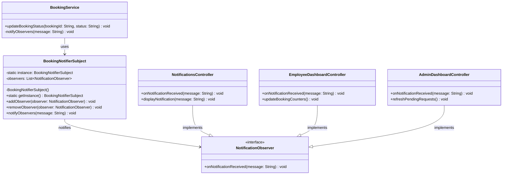
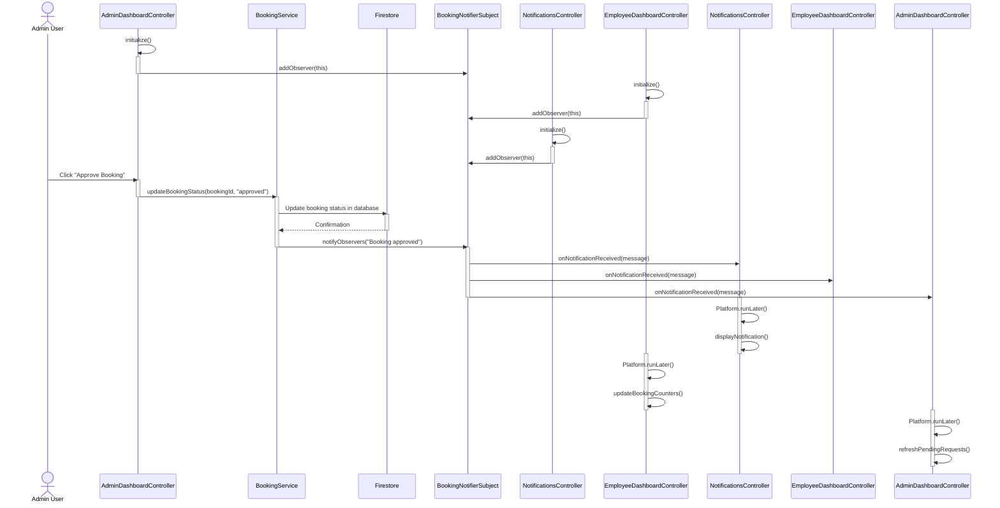
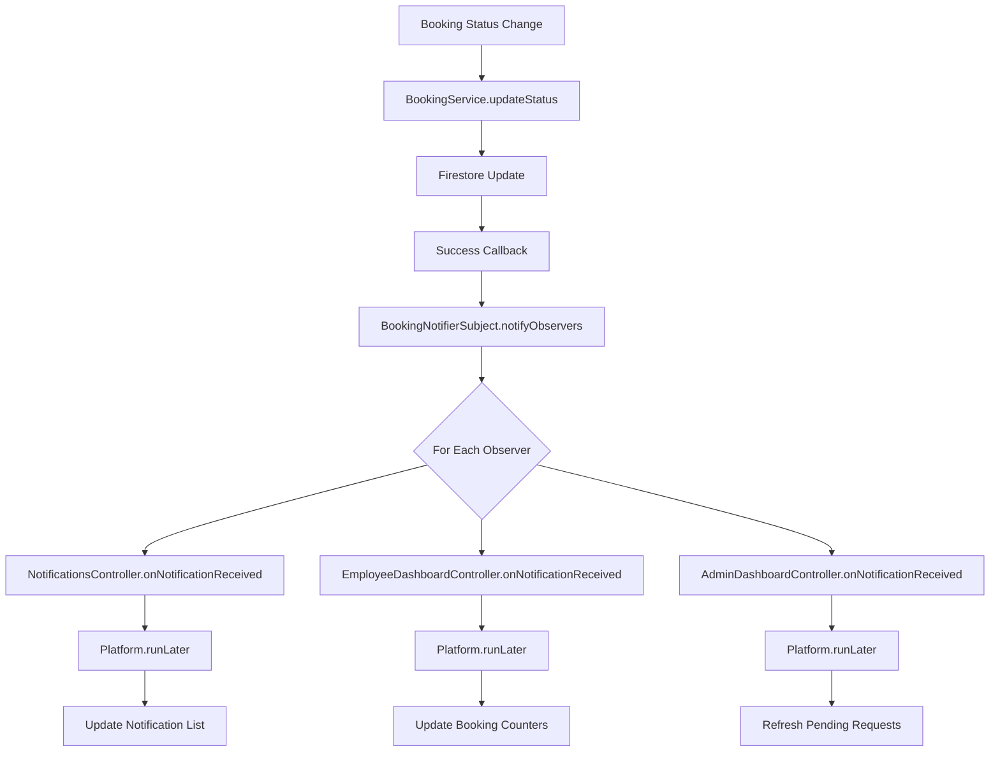
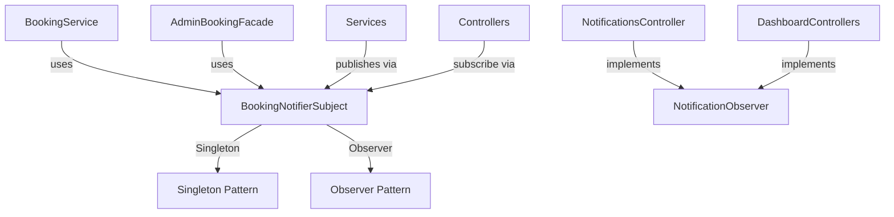

# Design Pattern: Observer

## Pattern Overview
**Pattern Name:** Observer (Publisher-Subscriber)  
**Category:** Behavioral Pattern  
**GoF Reference:** Define a one-to-many dependency between objects so that when one object changes state, all its dependents are notified automatically.

---

## Problem This Pattern Solves

In the SRD Desktop application, booking notifications need to be sent to multiple UI components whenever a booking status changes:
- Notification panel needs to display new notifications
- Dashboard counters need to update
- List views need to refresh
- Multiple screens may need to react to the same event

**Without Observer Pattern:**
- Each status change would require calling every UI component directly (tight coupling)
- Adding a new component that needs notifications would require modifying the booking service
- Testing components in isolation becomes difficult
- Different controllers can't discover that other controllers need the same event

**With Observer Pattern:**
- The booking system notifies all interested parties without knowing who they are
- UI components subscribe to notifications they care about
- New subscribers can be added without modifying the publisher
- Components are decoupled from the event source

---

## Where It's Used in the Codebase

### 1. **BookingNotifierSubject** - The Publisher
**Location:** `/src/main/java/com/aast/booking/core/observer/BookingNotifierSubject.java`

Central event hub that publishes booking-related events to all registered observers.

**Responsibilities:**
- Maintain a list of registered observers
- Broadcast events to all observers when they occur
- Allow registration and deregistration of observers

```java
public class BookingNotifierSubject {
    private static BookingNotifierSubject instance;
    private final List<NotificationObserver> observers = new ArrayList<>();

    public static BookingNotifierSubject getInstance() {
        if (instance == null) {
            instance = new BookingNotifierSubject();
        }
        return instance;
    }

    public void addObserver(NotificationObserver observer) {
        observers.add(observer);
    }

    public void removeObserver(NotificationObserver observer) {
        observers.remove(observer);
    }

    public void notifyObservers(String message) {
        for (NotificationObserver observer : observers) {
            observer.onNotificationReceived(message);
        }
    }
}
```

### 2. **NotificationObserver** - The Observer Interface
**Location:** `/src/main/java/com/aast/booking/core/observer/NotificationObserver.java`

Defines the contract that all observers must implement.

```java
public interface NotificationObserver {
    void onNotificationReceived(String message);
}
```

### 3. **Observer Implementations** - Concrete Observers

Throughout the codebase, various UI components implement `NotificationObserver`:

```java
public class NotificationsController implements NotificationObserver {
    @Override
    public void onNotificationReceived(String message) {
        Platform.runLater(() -> {
            displayNotification(message);
            refreshNotificationList();
        });
    }
}

public class EmployeeDashboardController extends BaseDashboardController 
    implements NotificationObserver {
    
    @Override
    public void onNotificationReceived(String message) {
        Platform.runLater(() -> {
            updateBookingCounters();
            refreshBookingList();
        });
    }
}
```

---

## Implementation Details

### Observer Registration Pattern

Controllers register themselves when initialized:

```java
public class NotificationsController implements Initializable, NotificationObserver {
    
    @Override
    public void initialize(URL location, ResourceBundle resources) {
        // Register as observer for booking notifications
        BookingNotifierSubject.getInstance().addObserver(this);
    }
    
    @Override
    public void onNotificationReceived(String message) {
        // Handle notification
        System.out.println("Notification received: " + message);
    }
}
```

### Event Publishing Pattern

When a booking status changes, the service publishes the event:

```java
public class BookingService {
    
    public void updateBookingStatus(String bookingId, String newStatus) {
        // Update the booking in Firestore
        db.collection("bookings").document(bookingId)
            .update("status", newStatus)
            .thenRun(() -> {
                // Notify all observers
                String message = "Booking " + bookingId + " status changed to " + newStatus;
                BookingNotifierSubject.getInstance().notifyObservers(message);
            });
    }
}
```

### Thread-Safe Notification

Since notifications come from background threads, observers use `Platform.runLater()`:

```java
@Override
public void onNotificationReceived(String message) {
    Platform.runLater(() -> {
        // UI updates must happen on JavaFX thread
        updateUI(message);
    });
}
```

---

## Mermaid Class Diagram



---

## Mermaid Sequence Diagram: Complete Notification Flow



---

## Code Examples from Real Usage

### Example 1: Controller Subscribing to Notifications

```java
public class NotificationsController 
    extends BaseDashboardController 
    implements NotificationObserver {
    
    @FXML private VBox notificationContainer;
    
    @Override
    protected void setupObservers() {
        BookingNotifierSubject.getInstance().addObserver(this);
    }
    
    @Override
    public void onNotificationReceived(String message) {
        Platform.runLater(() -> {
            // Parse the message (could be JSON or structured format)
            Notification notif = parseNotification(message);
            
            // Add to display
            notificationContainer.getChildren().add(
                createNotificationCard(notif)
            );
            
            // Play notification sound (optional)
            playNotificationSound();
        });
    }
    
    @Override
    protected void initUI() { /* ... */ }
    
    @Override
    protected void loadData() { /* ... */ }
}
```

### Example 2: Service Publishing Events

```java
public class AdminBookingService {
    
    public void approveBooking(String bookingId, String roomId) {
        Firestore db = FirebaseService.getInstance().getFirestore();
        
        Map<String, Object> updates = new HashMap<>();
        updates.put("status", "approved");
        updates.put("approvedRoomId", roomId);
        updates.put("approvedAt", FieldValue.serverTimestamp());
        
        db.collection("bookings").document(bookingId)
            .update(updates)
            .addOnSuccessListener(unused -> {
                // Publish notification to all observers
                String message = String.format(
                    "{\"type\":\"booking_approved\",\"bookingId\":\"%s\",\"roomId\":\"%s\"}",
                    bookingId, roomId
                );
                BookingNotifierSubject.getInstance().notifyObservers(message);
            })
            .addOnFailureListener(e -> {
                System.err.println("Failed to approve: " + e.getMessage());
            });
    }
}
```

### Example 3: Observer Cleanup on Controller Close

```java
public class EmployeeDashboardController extends BaseDashboardController {
    
    @Override
    public void initialize(URL location, ResourceBundle resources) {
        super.initialize(location, resources);
        // Register observer
        BookingNotifierSubject.getInstance().addObserver(this);
    }
    
    public void onControllerClosed() {
        // Unregister when controller is no longer needed
        BookingNotifierSubject.getInstance().removeObserver(this);
    }
    
    @Override
    public void onNotificationReceived(String message) {
        // Handle notification
    }
}
```

---

## Validation Checklist

- [ ] **Observer Registration**: Observers correctly register in initialize() method
  - Test: Verify `getInstance().addObserver(this)` called in controller initialization
  
- [ ] **Observer Notification**: All registered observers receive notifications
  - Test: Register 3 different observers and verify all receive event
  
- [ ] **Event Deduplication**: Same observer not registered multiple times
  - Test: Initialize same controller twice and verify it only receives one notification
  
- [ ] **Thread Safety**: UI updates happen on JavaFX thread
  - Test: Trigger notification from background thread and verify no UI errors
  
- [ ] **Observer Cleanup**: Observers unregister when no longer needed
  - Test: Close controller and verify old observers don't receive new events
  
- [ ] **Message Format**: Notification message is parseable and contains relevant data
  - Test: Parse notification JSON and extract booking ID, status, etc.
  
- [ ] **No Memory Leaks**: Removed observers are garbage collected
  - Test: Monitor memory usage after registering/unregistering many observers

---

## Mermaid Diagram: Observer Event Flow



---

## Observer Types and Message Formats

```
notification_types = {
    "booking_created": {
        "bookingId": "...",
        "roomId": "...",
        "userId": "...",
        "date": "2024-12-15",
        "timeFrom": "14:00",
        "timeTo": "15:30"
    },
    "booking_approved": {
        "bookingId": "...",
        "roomId": "...",
        "approvedBy": "admin@aast.edu"
    },
    "booking_rejected": {
        "bookingId": "...",
        "reason": "...",
        "suggestedRoomId": "..."
    },
    "booking_status_changed": {
        "bookingId": "...",
        "oldStatus": "pending",
        "newStatus": "approved"
    }
}
```

---

## Design Pattern Relationships



---

## Alignment with Web Application

The Java Observer pattern mirrors the web app's event system:

**Web App (React):**
```javascript
// EventEmitter pattern in Redux or Context API
useEffect(() => {
    const unsubscribe = firebaseDb
        .collection('bookings')
        .onSnapshot(snapshot => {
            dispatch(updateBookings(snapshot.docs));
            // Notify all components
        });
    return unsubscribe;
}, []);
```

**Java App (Observer):**
```java
// Similar event publication system
BookingNotifierSubject.getInstance().addObserver(this);
// Events published when Firestore data changes
public void onNotificationReceived(String message) {
    updateUI(message);
}
```

Both systems:
- Publish events when data changes
- Allow multiple subscribers
- Decouple publishers from subscribers
- Use real-time database listeners

---

## Potential Issues & Mitigations

### Issue 1: Memory Leaks from Observer Registration
**Problem:** If observer is not unregistered, it keeps reference alive

**Current Code Issue:**
```java
public class EmployeeDashboardController implements NotificationObserver {
    @Override
    public void initialize(URL location, ResourceBundle resources) {
        BookingNotifierSubject.getInstance().addObserver(this);
        // No cleanup when controller destroyed!
    }
}
```

**Recommendation:** Implement cleanup:
```java
public void cleanup() {
    BookingNotifierSubject.getInstance().removeObserver(this);
}

// In FXML controller cleanup:
@FXML
public void onControllerClosed() {
    cleanup();
}
```

### Issue 2: Not Thread-Safe Iteration
**Problem:** If observer is added/removed during notification, ConcurrentModificationException

**Current Code:**
```java
private final List<NotificationObserver> observers = new ArrayList<>();  // Not thread-safe

public void notifyObservers(String message) {
    for (NotificationObserver observer : observers) {  // Can fail if list modified
        observer.onNotificationReceived(message);
    }
}
```

**Recommendation:** Use synchronized list or copy:
```java
private final List<NotificationObserver> observers = 
    Collections.synchronizedList(new ArrayList<>());

public void notifyObservers(String message) {
    // Create a copy to avoid ConcurrentModificationException
    List<NotificationObserver> observersCopy = new ArrayList<>(observers);
    for (NotificationObserver observer : observersCopy) {
        observer.onNotificationReceived(message);
    }
}
```

### Issue 3: Exception in One Observer Blocks Others
**Problem:** If one observer throws exception, other observers don't get notified

**Current Code:**
```java
public void notifyObservers(String message) {
    for (NotificationObserver observer : observers) {
        observer.onNotificationReceived(message);  // If throws, loop stops
    }
}
```

**Recommendation:** Add error handling:
```java
public void notifyObservers(String message) {
    for (NotificationObserver observer : observers) {
        try {
            observer.onNotificationReceived(message);
        } catch (Exception e) {
            System.err.println("Observer failed: " + e.getMessage());
            // Continue to next observer
        }
    }
}
```

---

## Notes on This Implementation

### Strengths
1. **Loose Coupling**: Publishers don't know about specific observers
2. **Dynamic Subscriptions**: Observers can register at runtime
3. **Separation of Concerns**: UI components don't call each other directly
4. **Easy Testing**: Can test observers independently
5. **Scalable**: Adding new observers doesn't require code changes

### Weaknesses
1. **Hidden Dependencies**: Controllers register observers in `initialize()` without declaring dependency
2. **Memory Leaks**: Forgetting to unregister observers causes memory leaks
3. **Ordering Issues**: Observer notification order is unpredictable
4. **Threading Complexity**: Must use `Platform.runLater()` for UI updates
5. **Debugging Difficulty**: Hard to trace which observer caused an issue

### Future Improvements
1. **Event Bus Library**: Use Event Bus (Guava, Otto) for more robust event handling
2. **Strong Typing**: Use typed events instead of String messages
3. **Priority-Based**: Allow observers to specify priority (execute first/last)
4. **Async Notifications**: Support asynchronous observer notification with executors
5. **Lifecycle Management**: Automatic cleanup tied to FXML controller lifecycle

---

## Related Patterns in This Codebase

- **Singleton Pattern**: `BookingNotifierSubject` is a Singleton
- **Facade Pattern**: `AdminBookingFacade` uses Observer to notify about status changes
- **Mediator Pattern**: Could replace Observer for more centralized control

---

## Recommended Best Practices

1. **Explicit Cleanup**: Always unregister observers in controller cleanup
   ```java
   public void onDestroy() {
       BookingNotifierSubject.getInstance().removeObserver(this);
   }
   ```

2. **Strong Typing**: Use typed messages instead of String:
   ```java
   public record BookingEvent(String bookingId, String status) { }
   
   public interface TypedObserver<T> {
       void onEvent(T event);
   }
   ```

3. **Weak References**: Use WeakReferences to prevent memory leaks
   ```java
   private List<WeakReference<NotificationObserver>> observers;
   ```

4. **Error Handling**: Wrap observer calls in try-catch

5. **Logging**: Log all published events for debugging
   ```java
   System.out.println("[Observer] Publishing: " + message);
   ```

---

**Last Updated:** 2024  
**Pattern Status:** ✅ Active - Used for booking notifications
