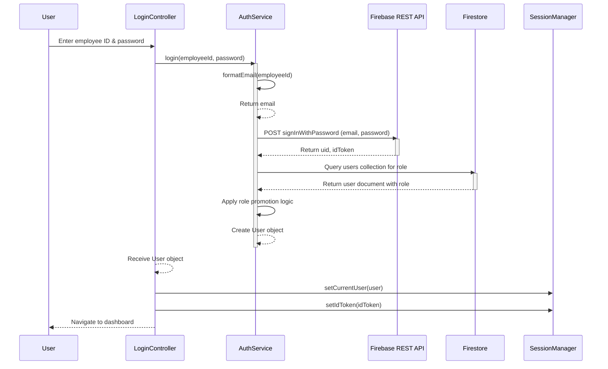
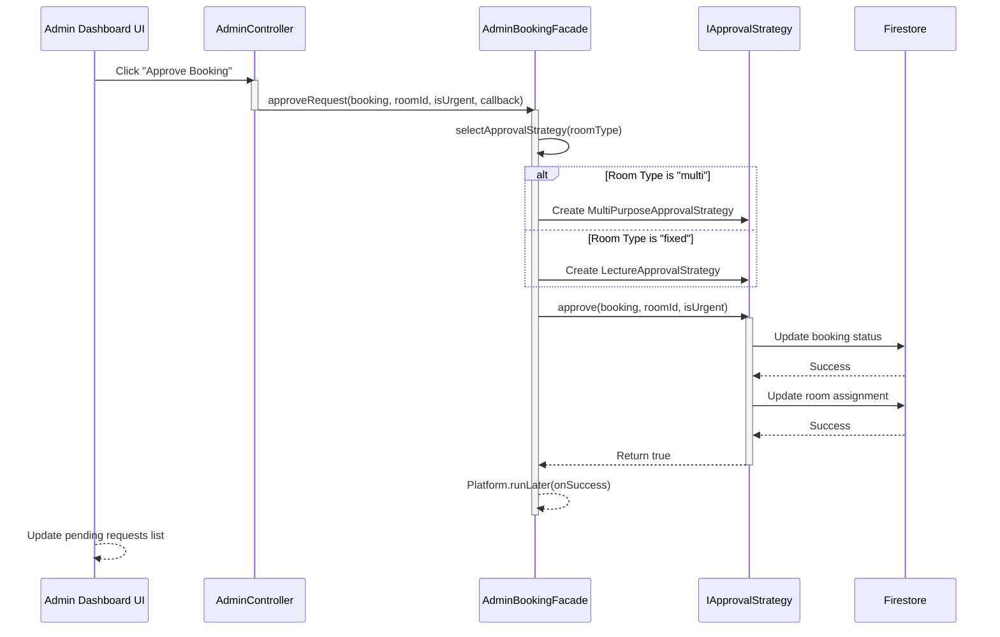
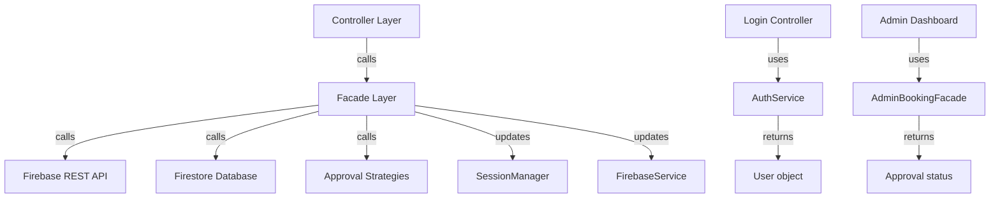
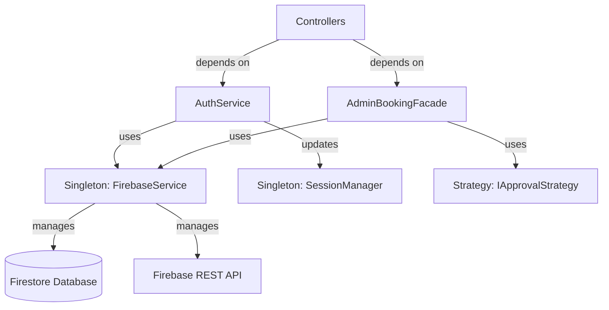

# Design Pattern: Facade

## Pattern Overview
**Pattern Name:** Facade  
**Category:** Structural Pattern  
**GoF Reference:** Provide a unified, simplified interface to a set of interfaces in a subsystem.

---

## Problem This Pattern Solves

The SRD Desktop application interacts with Firebase in complex ways:
- REST API authentication with multiple steps
- Firestore database queries with error handling
- Token management and session state
- Role-based permission lookups
- Multiple failure scenarios requiring retry logic

**Without Facade Pattern:**
- Controllers would make direct Firebase API calls
- Every controller would need to handle authentication complexity
- Changes to Firebase integration would require updating many controllers
- Duplicate code for common operations (fetch user, update booking, etc.)

**With Facade Pattern:**
- Controllers call simple high-level methods on service classes
- All Firebase complexity hidden behind clean interfaces
- Firebase changes only require updating the service layer
- Consistent error handling and logging across the application

---

## Where It's Used in the Codebase

### 1. **AuthService** - Authentication Facade
**Location:** `/src/main/java/com/aast/booking/auth/AuthService.java`

Hides the complexity of Firebase authentication and user role fetching.

**Responsibilities:**
- Handle Firebase REST API authentication
- Fetch user role from Firestore
- Apply role promotion rules (hardcoded for test accounts)
- Convert employee ID to Firebase email format
- Manage ID tokens
- Handle authentication errors gracefully

```java
public class AuthService {
    
    private static final String FIREBASE_AUTH_URL = 
        "https://identitytoolkit.googleapis.com/v1/accounts:signInWithPassword?key=...";
    
    private static final Map<String, String[]> ROLES_MAP = new HashMap<>();
    static {
        ROLES_MAP.put("admin@aast.edu", new String[]{"admin", "المسؤول العام"});
        ROLES_MAP.put("manager@aast.edu", new String[]{"branch_manager", "مدير الفرع"});
        // ... more roles
    }
    
    // Simple interface for login
    public static User login(String employeeId, String password) 
        throws AuthException {
        
        String email = formatEmail(employeeId);
        
        // Step 1: Firebase REST authentication
        String uid = authenticateViaRest(email, password);
        String idToken = fetchIdToken(email, password);
        
        // Step 2: Fetch role from Firestore
        String role = fetchRoleFromFirestore(uid);
        
        // Step 3: Apply role promotion logic
        applyRolePromotion(email);
        
        // Step 4: Create and return user object
        return new User(uid, email, role);
    }
    
    public static String formatEmail(String employeeId) {
        return employeeId.trim() + "@aast.edu";
    }
}
```

### 2. **AdminBookingFacade** - Admin Operations Facade
**Location:** `/src/main/java/com/aast/booking/admin/facade/AdminBookingFacade.java`

Simplifies complex admin booking operations.

**Responsibilities:**
- Listen to pending booking requests in real-time
- Execute approval workflow for different room types
- Handle rejection with suggestions
- Manage room assignment and scheduling
- Provide role-based approval strategies

```java
public class AdminBookingFacade {
    
    private ListenerRegistration pendingRequestsListener;
    
    // Simple interface for listening to pending requests
    public void listenToPendingRequests(
        Consumer<List<Booking>> onUpdate, 
        Consumer<Exception> onError) {
        
        Firestore db = FirebaseService.getInstance().getFirestore();
        
        Thread t = new Thread(() -> {
            try {
                QuerySnapshot snapshots = db.collection("bookings")
                    .whereIn("status", List.of("pending", "awaiting_manager_final"))
                    .limit(100)
                    .get()
                    .get();
                
                List<Booking> list = new ArrayList<>();
                for (DocumentSnapshot doc : snapshots.getDocuments()) {
                    list.add(Booking.fromDocument(doc));
                }
                list.sort((a, b) -> 
                    b.getCreatedAt().compareTo(a.getCreatedAt())
                );
                
                Platform.runLater(() -> onUpdate.accept(list));
            } catch (Exception e) {
                Platform.runLater(() -> onError.accept(e));
            }
        });
        t.setDaemon(true);
        t.start();
    }
    
    // Simple interface for approval
    public void approveRequest(
        Booking booking, 
        String roomId, 
        boolean isUrgent, 
        Runnable onSuccess, 
        Consumer<Exception> onError) {
        
        Thread t = new Thread(() -> {
            try {
                // Select strategy based on room type
                IApprovalStrategy strategy = booking.getRoomType().equals("multi")
                    ? new MultiPurposeApprovalStrategy()
                    : new LectureApprovalStrategy();
                
                boolean success = strategy.approve(booking, roomId, isUrgent);
                if (success) {
                    Platform.runLater(onSuccess);
                } else {
                    Platform.runLater(() -> 
                        onError.accept(new Exception("Approval failed"))
                    );
                }
            } catch (Exception e) {
                Platform.runLater(() -> onError.accept(e));
            }
        });
        t.setDaemon(true);
        t.start();
    }
}
```

---

## Implementation Details

### Facade Layer Architecture

```
┌─────────────────────────────────────────┐
│     Controllers (What users see)         │
├─────────────────────────────────────────┤
│  Facade Layer (Simple interface)         │
│  - AuthService                           │
│  - AdminBookingFacade                    │
│  - BookingService                        │
├─────────────────────────────────────────┤
│  Complex Subsystems (Hidden complexity)  │
│  - Firebase REST API                     │
│  - Firestore queries                     │
│  - Approval strategies                   │
│  - Error handling                        │
└─────────────────────────────────────────┘
```

### AuthService Facade Structure

```java
public class AuthService {
    
    // Facade Methods (Simple, high-level interface)
    public static User login(String employeeId, String password) { }
    public static User register(String employeeId, String password) { }
    public static void logout() { }
    
    // Private Helper Methods (Complex implementation details)
    private static String authenticateViaRest(String email, String password) { }
    private static String fetchIdToken(String email, String password) { }
    private static String fetchRoleFromFirestore(String uid) { }
    private static void applyRolePromotion(String email) { }
}
```

### Error Handling Within Facade

```java
public class AuthService {
    
    public static User login(String employeeId, String password) 
        throws AuthException {
        
        try {
            String email = formatEmail(employeeId);
            String uid = authenticateViaRest(email, password);
            String role = fetchRoleFromFirestore(uid);
            
            if (uid == null || uid.isEmpty()) {
                throw new AuthException("Invalid credentials");
            }
            
            if (role == null) {
                throw new AuthException("User role not found");
            }
            
            return new User(uid, email, role);
            
        } catch (IOException e) {
            throw new AuthException("Network error: " + e.getMessage(), e);
        } catch (JsonSyntaxException e) {
            throw new AuthException("Invalid response format", e);
        }
    }
}
```

---

## Mermaid Class Diagram

```mermaid
classDiagram
    class AuthService {
        -static httpClient: OkHttpClient
        -static gson: Gson
        +static login(employeeId: String, password: String) User
        +static register(employeeId: String, password: String) User
        +static formatEmail(employeeId: String) String
        -static authenticateViaRest(email: String, password: String) String
        -static fetchIdToken(email: String, password: String) String
        -static fetchRoleFromFirestore(uid: String) String
    }

    class AdminBookingFacade {
        -pendingRequestsListener: ListenerRegistration
        +listenToPendingRequests(onUpdate: Consumer, onError: Consumer) void
        +approveRequest(booking: Booking, roomId: String, isUrgent: boolean, onSuccess: Runnable, onError: Consumer) void
        +rejectRequest(booking: Booking, reason: String, suggestions: List, onSuccess: Runnable, onError: Consumer) void
        -selectApprovalStrategy(roomType: String) IApprovalStrategy
    }

    class IApprovalStrategy {
        <<interface>>
        +approve(booking: Booking, roomId: String, isUrgent: boolean) boolean
    }

    class MultiPurposeApprovalStrategy {
        +approve(booking: Booking, roomId: String, isUrgent: boolean) boolean
    }

    class LectureApprovalStrategy {
        +approve(booking: Booking, roomId: String, isUrgent: boolean) boolean
    }

    class FirebaseService {
        -static instance: FirebaseService
        -firestore: Firestore
        +static getInstance() FirebaseService
        +getFirestore() Firestore
    }

    class SessionManager {
        -static instance: SessionManager
        -currentUser: User
        +static getInstance() SessionManager
        +setCurrentUser(user: User) void
    }

    AuthService --> FirebaseService: uses
    AuthService --> SessionManager: updates
    AdminBookingFacade --> FirebaseService: uses
    AdminBookingFacade --> IApprovalStrategy: uses
    AdminBookingFacade --> MultiPurposeApprovalStrategy: creates
    AdminBookingFacade --> LectureApprovalStrategy: creates
```



---

## Mermaid Sequence Diagram: Authentication Facade Flow



---

## Mermaid Sequence Diagram: Admin Approval Facade Flow



---

## Code Examples from Real Usage

### Example 1: Login Using AuthService Facade

```java
public class LoginController {
    
    @FXML
    private void handleLogin() {
        String employeeId = employeeIdField.getText();
        String password = passwordField.getText();
        
        try {
            // Simple one-line login!
            User user = AuthService.login(employeeId, password);
            
            // All complexity is hidden in AuthService
            SessionManager.getInstance().setCurrentUser(user);
            SessionManager.getInstance().setIdToken(user.getIdToken());
            
            // Navigate to dashboard
            DashboardFactory.openDashboard(user, primaryStage);
            
        } catch (AuthException e) {
            showErrorAlert("Login failed: " + e.getMessage());
        }
    }
}
```

### Example 2: Using AdminBookingFacade

```java
public class AdminDashboardController extends BaseDashboardController {
    
    @Override
    protected void loadData() {
        AdminBookingFacade facade = new AdminBookingFacade();
        
        facade.listenToPendingRequests(
            bookings -> {
                // onUpdate callback
                bookingList.setItems(FXCollections.observableArrayList(bookings));
            },
            error -> {
                // onError callback
                showErrorAlert("Failed to load bookings: " + error.getMessage());
            }
        );
    }
    
    @FXML
    private void handleApprove() {
        Booking selectedBooking = bookingList.getSelectionModel().getSelectedItem();
        String selectedRoomId = roomComboBox.getValue();
        boolean isUrgent = urgentCheckBox.isSelected();
        
        AdminBookingFacade facade = new AdminBookingFacade();
        facade.approveRequest(
            selectedBooking,
            selectedRoomId,
            isUrgent,
            () -> {
                showSuccessAlert("Booking approved");
                loadData();  // Refresh list
            },
            error -> {
                showErrorAlert("Approval failed: " + error.getMessage());
            }
        );
    }
}
```

---

## Validation Checklist

- [ ] **Simplified Interface**: Facade methods have fewer parameters than underlying subsystem
  - Test: Compare AuthService.login() (2 params) vs internal auth calls (4+ params)
  
- [ ] **Hidden Complexity**: Controllers don't directly use Firebase/Firestore APIs
  - Test: Search codebase for "db.collection" in controller files (should not exist)
  
- [ ] **Consistent Error Handling**: All facade methods handle errors consistently
  - Test: All exceptions caught and wrapped in domain-specific exception (AuthException)
  
- [ ] **Thread Management**: Facade handles threading transparently
  - Test: UI updates happen on JavaFX thread even though backend is async
  
- [ ] **Separation of Concerns**: Facade layer keeps service layer separate from UI
  - Test: Could swap Firebase implementation without changing controllers
  
- [ ] **Authentication State**: AuthService updates SessionManager/FirebaseService
  - Test: After login, SessionManager.isLoggedIn() returns true
  
- [ ] **Error Recovery**: Facade provides meaningful error messages
  - Test: Invalid credentials show "Invalid credentials" not Firebase JSON error

---

## Mermaid Diagram: Facade Layers



---

## Design Pattern Relationships



---

## Alignment with Web Application

The Java Facade pattern mirrors the web app's service layer architecture:

**Web App (React/TypeScript):**
```typescript
// In services/authService.ts
export const login = async (employeeId: string, password: string): Promise<User> => {
    const email = formatEmail(employeeId);
    const { uid, token } = await authenticateWithFirebase(email, password);
    const role = await fetchUserRole(uid);
    return { uid, email, role, token };
};

// In components
const handleLogin = async () => {
    try {
        const user = await authService.login(employeeId, password);
        // Navigate to dashboard
    } catch (error) {
        // Show error
    }
};
```

**Java App (Facade):**
```java
// In AuthService
public static User login(String employeeId, String password) throws AuthException {
    String email = formatEmail(employeeId);
    String uid = authenticateViaRest(email, password);
    String role = fetchRoleFromFirestore(uid);
    return new User(uid, email, role);
}

// In LoginController
try {
    User user = AuthService.login(employeeId, password);
    // Navigate to dashboard
} catch (AuthException error) {
    // Show error
}
```

Both systems:
- Abstract Firebase complexity behind service layer
- Provide simple, high-level APIs
- Handle errors consistently
- Manage authentication state centrally

---

## Potential Issues & Mitigations

### Issue 1: Facade Becomes Too Complex
**Problem:** Facade starts doing too much and becomes hard to test

**Current Risk:** AdminBookingFacade combines listening, approving, rejecting, and suggesting

**Recommendation:** Split into multiple focused facades:
```java
// Instead of AdminBookingFacade doing everything
public class BookingQueryFacade { }  // Listening to bookings
public class BookingApproveFacade { } // Approval logic
public class BookingRejectFacade { }  // Rejection logic
```

### Issue 2: Facade Hides Too Much
**Problem:** Controllers can't handle special cases that facade doesn't support

**Current Risk:** Controllers need specific approval logic not supported by facade

**Recommendation:** Provide escape hatch to access underlying subsystems:
```java
public class AdminBookingFacade {
    public Firestore getFirestore() {
        return FirebaseService.getInstance().getFirestore();
    }
}
```

### Issue 3: Async Operations Not Clear
**Problem:** Facade methods are async but don't use CompletableFuture

**Current Code:**
```java
public void listenToPendingRequests(
    Consumer<List<Booking>> onUpdate,
    Consumer<Exception> onError) {
    // Async but uses callbacks, not futures
}
```

**Recommendation:** Consider using CompletableFuture for clearer API:
```java
public CompletableFuture<List<Booking>> getPendingRequests() {
    CompletableFuture<List<Booking>> future = new CompletableFuture<>();
    Thread t = new Thread(() -> {
        try {
            List<Booking> bookings = fetchFromFirestore();
            future.complete(bookings);
        } catch (Exception e) {
            future.completeExceptionally(e);
        }
    });
    t.setDaemon(true);
    t.start();
    return future;
}
```

---

## Notes on This Implementation

### Strengths
1. **Simplicity**: Controllers have clean, easy-to-understand code
2. **Encapsulation**: All Firebase complexity hidden in facades
3. **Maintainability**: Changes to Firebase only affect facades
4. **Consistency**: All services handle errors the same way
5. **Testability**: Can mock facades for unit tests

### Weaknesses
1. **Feature Discoverability**: Hard to know what's possible with facade
2. **Limited Flexibility**: Facades may not support all use cases
3. **Thread Management**: Complex threading logic hidden in facades
4. **Error Recovery**: Hard for controllers to implement custom retry logic
5. **Debugging**: Multiple layers make debugging harder

### Future Improvements
1. **Fluent API**: Chain facade calls for readability
2. **Plugin System**: Allow registering custom approval strategies
3. **Caching Layer**: Add facade-level caching for performance
4. **Metrics**: Track operations and performance through facades
5. **Reactive Types**: Use RxJava for cleaner async patterns

---

## Related Patterns in This Codebase

- **Singleton Pattern**: Facades use `FirebaseService` and `SessionManager` singletons
- **Strategy Pattern**: `AdminBookingFacade` uses approval strategies
- **Factory Pattern**: Facades create strategy objects based on type
- **Observer Pattern**: Facades notify listeners of state changes

---

## Recommended Best Practices

1. **Keep Facades Focused**: Each facade should handle one related area
2. **Consistent Error Handling**: Always wrap errors in domain-specific exceptions
3. **Clear Method Names**: Use names that describe what the facade does, not how
4. **Hide Threading**: Manage threading in facade, not in controllers
5. **Provide Callbacks**: Use callbacks for async operations
6. **Log Operations**: Log all facade calls for debugging

---

**Last Updated:** 2024  
**Pattern Status:** ✅ Active - Used throughout service layer
