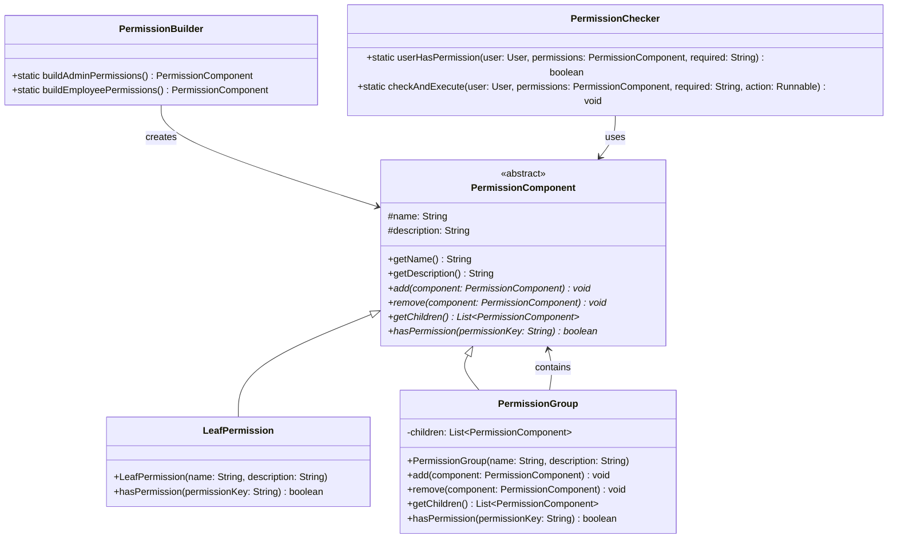
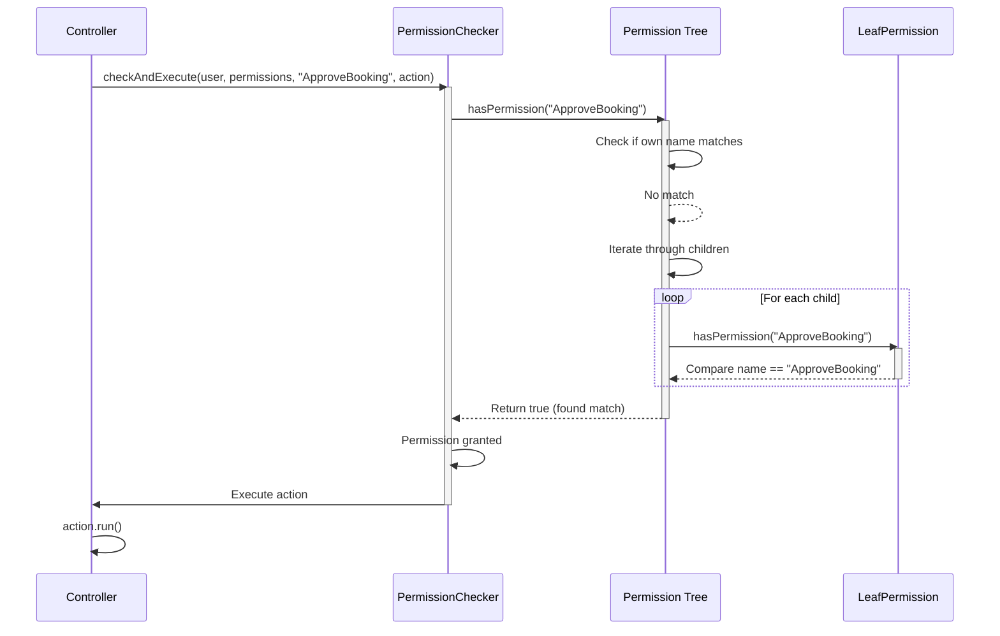
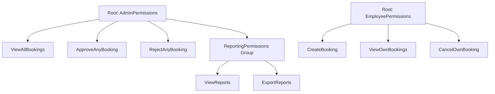
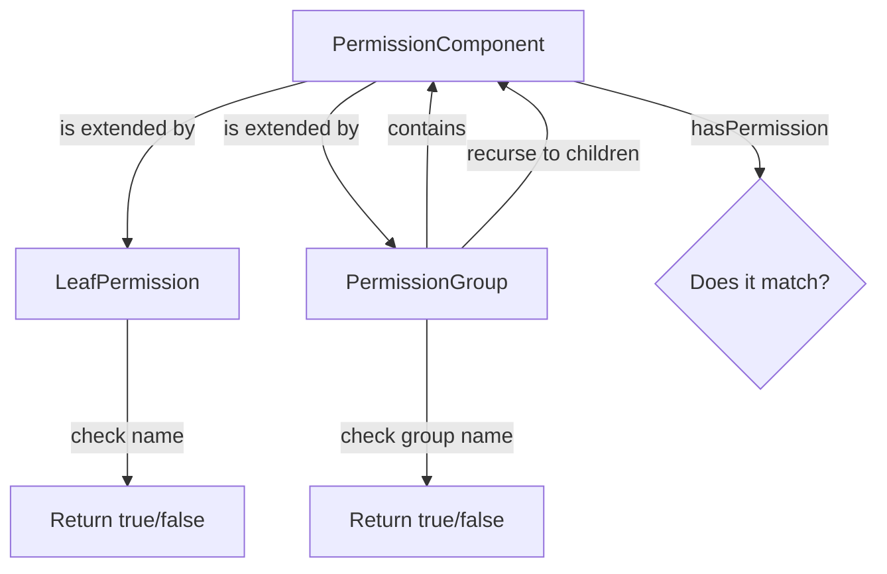
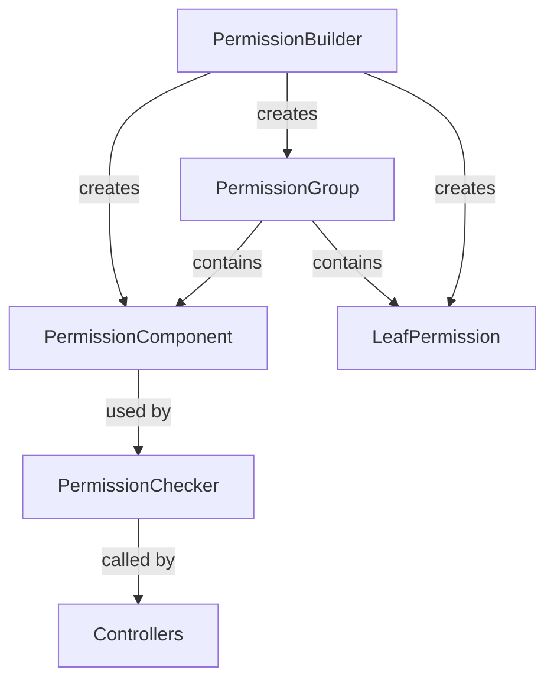

# Design Pattern: Composite

## Pattern Overview
**Pattern Name:** Composite  
**Category:** Structural Pattern  
**GoF Reference:** Compose objects into tree structures to represent part-whole hierarchies allowing clients to treat individual objects and compositions of objects uniformly.

---

## Problem This Pattern Solves

The SRD Desktop application manages permissions in a hierarchical structure where some permissions are atomic (leaf nodes) and others are groups of permissions (composite nodes):

- A user might have permission group "EditBooking" which contains "ApproveBooking", "RejectBooking", and "AssignRoom"
- A user might have a single permission "ViewReports"
- We need to check permissions uniformly whether they are single permissions or groups

**Without Composite Pattern:**
- Different logic for checking single permissions vs. groups
- Adding permission groups would require changes throughout the codebase
- Controllers would need to understand the permission structure
- Difficult to build hierarchical permission trees at runtime

**With Composite Pattern:**
- Single permissions and groups are treated uniformly
- New permission types can be added without changing existing code
- Permission trees built using same add/remove operations for leaves and groups
- Simple recursive check for any permission in the tree

---

## Where It's Used in the Codebase

### 1. **PermissionComponent** - Abstract Component Base
**Location:** `/src/main/java/com/aast/booking/patterns/permissions/PermissionComponent.java`

Defines the common interface for both leaf permissions and permission groups.

```java
public abstract class PermissionComponent {
    protected String name;
    protected String description;

    public PermissionComponent(String name, String description) {
        this.name = name;
        this.description = description;
    }

    public String getName() { return name; }
    public String getDescription() { return description; }

    // Composite methods (optional override)
    public void add(PermissionComponent component) {
        throw new UnsupportedOperationException("Cannot add to a leaf permission.");
    }

    public void remove(PermissionComponent component) {
        throw new UnsupportedOperationException("Cannot remove from a leaf permission.");
    }

    public List<PermissionComponent> getChildren() {
        throw new UnsupportedOperationException("Leaf permissions have no children.");
    }

    // Core logic: Checks if this component matches the permission key
    public abstract boolean hasPermission(String permissionKey);
}
```

### 2. **LeafPermission** - Leaf Component
**Location:** `/src/main/java/com/aast/booking/patterns/permissions/LeafPermission.java`

Represents a single, atomic permission.

```java
public class LeafPermission extends PermissionComponent {
    
    public LeafPermission(String name, String description) {
        super(name, description);
    }

    @Override
    public boolean hasPermission(String permissionKey) {
        // A leaf matches if its name matches the key
        return this.name.equalsIgnoreCase(permissionKey);
    }
}
```

### 3. **PermissionGroup** - Composite Component
**Location:** `/src/main/java/com/aast/booking/patterns/permissions/PermissionGroup.java`

Represents a group of permissions (can contain both leaves and other groups).

```java
public class PermissionGroup extends PermissionComponent {
    private List<PermissionComponent> children = new ArrayList<>();

    public PermissionGroup(String name, String description) {
        super(name, description);
    }

    @Override
    public void add(PermissionComponent component) {
        children.add(component);
    }

    @Override
    public void remove(PermissionComponent component) {
        children.remove(component);
    }

    @Override
    public List<PermissionComponent> getChildren() {
        return children;
    }

    @Override
    public boolean hasPermission(String permissionKey) {
        // A group matches if any child matches or the group itself matches
        if (this.name.equalsIgnoreCase(permissionKey)) return true;
        
        for (PermissionComponent child : children) {
            if (child.hasPermission(permissionKey)) {
                return true;
            }
        }
        return false;
    }
}
```

---

## Implementation Details

### Building Permission Trees

```java
public class PermissionBuilder {
    
    public static PermissionComponent buildAdminPermissions() {
        PermissionGroup adminPerms = new PermissionGroup(
            "AdminPermissions", 
            "Full administrative permissions"
        );
        
        // Add leaf permissions
        adminPerms.add(new LeafPermission("ViewAllBookings", "View all bookings"));
        adminPerms.add(new LeafPermission("ApproveAnyBooking", "Approve any booking"));
        adminPerms.add(new LeafPermission("RejectAnyBooking", "Reject any booking"));
        
        // Add sub-groups
        PermissionGroup reportingPerms = new PermissionGroup(
            "ReportingPermissions",
            "Reporting and analytics"
        );
        reportingPerms.add(new LeafPermission("ViewReports", "View reports"));
        reportingPerms.add(new LeafPermission("ExportReports", "Export reports"));
        
        adminPerms.add(reportingPerms);
        
        return adminPerms;
    }
    
    public static PermissionComponent buildEmployeePermissions() {
        PermissionGroup employeePerms = new PermissionGroup(
            "EmployeePermissions",
            "Basic employee permissions"
        );
        
        employeePerms.add(new LeafPermission("CreateBooking", "Create new booking"));
        employeePerms.add(new LeafPermission("ViewOwnBookings", "View own bookings"));
        employeePerms.add(new LeafPermission("CancelOwnBooking", "Cancel own booking"));
        
        return employeePerms;
    }
}
```

### Using Permissions Uniformly

```java
public class PermissionChecker {
    
    public static boolean userHasPermission(
        User user, 
        PermissionComponent userPermissions, 
        String requiredPermission) {
        
        // Works for both leaf and composite permissions!
        return userPermissions.hasPermission(requiredPermission);
    }
    
    public static void checkAndExecute(
        User user,
        PermissionComponent userPermissions,
        String requiredPermission,
        Runnable action) throws PermissionDeniedException {
        
        if (!userPermissions.hasPermission(requiredPermission)) {
            throw new PermissionDeniedException(
                "User lacks permission: " + requiredPermission
            );
        }
        
        action.run();
    }
}
```

### Permission Traversal

```java
public class PermissionIterator {
    
    public static void printPermissionTree(PermissionComponent root, int depth) {
        String indent = "  ".repeat(depth);
        System.out.println(indent + "- " + root.getName());
        
        try {
            for (PermissionComponent child : root.getChildren()) {
                printPermissionTree(child, depth + 1);
            }
        } catch (UnsupportedOperationException e) {
            // It's a leaf, no children to print
        }
    }
    
    public static List<String> getAllPermissionNames(PermissionComponent root) {
        List<String> names = new ArrayList<>();
        names.add(root.getName());
        
        try {
            for (PermissionComponent child : root.getChildren()) {
                names.addAll(getAllPermissionNames(child));
            }
        } catch (UnsupportedOperationException e) {
            // It's a leaf
        }
        
        return names;
    }
}
```

---

## Mermaid Class Diagram



---

## Mermaid Sequence Diagram: Permission Checking



---

## Mermaid Diagram: Permission Tree Structure



---

## Code Examples from Real Usage

### Example 1: Building Permission Tree at Startup

```java
public class PermissionManager {
    private static Map<String, PermissionComponent> permissionTrees;
    
    public static void initialize() {
        permissionTrees = new HashMap<>();
        
        // Build permission trees for each role
        permissionTrees.put("admin", PermissionBuilder.buildAdminPermissions());
        permissionTrees.put("branch_manager", PermissionBuilder.buildManagerPermissions());
        permissionTrees.put("secretary", PermissionBuilder.buildSecretaryPermissions());
        permissionTrees.put("employee", PermissionBuilder.buildEmployeePermissions());
    }
    
    public static PermissionComponent getPermissionsForRole(String role) {
        return permissionTrees.get(role);
    }
}
```

### Example 2: Checking Permissions in Controller

```java
public class AdminBookingController {
    
    @FXML
    private void handleApproveBooking() {
        User user = SessionManager.getInstance().getCurrentUser();
        PermissionComponent permissions = 
            PermissionManager.getPermissionsForRole(user.getRole());
        
        try {
            PermissionChecker.checkAndExecute(
                user,
                permissions,
                "ApproveAnyBooking",
                this::approveSelectedBooking
            );
        } catch (PermissionDeniedException e) {
            showAlert("Permission Denied: " + e.getMessage());
        }
    }
    
    private void approveSelectedBooking() {
        Booking booking = bookingTable.getSelectionModel().getSelectedItem();
        bookingService.approveBooking(booking);
        refreshBookingList();
    }
}
```

### Example 3: Building Dynamic Permission Groups

```java
public class CustomPermissionBuilder {
    
    public static PermissionComponent buildTemporaryAdminPermissions() {
        PermissionGroup tempAdmin = new PermissionGroup(
            "TemporaryAdminPermissions",
            "Restricted admin permissions"
        );
        
        // Limited set of permissions for temporary admins
        tempAdmin.add(new LeafPermission("ViewBookings", "View bookings only"));
        tempAdmin.add(new LeafPermission("ViewReports", "View reports"));
        
        // Cannot include approval or deletion permissions
        
        return tempAdmin;
    }
    
    public static PermissionComponent buildDepartmentHeadPermissions() {
        PermissionGroup deptHead = new PermissionGroup(
            "DepartmentHeadPermissions",
            "Department-level permissions"
        );
        
        // Department-specific permissions
        PermissionGroup approvalPerms = new PermissionGroup(
            "ApprovalPermissions",
            "Department booking approvals"
        );
        approvalPerms.add(new LeafPermission("ApproveDepartmentBookings", ""));
        approvalPerms.add(new LeafPermission("RejectDepartmentBookings", ""));
        
        deptHead.add(approvalPerms);
        deptHead.add(new LeafPermission("ViewDepartmentReports", ""));
        
        return deptHead;
    }
}
```

---

## Validation Checklist

- [ ] **Leaf Permissions Work Alone**: Single permissions can be checked independently
  - Test: `leafPermission.hasPermission("ViewReports")` returns true/false correctly
  
- [ ] **Groups Contain Mixed Types**: Groups can contain both leaves and other groups
  - Test: Add leaf to group, add group to another group, verify structure
  
- [ ] **Recursive Permission Check**: Nested groups are checked recursively
  - Test: Create 3-level deep permission tree and verify permission checking works
  
- [ ] **Uniform Interface**: Both leaves and groups respond to hasPermission()
  - Test: Get permission (either leaf or group) and call hasPermission() without casting
  
- [ ] **Add/Remove Operations**: Can add/remove permissions from groups
  - Test: Add 3 permissions to group, remove 1, verify only 2 remain
  
- [ ] **Leaf Operations Fail Gracefully**: Calling add() on leaf throws UnsupportedOperationException
  - Test: Try to add permission to leaf and catch exception
  
- [ ] **Tree Traversal**: Can traverse entire permission tree depth-first
  - Test: Print all permission names from complex tree and verify order

---

## Mermaid Diagram: Composite Pattern Class Hierarchy



---

## Design Pattern Relationships



---

## Alignment with Web Application

The web app may use a similar hierarchical permissions structure:

**Web App (React/TypeScript):**
```typescript
interface Permission {
    name: string;
    children?: Permission[];
}

function hasPermission(permissions: Permission[], requiredPerm: string): boolean {
    for (const perm of permissions) {
        if (perm.name === requiredPerm) return true;
        if (perm.children && hasPermission(perm.children, requiredPerm)) {
            return true;
        }
    }
    return false;
}
```

**Java App (Composite):**
```java
public abstract boolean hasPermission(String permissionKey);

class PermissionGroup {
    @Override
    public boolean hasPermission(String permissionKey) {
        if (this.name.equals(permissionKey)) return true;
        for (PermissionComponent child : children) {
            if (child.hasPermission(permissionKey)) return true;
        }
        return false;
    }
}
```

Both systems:
- Support hierarchical permissions
- Check permissions recursively
- Treat individual and composite permissions uniformly
- Build permission trees at initialization time

---

## Potential Issues & Mitigations

### Issue 1: Circular References
**Problem:** Adding a permission group to itself creates infinite loop

```java
PermissionGroup admin = new PermissionGroup("Admin", "");
admin.add(admin);  // Circular reference!
admin.hasPermission("Admin");  // Infinite recursion!
```

**Recommendation:** Prevent circular references:
```java
public void add(PermissionComponent component) throws IllegalArgumentException {
    if (component instanceof PermissionGroup) {
        if (isDescendantOf((PermissionGroup) component)) {
            throw new IllegalArgumentException("Circular reference detected");
        }
    }
    children.add(component);
}

private boolean isDescendantOf(PermissionGroup other) {
    if (this == other) return true;
    for (PermissionComponent child : children) {
        if (child instanceof PermissionGroup) {
            if (((PermissionGroup) child).isDescendantOf(other)) {
                return true;
            }
        }
    }
    return false;
}
```

### Issue 2: Case Sensitivity
**Problem:** Permission names may have different cases

**Current Code:**
```java
public boolean hasPermission(String permissionKey) {
    return this.name.equalsIgnoreCase(permissionKey);  // Good: case-insensitive
}
```

**Already Mitigated:** Uses `equalsIgnoreCase()`

### Issue 3: Performance with Large Trees
**Problem:** Deep permission trees with many children slow down permission checks

**Recommendation:** Add caching:
```java
public class CachedPermissionComponent extends PermissionComponent {
    private Set<String> cachedPermissions;
    
    @Override
    public boolean hasPermission(String permissionKey) {
        if (cachedPermissions == null) {
            cachedPermissions = buildCache();
        }
        return cachedPermissions.contains(permissionKey.toLowerCase());
    }
    
    private Set<String> buildCache() {
        // Recursively build all available permissions
    }
}
```

---

## Notes on This Implementation

### Strengths
1. **Flexibility**: Easily build complex permission hierarchies
2. **Uniformity**: Treat individual and composite permissions the same way
3. **Extensibility**: Can add new permission types without changing code
4. **Type Safety**: Compile-time checking prevents errors
5. **Recursion**: Natural recursive structure for hierarchical permissions

### Weaknesses
1. **Mutability**: Permission trees can be modified at runtime (may want immutable)
2. **No Ordering**: Children have no guaranteed order
3. **Duplicate Permissions**: Same permission can exist in multiple places
4. **Memory Overhead**: Each permission is separate object (vs. bitflags)
5. **Performance**: Recursive search can be slow with deep trees

### Improvements
1. **Immutable Permissions**: Make trees immutable after construction
2. **Caching**: Cache permission lookups for frequently checked trees
3. **Persistence**: Serialize/deserialize permission trees to database
4. **Debugging**: Add toString() to print tree structure
5. **Validation**: Verify no circular references or invalid configurations

---

## Related Patterns in This Codebase

- **Factory Pattern**: `PermissionBuilder` creates permission trees
- **Visitor Pattern**: Could use visitor to traverse permission tree
- **Observer Pattern**: Could notify when permissions change

---

## Recommended Best Practices

1. **Immutability**: Make permission trees immutable after construction
2. **Named Permissions**: Use string constants for permission names
3. **Role-Based Initialization**: Load permission trees from database based on role
4. **Audit Logging**: Log all permission checks for security
5. **Performance Testing**: Monitor permission check performance with large trees

---

**Last Updated:** 2024  
**Pattern Status:** ✅ Active - Used for permission management
