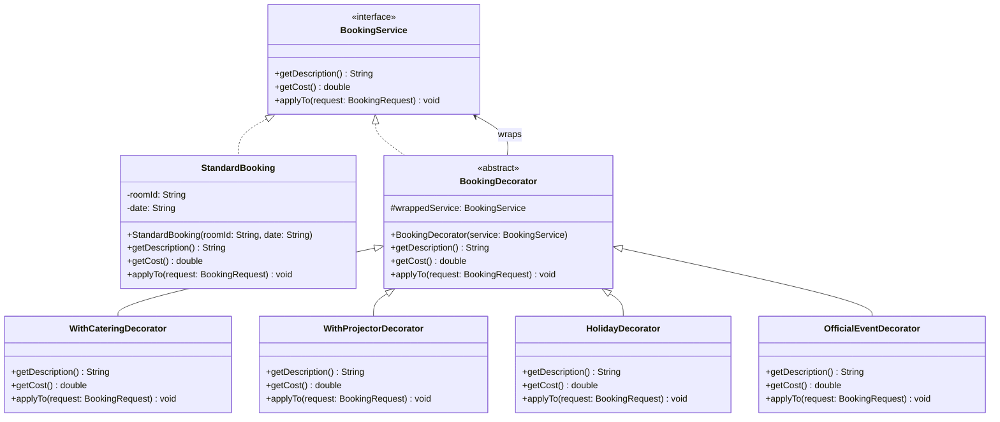
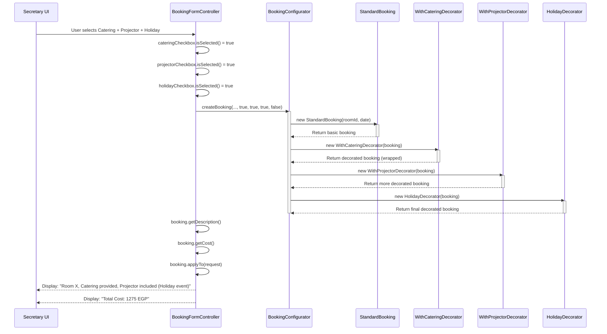
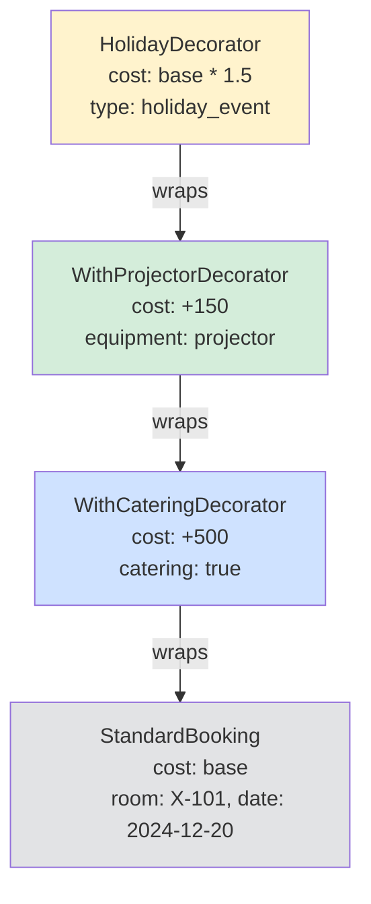
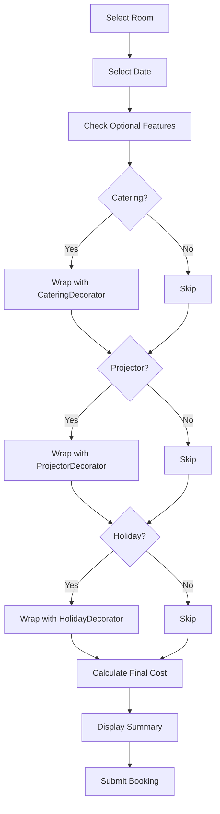
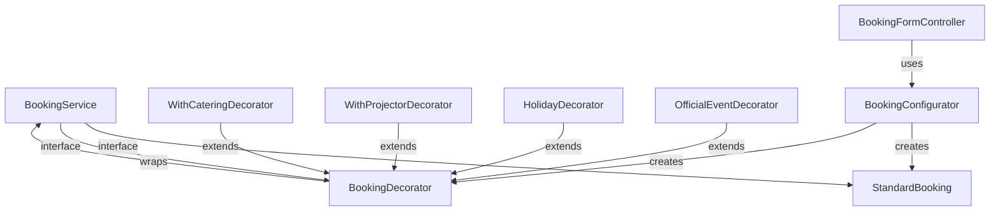

# Design Pattern: Decorator

## Pattern Overview
**Pattern Name:** Decorator  
**Category:** Structural Pattern  
**GoF Reference:** Attach additional responsibilities to an object dynamically, providing a flexible alternative to subclassing.

---

## Problem This Pattern Solves

When secretaries create bookings in the SRD system, they can add various optional enhancements:
- **Catering** - Food and beverages provided
- **Holiday/Official Event** - Special booking type with different rules
- **Equipment** - Projector, microphone, video conferencing setup
- **Notifications** - Send alerts to various stakeholders

**Without Decorator Pattern:**
- Would need a separate booking class for every combination (10+ subclasses)
- `BasicBooking`, `Catering Booking`, `ProjectorBooking`, `CateringAndProjectorBooking`, etc.
- Adding a new optional feature requires creating new subclasses
- Impossible to dynamically build a booking with exactly the needed features

**With Decorator Pattern:**
- Start with a basic booking
- Wrap it with decorators for each needed feature
- Dynamically add/remove features without creating new classes
- Can apply any combination of features

---

## Where It's Used in the Codebase

### 1. **BookingService** - Component Interface
**Location:** `/src/main/java/com/aast/booking/secretary/form/` (implicit base)

Defines the interface for both basic bookings and decorated bookings.

```java
public interface BookingService {
    String getDescription();
    double getCost();
    void applyTo(BookingRequest request);
}
```

### 2. **BookingDecorator** - Abstract Decorator Base
**Location:** `/src/main/java/com/aast/booking/secretary/form/BookingDecorator.java`

Base class for all booking decorators.

```java
public abstract class BookingDecorator implements BookingService {
    protected BookingService wrappedService;

    public BookingDecorator(BookingService service) {
        this.wrappedService = service;
    }

    @Override
    public String getDescription() {
        return wrappedService.getDescription();
    }

    @Override
    public double getCost() {
        return wrappedService.getCost();
    }

    @Override
    public void applyTo(BookingRequest request) {
        wrappedService.applyTo(request);
    }
}
```

### 3. **Concrete Decorators** - Specific Features

#### WithCateringDecorator
**Location:** `/src/main/java/com/aast/booking/secretary/form/WithCateringDecorator.java`

```java
public class WithCateringDecorator extends BookingDecorator {

    public WithCateringDecorator(BookingService service) {
        super(service);
    }

    @Override
    public String getDescription() {
        return wrappedService.getDescription() + ", Catering provided";
    }

    @Override
    public double getCost() {
        return wrappedService.getCost() + 500.0;  // Catering cost
    }

    @Override
    public void applyTo(BookingRequest request) {
        super.applyTo(request);
        request.setCateringRequired(true);
        request.setSpecialRequirements("Catering service needed");
    }
}
```

#### WithProjectorDecorator
**Location:** `/src/main/java/com/aast/booking/secretary/form/WithProjectorDecorator.java`

```java
public class WithProjectorDecorator extends BookingDecorator {

    public WithProjectorDecorator(BookingService service) {
        super(service);
    }

    @Override
    public String getDescription() {
        return wrappedService.getDescription() + ", Projector included";
    }

    @Override
    public double getCost() {
        return wrappedService.getCost() + 150.0;  // Projector rental
    }

    @Override
    public void applyTo(BookingRequest request) {
        super.applyTo(request);
        request.setProjectorRequired(true);
    }
}
```

#### HolidayDecorator
**Location:** `/src/main/java/com/aast/booking/secretary/form/HolidayDecorator.java`

```java
public class HolidayDecorator extends BookingDecorator {

    public HolidayDecorator(BookingService service) {
        super(service);
    }

    @Override
    public String getDescription() {
        return wrappedService.getDescription() + " (Holiday event)";
    }

    @Override
    public double getCost() {
        return wrappedService.getCost() * 1.5;  // 50% premium for holiday
    }

    @Override
    public void applyTo(BookingRequest request) {
        super.applyTo(request);
        request.setHolidayEvent(true);
        request.setApprovalType("holiday_event");
    }
}
```

#### OfficialEventDecorator
**Location:** `/src/main/java/com/aast/booking/secretary/form/OfficialEventDecorator.java`

```java
public class OfficialEventDecorator extends BookingDecorator {

    public OfficialEventDecorator(BookingService service) {
        super(service);
    }

    @Override
    public String getDescription() {
        return wrappedService.getDescription() + " (Official occasion)";
    }

    @Override
    public double getCost() {
        return wrappedService.getCost();  // No additional cost
    }

    @Override
    public void applyTo(BookingRequest request) {
        super.applyTo(request);
        request.setOfficialOccasion(true);
        request.setApprovalType("official_event");
    }
}
```

---

## Implementation Details

### Building Decorated Bookings Step-by-Step

```java
public class BookingConfigurator {
    
    public static BookingService createBooking(
        String roomId, 
        String date,
        boolean needsCatering,
        boolean needsProjector,
        boolean isHolidayEvent,
        boolean isOfficialEvent) {
        
        // Start with basic service
        BookingService booking = new StandardBooking(roomId, date);
        
        // Add decorators conditionally
        if (needsCatering) {
            booking = new WithCateringDecorator(booking);
        }
        
        if (needsProjector) {
            booking = new WithProjectorDecorator(booking);
        }
        
        if (isHolidayEvent) {
            booking = new HolidayDecorator(booking);
        }
        
        if (isOfficialEvent) {
            booking = new OfficialEventDecorator(booking);
        }
        
        return booking;
    }
}
```

### Using Decorated Bookings

```java
public class BookingFormController {
    
    @FXML
    private CheckBox cateringCheckbox;
    @FXML
    private CheckBox projectorCheckbox;
    @FXML
    private CheckBox holidayCheckbox;
    @FXML
    private CheckBox officialCheckbox;
    @FXML
    private Label totalCostLabel;
    
    @FXML
    private void updateBookingSummary() {
        BookingService booking = BookingConfigurator.createBooking(
            selectedRoomId,
            selectedDate,
            cateringCheckbox.isSelected(),
            projectorCheckbox.isSelected(),
            holidayCheckbox.isSelected(),
            officialCheckbox.isSelected()
        );
        
        // Display decorated booking information
        summaryLabel.setText(booking.getDescription());
        totalCostLabel.setText("Total Cost: " + booking.getCost() + " EGP");
        
        bookingRequest = new BookingRequest();
        booking.applyTo(bookingRequest);  // Apply all decorations
    }
    
    @FXML
    private void submitBooking() {
        // Booking already has all decorations applied!
        bookingService.save(bookingRequest);
    }
}
```

---

## Mermaid Class Diagram



---

## Mermaid Sequence Diagram: Decorating a Booking



---

## Mermaid Diagram: Decoration Chain Structure



---

## Code Examples from Real Usage

### Example 1: Building Booking with Multiple Decorators

```java
public class SecretaryBookingService {
    
    public void submitBookingWithOptions(
        Room room,
        LocalDate date,
        String purpose,
        BookingOptions options) {
        
        // Start with basic booking
        BookingService booking = new StandardBooking(room.getId(), date.toString());
        
        // Add requested features (decorators)
        if (options.includesCatering()) {
            booking = new WithCateringDecorator(booking);
        }
        
        if (options.includesProjector()) {
            booking = new WithProjectorDecorator(booking);
        }
        
        if (options.isHolidayEvent()) {
            booking = new HolidayDecorator(booking);
        }
        
        if (options.isOfficialEvent()) {
            booking = new OfficialEventDecorator(booking);
        }
        
        // Get final description and cost
        System.out.println("Booking: " + booking.getDescription());
        System.out.println("Cost: " + booking.getCost() + " EGP");
        
        // Apply to booking request
        BookingRequest request = new BookingRequest();
        booking.applyTo(request);
        
        // Submit the booking
        saveBookingRequest(request);
    }
}
```

### Example 2: Dynamic Cost Calculation

```java
public class BookingPricingService {
    
    public double calculateTotalCost(BookingService booking) {
        return booking.getCost();
    }
    
    public String getDetailedCostBreakdown(BookingService booking) {
        // Could enhance to show breakdown of each decorator's cost
        return booking.getDescription() + "\n" +
               "Total: " + booking.getCost() + " EGP";
    }
}
```

### Example 3: Admin Booking Decorator (Different Use Case)

```java
public class AdminBookingDecorator {
    protected Booking booking;

    public AdminBookingDecorator(Booking booking) {
        this.booking = booking;
    }

    public abstract void decorate();
    
    // Specific admin decorators would mark booking with admin actions
    public static class ApprovedByAdminDecorator extends AdminBookingDecorator {
        private String adminId;
        
        public ApprovedByAdminDecorator(Booking booking, String adminId) {
            super(booking);
            this.adminId = adminId;
        }
        
        @Override
        public void decorate() {
            booking.setStatus("approved");
            booking.setApprovedBy(adminId);
            booking.setApprovedAt(new Date());
        }
    }
}
```

---

## Validation Checklist

- [ ] **Basic Booking Works**: StandardBooking without decorators functions correctly
  - Test: Create booking without decorators and verify getDescription() and getCost()
  
- [ ] **Single Decorator Works**: Adding one decorator modifies description and cost
  - Test: Wrap with WithCateringDecorator and verify cost increases by 500
  
- [ ] **Multiple Decorators Work**: Chain multiple decorators together
  - Test: Apply catering + projector + holiday, verify combined cost calculation
  
- [ ] **Decorator Order**: Cost and description reflect decorator order
  - Test: Apply catering then projector vs. projector then catering
  
- [ ] **applyTo Method**: Decorators correctly apply to BookingRequest
  - Test: Call booking.applyTo(request) and verify request fields populated
  
- [ ] **Cost Accumulation**: Each decorator's cost is properly added/multiplied
  - Test: Base 1000 + catering 500 + projector 150 = 1650 (or 1000 * 1.5 * 1 = 1500 if holiday)
  
- [ ] **Description Composition**: Description shows all applied decorators
  - Test: Get description and verify it includes all decorator names

---

## Mermaid Diagram: Decorator Application Flow



---

## Design Pattern Relationships



---

## Comparison: Decorator vs. Inheritance

**Problem:** Add multiple optional features to a booking

**Inheritance Approach (Bad):**
```java
class BasicBooking { }
class CateringBooking extends BasicBooking { }
class ProjectorBooking extends BasicBooking { }
class CateringProjectorBooking extends CateringBooking { }
class HolidayBooking extends BasicBooking { }
class CateringProjectorHolidayBooking extends HolidayBooking { }
// Combinatorial explosion: 2^4 = 16 classes for 4 features!
```

**Decorator Approach (Good):**
```java
BookingService booking = new StandardBooking(...);
if (catering) booking = new WithCateringDecorator(booking);
if (projector) booking = new WithProjectorDecorator(booking);
if (holiday) booking = new HolidayDecorator(booking);
// Flexible, composable, no class explosion
```

---

## Potential Issues & Mitigations

### Issue 1: Loss of Type Information
**Problem:** Cannot cast back to StandardBooking after decoration

**Current Code:**
```java
BookingService booking = new WithCateringDecorator(new StandardBooking(...));
// booking instanceof StandardBooking == false, it's now a decorator!
```

**Recommendation:** Avoid relying on concrete types:
```java
// Good: Use interface
BookingService booking = createDecorated(...);

// Bad: Try to cast
if (booking instanceof WithCateringDecorator) {
    // This defeats the purpose of decorator pattern
}
```

### Issue 2: Deep Nesting = Memory Overhead
**Problem:** Each decorator adds a reference, can use lots of memory

**Mitigation:** Limit nesting depth:
```java
private static final int MAX_DECORATORS = 5;
private int decorationDepth = 0;

public void addDecorator(BookingService decorator) 
    throws TooManyDecoratorsException {
    if (decorationDepth >= MAX_DECORATORS) {
        throw new TooManyDecoratorsException("Too many decorators applied");
    }
    decorationDepth++;
}
```

### Issue 3: Order Matters
**Problem:** Applying HolidayDecorator (1.5x multiplier) before vs. after CateringDecorator changes total

```java
// Option 1: Catering first, then holiday
BookingService b1 = new HolidayDecorator(
    new WithCateringDecorator(
        new StandardBooking()  // 1000
    )
);
// Cost: (1000 + 500) * 1.5 = 2250

// Option 2: Holiday first, then catering
BookingService b2 = new WithCateringDecorator(
    new HolidayDecorator(
        new StandardBooking()  // 1000
    )
);
// Cost: (1000 * 1.5) + 500 = 2000
```

**Recommendation:** Document the intended order and enforce it:
```java
public class BookingConfigurator {
    public static BookingService createBooking(...) {
        BookingService booking = new StandardBooking(...);
        
        // Always apply in this order to ensure consistent costs:
        if (needsCatering) booking = new WithCateringDecorator(booking);
        if (needsProjector) booking = new WithProjectorDecorator(booking);
        if (isHolidayEvent) booking = new HolidayDecorator(booking);
        
        return booking;
    }
}
```

---

## Notes on This Implementation

### Strengths
1. **Flexibility**: Dynamically add features without creating new classes
2. **Composition**: Better than inheritance for combinations of features
3. **Single Responsibility**: Each decorator has one job
4. **Open/Closed**: Open for extension (new decorators), closed for modification
5. **Runtime**: Add features at runtime based on user selections

### Weaknesses
1. **Complexity**: More classes to understand (decorator + all concrete decorators)
2. **Order Matters**: Decorator order affects behavior
3. **Deep Stacks**: Many decorators create deep call stacks
4. **Type Checking**: Lost specific type information after decoration
5. **Debugging**: Hard to trace through decorator chains

### Improvements
1. **Builder Pattern**: Combine decorator with builder for cleaner API
2. **Fluent Interface**: Allow chaining like `.withCatering().withProjector().build()`
3. **Immutability**: Make decorated bookings immutable
4. **Validation**: Validate decorator combinations at construction time
5. **Caching**: Cache common decorator combinations

---

## Related Patterns in This Codebase

- **Builder Pattern**: Could combine decorators with builder pattern
- **Factory Pattern**: `BookingConfigurator` acts like a factory for decorated bookings
- **Strategy Pattern**: Different approval strategies might apply to decorated bookings

---

## Recommended Best Practices

1. **Consistent Ordering**: Always apply decorators in the same order
2. **Immutable Decorators**: Don't modify booking after decoration
3. **Clear Naming**: Decorator class names clearly indicate what they add
4. **Documentation**: Document the purpose and effects of each decorator
5. **Testing**: Test each decorator individually and in combinations

---

**Last Updated:** 2024  
**Pattern Status:** ✅ Active - Used for booking customization
