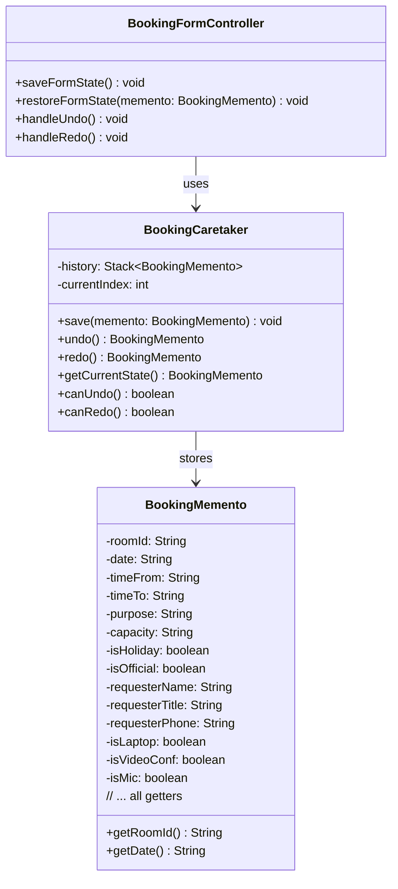
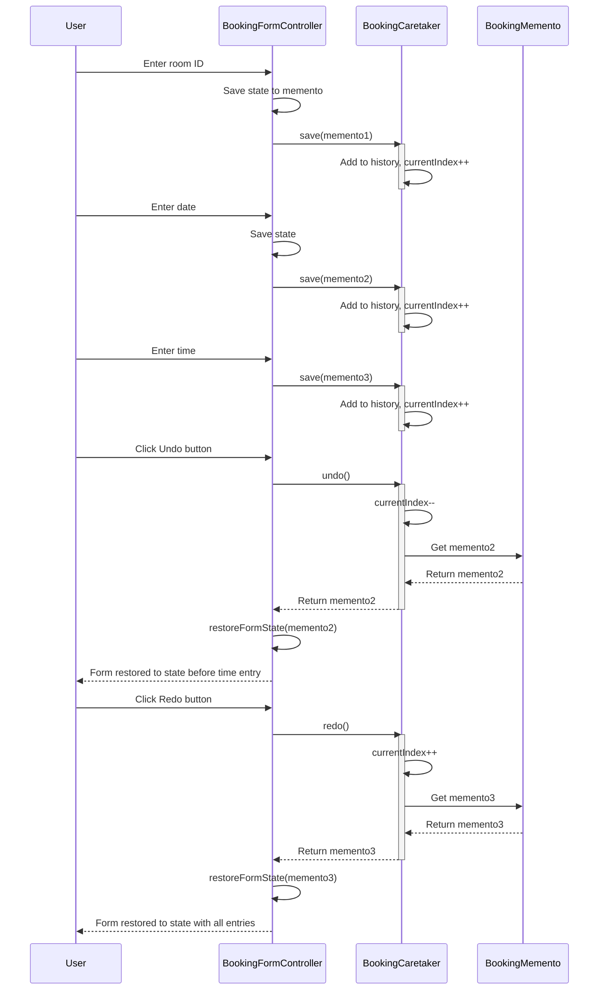
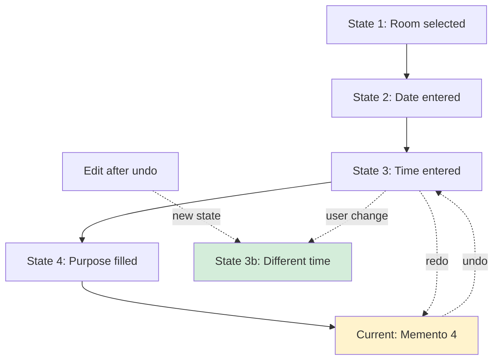
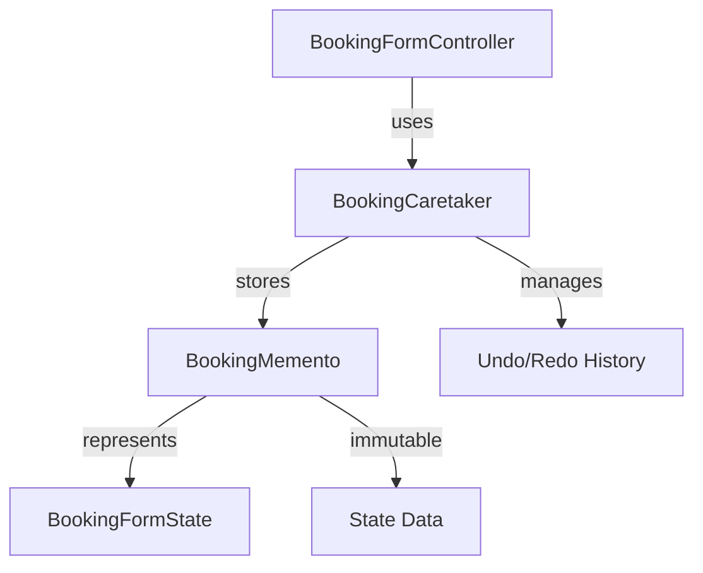

# Design Pattern: Memento

## Pattern Overview
**Pattern Name:** Memento (Snapshot)  
**Category:** Behavioral Pattern  
**GoF Reference:** Capture and externalize an object's internal state without violating encapsulation, allowing the object to be restored to this state later.

---

## Problem This Pattern Solves

When secretaries or admins fill out multi-step booking forms, they may:
- Navigate away accidentally
- Need to review previous steps
- Want to undo recent changes
- Need to compare different booking configurations

**Without Memento Pattern:**
- Form state lost when navigating away
- No undo functionality
- Cannot save drafts for later completion
- No way to compare versions

**With Memento Pattern:**
- Save form state at any point
- Restore previous states with "Undo"
- Save drafts and resume later
- Compare different configurations

---

## Where It's Used in the Codebase

### 1. **BookingMemento** - Memento Object (Secretary)
**Location:** `/src/main/java/com/aast/booking/secretary/form/BookingMemento.java`

Stores a snapshot of booking form state.

```java
public class BookingMemento {
    private final String roomId;
    private final String date;
    private final String timeFrom;
    private final String timeTo;
    private final String purpose;
    private final String capacity;
    private final boolean isHoliday;
    private final boolean isOfficial;

    // Step 2 & 3 fields
    private final String requesterName;
    private final String requesterTitle;
    private final String requesterPhone;
    private final boolean isLaptop;
    private final boolean isVideoConf;
    private final boolean isMic;

    public BookingMemento(String roomId, String date, String timeFrom, String timeTo, 
                         String purpose, String capacity, boolean isHoliday, 
                         boolean isOfficial, String requesterName, String requesterTitle, 
                         String requesterPhone, boolean isLaptop, boolean isVideoConf, 
                         boolean isMic) {
        this.roomId = roomId;
        this.date = date;
        // ... initialize all fields
    }

    // Getters only (immutable)
    public String getRoomId() { return roomId; }
    public String getDate() { return date; }
    // ... etc
}
```

### 2. **BookingCaretaker** - State Manager (Secretary)
**Location:** `/src/main/java/com/aast/booking/secretary/form/BookingCaretaker.java` (implicit)

Manages history of mementos.

```java
public class BookingCaretaker {
    private Stack<BookingMemento> history = new Stack<>();
    private int currentIndex = -1;

    public void save(BookingMemento memento) {
        // Clear any redo history
        while (currentIndex < history.size() - 1) {
            history.pop();
        }
        history.push(memento);
        currentIndex++;
    }

    public BookingMemento undo() {
        if (currentIndex > 0) {
            currentIndex--;
            return history.get(currentIndex);
        }
        return null;
    }

    public BookingMemento redo() {
        if (currentIndex < history.size() - 1) {
            currentIndex++;
            return history.get(currentIndex);
        }
        return null;
    }

    public BookingMemento getCurrentState() {
        if (currentIndex >= 0) {
            return history.get(currentIndex);
        }
        return null;
    }

    public boolean canUndo() {
        return currentIndex > 0;
    }

    public boolean canRedo() {
        return currentIndex < history.size() - 1;
    }
}
```

### 3. **AdminBookingMemento** - Memento Object (Admin)
**Location:** `/src/main/java/com/aast/booking/admin/AdminBookingMemento.java`

Stores snapshot of admin booking form state.

```java
public class AdminBookingMemento {
    private final String bookingId;
    private final String roomId;
    private final String approvalStatus;
    private final String assignedRoom;
    private final String approvalNotes;
    private final Date approvalTime;

    public AdminBookingMemento(String bookingId, String roomId, String approvalStatus,
                              String assignedRoom, String approvalNotes, Date approvalTime) {
        this.bookingId = bookingId;
        this.roomId = roomId;
        this.approvalStatus = approvalStatus;
        this.assignedRoom = assignedRoom;
        this.approvalNotes = approvalNotes;
        this.approvalTime = approvalTime;
    }

    // All getters
    public String getBookingId() { return bookingId; }
    public String getRoomId() { return roomId; }
    public String getApprovalStatus() { return approvalStatus; }
    public String getAssignedRoom() { return assignedRoom; }
    public String getApprovalNotes() { return approvalNotes; }
    public Date getApprovalTime() { return approvalTime; }
}
```

### 4. **AdminBookingCaretaker** - State Manager (Admin)
**Location:** `/src/main/java/com/aast/booking/admin/AdminBookingCaretaker.java`

Manages admin booking state history.

```java
public class AdminBookingCaretaker {
    private List<AdminBookingMemento> history = new ArrayList<>();
    private int currentIndex = -1;

    public void save(AdminBookingMemento memento) {
        while (currentIndex < history.size() - 1) {
            history.remove(history.size() - 1);
        }
        history.add(memento);
        currentIndex++;
    }

    public AdminBookingMemento undo() {
        if (currentIndex > 0) {
            return history.get(--currentIndex);
        }
        return null;
    }

    public AdminBookingMemento redo() {
        if (currentIndex < history.size() - 1) {
            return history.get(++currentIndex);
        }
        return null;
    }

    public boolean canUndo() { return currentIndex > 0; }
    public boolean canRedo() { return currentIndex < history.size() - 1; }
}
```

---

## Implementation Details

### Creating a Memento from Current State

```java
public class BookingFormController {
    
    private BookingCaretaker caretaker = new BookingCaretaker();
    
    // Save current form state
    @FXML
    private void saveFormState() {
        BookingMemento memento = new BookingMemento(
            roomIdField.getText(),
            dateField.getValue().toString(),
            timeFromField.getText(),
            timeToField.getText(),
            purposeField.getText(),
            capacityField.getText(),
            holidayCheckbox.isSelected(),
            officialCheckbox.isSelected(),
            nameField.getText(),
            titleField.getText(),
            phoneField.getText(),
            laptopCheckbox.isSelected(),
            videoConfCheckbox.isSelected(),
            micCheckbox.isSelected()
        );
        
        caretaker.save(memento);
    }
    
    // Restore form from memento
    private void restoreFormState(BookingMemento memento) {
        if (memento == null) return;
        
        roomIdField.setText(memento.getRoomId());
        dateField.setValue(LocalDate.parse(memento.getDate()));
        timeFromField.setText(memento.getTimeFrom());
        timeToField.setText(memento.getTimeTo());
        purposeField.setText(memento.getPurpose());
        capacityField.setText(memento.getCapacity());
        holidayCheckbox.setSelected(memento.isHoliday());
        officialCheckbox.setSelected(memento.isOfficial());
        nameField.setText(memento.getRequesterName());
        titleField.setText(memento.getRequesterTitle());
        phoneField.setText(memento.getRequesterPhone());
        laptopCheckbox.setSelected(memento.isLaptop());
        videoConfCheckbox.setSelected(memento.isVideoConf());
        micCheckbox.setSelected(memento.isMic());
    }
    
    // Undo to previous state
    @FXML
    private void handleUndo() {
        if (caretaker.canUndo()) {
            BookingMemento memento = caretaker.undo();
            restoreFormState(memento);
        }
    }
    
    // Redo to next state
    @FXML
    private void handleRedo() {
        if (caretaker.canRedo()) {
            BookingMemento memento = caretaker.redo();
            restoreFormState(memento);
        }
    }
}
```

---

## Mermaid Class Diagram



---

## Mermaid Sequence Diagram: Undo/Redo Flow



---

## Code Examples from Real Usage

### Example 1: Auto-Save with Memento

```java
public class BookingFormController implements Initializable {
    
    private BookingCaretaker caretaker = new BookingCaretaker();
    
    @Override
    public void initialize(URL location, ResourceBundle resources) {
        // Save state every time any field changes
        roomIdField.textProperty().addListener((obs, oldVal, newVal) -> {
            saveCurrentState();
        });
        dateField.valueProperty().addListener((obs, oldVal, newVal) -> {
            saveCurrentState();
        });
        // ... listeners for all fields
    }
    
    private void saveCurrentState() {
        // Only save if enough time has passed (debounce)
        if (shouldSaveState()) {
            BookingMemento memento = captureCurrentState();
            caretaker.save(memento);
            updateUndoRedoButtonState();
        }
    }
    
    private BookingMemento captureCurrentState() {
        return new BookingMemento(
            roomIdField.getText(),
            dateField.getValue().toString(),
            // ... capture all form fields
        );
    }
    
    private void updateUndoRedoButtonState() {
        undoButton.setDisable(!caretaker.canUndo());
        redoButton.setDisable(!caretaker.canRedo());
    }
}
```

### Example 2: Draft Persistence

```java
public class BookingDraftService {
    
    public void saveDraft(String draftName, BookingMemento memento) {
        // Store memento in local database
        draftDatabase.save(draftName, memento);
    }
    
    public BookingMemento loadDraft(String draftName) {
        return draftDatabase.load(draftName);
    }
    
    public List<String> listDrafts() {
        return draftDatabase.listAll();
    }
    
    public void deleteDraft(String draftName) {
        draftDatabase.delete(draftName);
    }
}
```

### Example 3: Admin Approval History

```java
public class AdminBookingController {
    
    private AdminBookingCaretaker caretaker = new AdminBookingCaretaker();
    
    @FXML
    private void handleApproval() {
        String roomId = roomSelectionCombo.getValue();
        String notes = notesField.getText();
        
        AdminBookingMemento memento = new AdminBookingMemento(
            currentBooking.getId(),
            roomId,
            "approved",
            roomId,
            notes,
            new Date()
        );
        
        caretaker.save(memento);
    }
    
    @FXML
    private void showApprovalHistory() {
        // Display all approval attempts
        for (int i = 0; i < caretaker.getHistorySize(); i++) {
            AdminBookingMemento m = caretaker.getMemento(i);
            System.out.println(m.getApprovalTime() + ": " + m.getApprovalStatus());
        }
    }
}
```

---

## Validation Checklist

- [ ] **Memento Immutability**: Memento objects cannot be modified after creation
  - Test: Try to set field on memento (should fail)
  
- [ ] **State Capture**: All form fields captured in memento
  - Test: Create memento and verify all field values stored
  
- [ ] **State Restore**: Form fields restored exactly to memento state
  - Test: Save state, modify fields, restore, verify fields match
  
- [ ] **Undo Works**: Clicking undo restores previous state
  - Test: Make 3 changes, click undo 3 times, verify back at start
  
- [ ] **Redo Works**: Clicking redo restores next state
  - Test: Undo then redo, verify states match
  
- [ ] **Redo History Cleared**: Making new change after undo clears redo history
  - Test: Undo then make new change, redo should be disabled
  
- [ ] **Can Undo/Redo**: Buttons show correct enabled state
  - Test: First state can't undo, can redo after undo

---

## Mermaid Diagram: History Stack Visualization



---

## Design Pattern Relationships



---

## Potential Issues & Mitigations

### Issue 1: Memory Usage
**Problem:** Storing many large mementos uses lots of memory

**Mitigation:** Limit history size:
```java
public class BookingCaretaker {
    private static final int MAX_HISTORY = 20;
    
    public void save(BookingMemento memento) {
        if (history.size() >= MAX_HISTORY) {
            history.remove(0);  // Remove oldest
        }
        // ... add new
    }
}
```

### Issue 2: Memento Contains Sensitive Data
**Problem:** Mementos stored in memory contain all form data including phone numbers

**Mitigation:** Encrypt sensitive fields:
```java
public class SecureBookingMemento extends BookingMemento {
    private String encryptedPhone;
    
    public SecureBookingMemento(...) {
        this.encryptedPhone = encrypt(requesterPhone);
    }
}
```

### Issue 3: Performance of Large State
**Problem:** Creating memento for complex forms with many fields is slow

**Mitigation:** Use lazy initialization:
```java
public class LazyBookingMemento extends BookingMemento {
    private Map<String, Object> lazyFields;
    
    public LazyBookingMemento(...) {
        lazyFields = new HashMap<>();
        // Don't copy all fields immediately
    }
    
    public void captureFieldOnDemand(String fieldName) {
        // Capture only when needed
    }
}
```

---

## Notes on This Implementation

### Strengths
1. **Undo/Redo**: Full undo/redo functionality
2. **State Isolation**: Memento doesn't expose internal structure
3. **Encapsulation**: Form doesn't need to know memento structure
4. **Draft Saving**: Can save and resume multi-step forms
5. **Audit Trail**: History shows all state changes

### Weaknesses
1. **Memory Usage**: Each memento stores complete state copy
2. **Complexity**: More classes and state management logic
3. **Performance**: Creating mementos every change can be slow
4. **Type Safety**: No validation that memento matches form structure
5. **Debugging**: Hard to see what changed between states

### Improvements
1. **Delta Storage**: Only store changes, not full state
2. **Compression**: Compress memento data
3. **Lazy Evaluation**: Capture fields on-demand
4. **Versioning**: Support different memento versions
5. **Serialization**: Save/load mementos to disk

---

## Related Patterns in This Codebase

- **Builder Pattern**: Could use builder to create mementos
- **Command Pattern**: Could combine with commands for better undo
- **Singleton Pattern**: Could use singleton caretaker

---

## Recommended Best Practices

1. **Debounce Saves**: Don't save on every keystroke
2. **Limit History**: Cap history size to prevent memory leaks
3. **Immutable Mementos**: Make all memento fields final
4. **Clear Naming**: Name methods clearly (save, undo, redo)
5. **UI Feedback**: Show undo/redo button states

---

**Last Updated:** 2024  
**Pattern Status:** ✅ Active - Used for form state management
