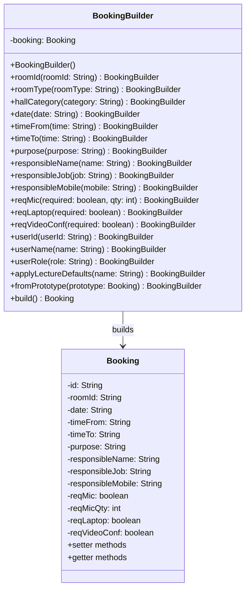
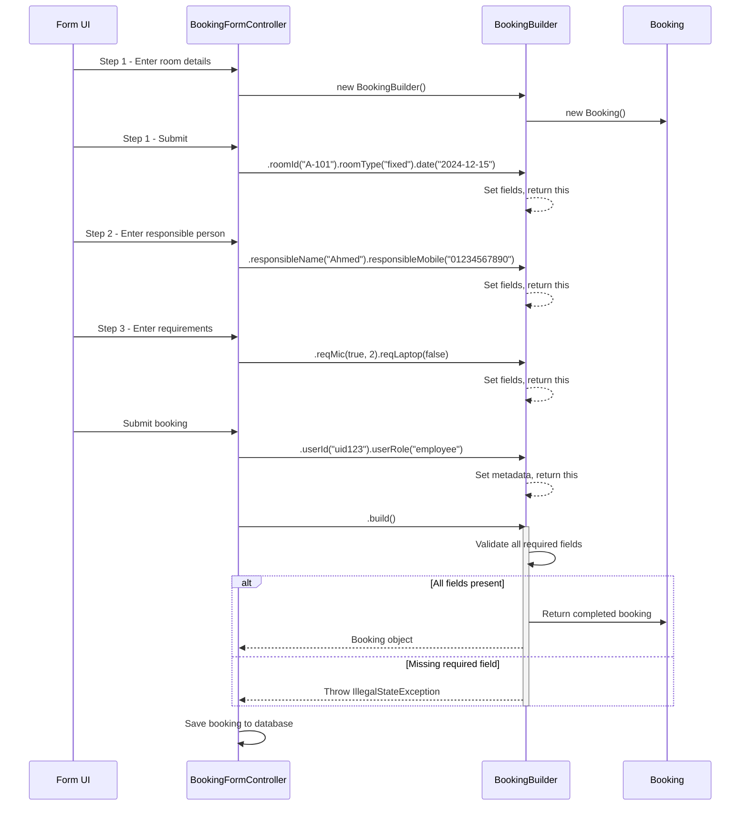
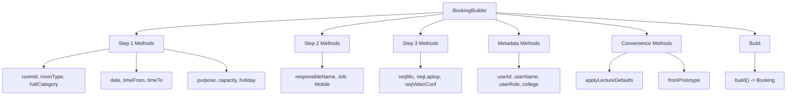
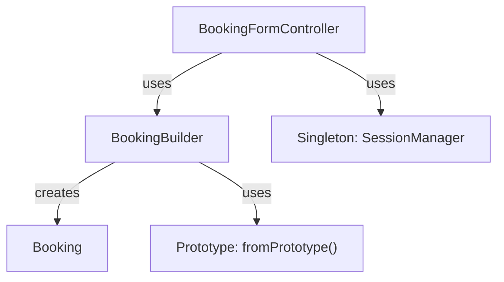

# Design Pattern: Builder

## Pattern Overview
**Pattern Name:** Builder  
**Category:** Creational Pattern  
**GoF Reference:** Separate the construction of a complex object from its representation allowing the same construction process to create different representations.

---

## Problem This Pattern Solves

The Booking model has 20+ fields spread across three form steps:
- **Step 1**: Room, date, time, purpose, capacity, holiday/official
- **Step 2**: Responsible person name, job, mobile
- **Step 3**: Equipment requirements, other details

**Without Builder Pattern:**
```java
// Nightmare: 20+ parameter constructor!
Booking booking = new Booking(
    "A-101", "fixed", "lecture", "2024-12-15", "14:00", "15:30",
    "محاضرة", 50, false, false,
    "أحمد محمد", "دكتور", "01234567890",
    true, 2, false, false, false, "",
    "uid123", "أحمد", "employee", "college1", "pending"
);
```

**With Builder Pattern:**
```java
Booking booking = new BookingBuilder()
    .roomId("A-101").roomType("fixed").hallCategory("lecture")
    .date("2024-12-15").timeFrom("14:00").timeTo("15:30")
    .purpose("محاضرة").requiredCapacity(50)
    .responsibleName("أحمد محمد").responsibleJob("دكتور")
    .responsibleMobile("01234567890")
    .reqMic(true, 2).reqLaptop(false)
    .userId("uid123").userName("أحمد")
    .build();
```

---

## Where It's Used in the Codebase

### **BookingBuilder** - Main Builder
**Location:** `/src/main/java/com/aast/booking/patterns/builder/BookingBuilder.java`

Provides fluent interface for constructing Booking objects step-by-step.

```java
public class BookingBuilder {

    private final Booking booking;

    public BookingBuilder() {
        this.booking = new Booking();
        this.booking.setReqMicQty(1);
        this.booking.setStatus("pending");
    }

    // ── Step 1: Basic Info ─────────────────────────────────────────
    public BookingBuilder roomId(String roomId) {
        booking.setRoomId(roomId);
        return this;
    }

    public BookingBuilder roomType(String roomType) {
        booking.setRoomType(roomType);
        return this;
    }

    public BookingBuilder hallCategory(String hallCategory) {
        booking.setHallCategory(hallCategory);
        return this;
    }

    public BookingBuilder date(String date) {
        booking.setDate(date);
        return this;
    }

    public BookingBuilder timeFrom(String timeFrom) {
        booking.setTimeFrom(timeFrom);
        return this;
    }

    public BookingBuilder timeTo(String timeTo) {
        booking.setTimeTo(timeTo);
        return this;
    }

    // ── Step 2: Responsible Person ───────────────────────────────
    public BookingBuilder responsibleName(String name) {
        booking.setResponsibleName(name);
        return this;
    }

    public BookingBuilder responsibleJob(String job) {
        booking.setResponsibleJob(job);
        return this;
    }

    public BookingBuilder responsibleMobile(String mobile) {
        booking.setResponsibleMobile(mobile);
        return this;
    }

    // ── Step 3: Requirements ──────────────────────────────────────
    public BookingBuilder reqMic(boolean reqMic, int qty) {
        booking.setReqMic(reqMic);
        booking.setReqMicQty(qty);
        return this;
    }

    public BookingBuilder reqLaptop(boolean reqLaptop) {
        booking.setReqLaptop(reqLaptop);
        return this;
    }

    // ── Metadata ──────────────────────────────────────────────────
    public BookingBuilder userId(String userId) {
        booking.setUserId(userId);
        return this;
    }

    public BookingBuilder userRole(String role) {
        booking.setUserRole(role);
        if ("admin".equals(role) || "temp_admin".equals(role)) {
            booking.setStatus("awaiting_manager_final");
        } else {
            booking.setStatus("pending");
        }
        return this;
    }

    // ── Pre-defined Defaults ──────────────────────────────────────
    public BookingBuilder applyLectureDefaults(String defaultResponsibleName) {
        if (booking.getResponsibleName() == null || booking.getResponsibleName().isEmpty()) {
            booking.setResponsibleName(defaultResponsibleName != null ? defaultResponsibleName : "");
        }
        booking.setReqMic(false);
        booking.setReqMicQty(0);
        booking.setReqLaptop(false);
        booking.setReqVideoConf(false);
        return this;
    }

    // ── Pre-fill from existing booking (Prototype pattern) ────────
    public BookingBuilder fromPrototype(Booking prototype) {
        booking.setRoomId(prototype.getRoomId());
        booking.setRoomType(prototype.getRoomType());
        // ... copy all fields
        return this;
    }

    // ── Build ─────────────────────────────────────────────────────
    public Booking build() {
        // Validate required fields
        if (booking.getDate() == null || booking.getDate().isEmpty())
            throw new IllegalStateException("date is required");
        if (booking.getTimeFrom() == null || booking.getTimeFrom().isEmpty())
            throw new IllegalStateException("timeFrom is required");
        if (booking.getTimeTo() == null || booking.getTimeTo().isEmpty())
            throw new IllegalStateException("timeTo is required");
        if (booking.getPurpose() == null || booking.getPurpose().isEmpty())
            throw new IllegalStateException("purpose is required");
        if (booking.getUserId() == null || booking.getUserId().isEmpty())
            throw new IllegalStateException("userId is required");
        if (booking.getHallCategory() == null || booking.getHallCategory().isEmpty())
            throw new IllegalStateException("hallCategory is required");

        return booking;
    }
}
```

---

## Implementation Details

### Fluent Interface Pattern

The builder uses method chaining to create readable code:

```java
public BookingBuilder roomId(String roomId) {
    booking.setRoomId(roomId);
    return this;  // Return 'this' to allow chaining
}
```

This enables:
```java
builder.roomId("A-101")
    .roomType("fixed")
    .hallCategory("lecture")
    .date("2024-12-15")
    // ... more method calls
```

### Step-by-Step Construction

```java
public BookingBuilder date(String date) {
    booking.setDate(date);
    return this;
}

public BookingBuilder timeFrom(String timeFrom) {
    booking.setTimeFrom(timeFrom);
    return this;
}

public BookingBuilder timeTo(String timeTo) {
    booking.setTimeTo(timeTo);
    return this;
}

// Usage:
builder.date("2024-12-15")
    .timeFrom("14:00")
    .timeTo("15:30")
```

### Validation on Build

```java
public Booking build() {
    // Check all required fields are set
    if (booking.getDate() == null || booking.getDate().isEmpty())
        throw new IllegalStateException("date is required");
    
    // Return only if all validations pass
    return booking;
}
```

### Optional vs. Required Fields

```java
// Required fields (checked in build())
booking.setDate(date);
booking.setTimeFrom(timeFrom);
booking.setTimeTo(timeTo);

// Optional fields (no validation)
booking.setReqMic(false);  // Can be omitted
booking.setReqVideoConf(false);  // Can be omitted
```

---

## Mermaid Class Diagram



---

## Mermaid Sequence Diagram: Builder Usage



---

## Code Examples from Real Usage

### Example 1: Simple Booking Creation

```java
public class BookingFormController {
    
    @FXML
    private void handleSubmit() {
        try {
            Booking booking = new BookingBuilder()
                .roomId(roomCombo.getValue())
                .roomType("fixed")
                .hallCategory("lecture")
                .date(datePicker.getValue().toString())
                .timeFrom(fromTime.getText())
                .timeTo(toTime.getText())
                .purpose(purposeField.getText())
                .requiredCapacity(Integer.parseInt(capacityField.getText()))
                .responsibleName(nameField.getText())
                .responsibleJob(jobField.getText())
                .responsibleMobile(phoneField.getText())
                .reqMic(micCheckbox.isSelected(), 1)
                .reqLaptop(laptopCheckbox.isSelected())
                .reqVideoConf(videoConfCheckbox.isSelected())
                .userId(SessionManager.getInstance().getCurrentUser().getId())
                .userName(SessionManager.getInstance().getCurrentUser().getDisplayName())
                .userRole(SessionManager.getInstance().getCurrentUser().getRole())
                .build();
            
            bookingService.save(booking);
            showSuccessAlert("Booking submitted successfully!");
            
        } catch (IllegalStateException e) {
            showErrorAlert("Validation error: " + e.getMessage());
        }
    }
}
```

### Example 2: Using Defaults

```java
public class LectureRoomBookingService {
    
    public Booking createDefaultLectureBooking(String roomId, LocalDate date) {
        return new BookingBuilder()
            .roomId(roomId)
            .roomType("fixed")
            .hallCategory("lecture")
            .date(date.toString())
            .applyLectureDefaults("Dr. Default")
            .userId(SessionManager.getInstance().getCurrentUser().getId())
            .userRole(SessionManager.getInstance().getCurrentUser().getRole())
            .build();
    }
}
```

### Example 3: Re-submitting with Prototype

```java
public class BookingFormController {
    
    public void prepareResubmission(Booking rejectedBooking) {
        // Use prototype pattern combined with builder
        Booking newBooking = new BookingBuilder()
            .fromPrototype(rejectedBooking)  // Copy all fields from rejected
            .roomId("B-202")  // Override suggested room
            .date(LocalDate.now().plusDays(1).toString())  // New date
            .userId(SessionManager.getInstance().getCurrentUser().getId())
            .build();
        
        // Populate form with new booking
        populateFormFromBooking(newBooking);
    }
}
```

---

## Validation Checklist

- [ ] **Method Chaining**: Each builder method returns 'this'
  - Test: Call multiple methods in chain and verify it works
  
- [ ] **Fluent Interface**: Code reads naturally left-to-right, top-to-bottom
  - Test: Review builder code and verify readability
  
- [ ] **Default Values**: Builder sets sensible defaults
  - Test: Create booking and verify reqMicQty defaults to 1
  
- [ ] **Validation on Build**: Required fields checked when build() called
  - Test: Build without date field, verify exception thrown
  
- [ ] **All Fields Set**: Every Booking field has builder method
  - Test: Create complete booking and verify no fields are null
  
- [ ] **Optional Fields**: Fields can be omitted without error
  - Test: Build without optional equipment fields, verify builds successfully
  
- [ ] **Immutability**: Builder doesn't expose internal Booking
  - Test: Modify returned booking and verify builder state unchanged

---

## Mermaid Diagram: Builder Method Categories



---

## Design Pattern Relationships



---

## Alignment with Web Application

The web app uses a similar multi-step form builder:

**Web App (React):**
```javascript
// Form state management
const [formData, setFormData] = useState({
    roomId: "",
    date: "",
    timeFrom: "",
    timeTo: "",
    purpose: "",
    // ... more fields
});

// On each step, update formData
const handleStep1Submit = (data) => {
    setFormData(prev => ({ ...prev, ...data }));
    goToStep(2);
};

// On final submit
const handleSubmit = () => {
    const booking = createBooking(formData);
    submitBooking(booking);
};
```

**Java App (Builder):**
```java
// Builder accumulates fields step by step
new BookingBuilder()
    .roomId(formData.roomId)
    .date(formData.date)
    .timeFrom(formData.timeFrom)
    // ... more fields
    .build();
```

Both systems:
- Build objects step by step across multiple screens
- Accumulate data as user progresses
- Validate only on final submission
- Support fluent/chained API

---

## Potential Issues & Mitigations

### Issue 1: Setter After Build
**Problem:** User can modify booking after build():

```java
Booking booking = builder.build();
booking.setRoomId("HACKED");  // Modifies completed booking
```

**Recommendation:** Make Booking immutable:
```java
public final class Booking {
    // All fields final
    private final String roomId;
    private final String date;
    // ... no setters, only getters
}
```

### Issue 2: Missing Required Field Caught Late
**Problem:** Don't know until build() that field is missing

**Mitigation:** Early validation:
```java
public Booking build() {
    // Check immediately
    if (booking.getDate() == null) {
        throw new IllegalStateException("date is required");
    }
    // ... validate all required fields
    return booking;
}
```

### Issue 3: Builder State Management
**Problem:** Can reuse builder and create multiple bookings accidentally:

```java
BookingBuilder builder = new BookingBuilder();
Booking b1 = builder.roomId("A-101").build();
Booking b2 = builder.build();  // b2 also has roomId "A-101"
```

**Recommendation:** Create new builder for each booking:
```java
Booking b1 = new BookingBuilder().roomId("A-101").build();
Booking b2 = new BookingBuilder().roomId("B-202").build();
```

---

## Notes on This Implementation

### Strengths
1. **Readability**: Code reads like natural language
2. **Flexibility**: Can build booking in any order
3. **Validation**: Catches errors at build time
4. **Defaults**: Sets sensible defaults automatically
5. **Extensibility**: Easy to add new builder methods

### Weaknesses
1. **Verbosity**: More code than direct constructor
2. **Performance**: Creates intermediate objects
3. **Memory**: Builder holds reference to booking while building
4. **Complexity**: More classes to understand
5. **Type Safety**: No compile-time guarantee all fields set

### Improvements
1. **Immutable Bookings**: Prevent modification after build
2. **Type-Safe Builder**: Use phantom types for compile-time safety
3. **Cascading Builders**: Separate builders for nested objects
4. **Required vs Optional**: Explicitly mark required fields
5. **Self-Validation**: Validate as fields are set, not just at build

---

## Related Patterns in This Codebase

- **Prototype Pattern**: `fromPrototype()` method copies existing bookings
- **Factory Pattern**: Could use factory to select appropriate builder
- **Decorator Pattern**: Could decorate builder to add features
- **Template Method**: Could use template for builder initialization

---

## Recommended Best Practices

1. **Clear Method Names**: Use domain language (not just setters)
2. **Validate Early**: Check constraints as fields are set
3. **Immutable Result**: Booking should be immutable after build()
4. **Fluent API**: Always return 'this' for chaining
5. **Sensible Defaults**: Set reasonable defaults in constructor

---

**Last Updated:** 2024  
**Pattern Status:** ✅ Active - Used for booking form submission
