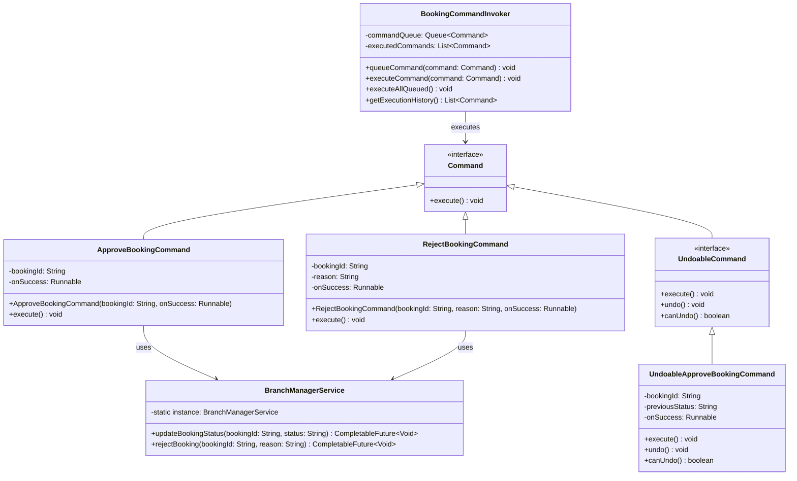
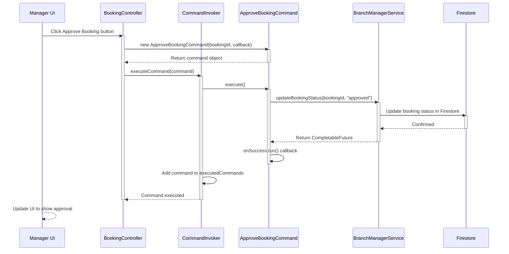
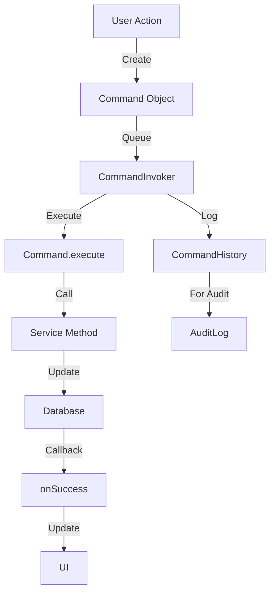
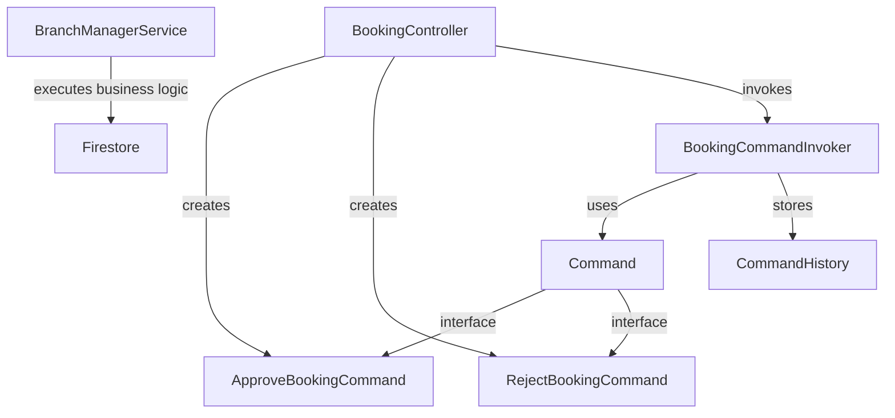

# Design Pattern: Command

## Pattern Overview
**Pattern Name:** Command  
**Category:** Behavioral Pattern  
**GoF Reference:** Encapsulate a request as an object allowing parametrization of clients with different requests, queuing of requests, and logging of requests.

---

## Problem This Pattern Solves

When admins or managers approve/reject bookings, the system needs to:
- Execute the approval/rejection action
- Potentially undo the action later
- Queue commands for batch processing
- Log all commands for audit trail
- Execute commands asynchronously

**Without Command Pattern:**
- Controllers directly call approval methods
- Undo/redo requires complex state management
- Commands scattered throughout codebase
- Hard to queue or defer execution
- No audit trail

**With Command Pattern:**
- Command object encapsulates approval logic
- Commands can be queued, executed, logged
- Each command object can implement undo()
- Separation between invoker (UI) and executor (service)

---

## Where It's Used in the Codebase

### 1. **Command** - Command Interface
**Location:** `/src/main/java/com/aast/booking/patterns/command/Command.java`

Defines the contract all commands must implement.

```java
public interface Command {
    void execute();
}
```

### 2. **ApproveBookingCommand** - Concrete Command
**Location:** `/src/main/java/com/aast/booking/patterns/command/ApproveBookingCommand.java`

Encapsulates the logic to approve a booking.

```java
public class ApproveBookingCommand implements Command {
    private final String bookingId;
    private final Runnable onSuccess;

    public ApproveBookingCommand(String bookingId, Runnable onSuccess) {
        this.bookingId = bookingId;
        this.onSuccess = onSuccess;
    }

    @Override
    public void execute() {
        BranchManagerService.getInstance()
            .updateBookingStatus(bookingId, "approved")
            .thenRun(onSuccess)
            .exceptionally(ex -> {
                ex.printStackTrace();
                return null;
            });
    }
}
```

### 3. **RejectBookingCommand** - Concrete Command
**Location:** `/src/main/java/com/aast/booking/patterns/command/RejectBookingCommand.java`

Encapsulates the logic to reject a booking.

```java
public class RejectBookingCommand implements Command {
    private final String bookingId;
    private final String reason;
    private final Runnable onSuccess;

    public RejectBookingCommand(String bookingId, String reason, Runnable onSuccess) {
        this.bookingId = bookingId;
        this.reason = reason;
        this.onSuccess = onSuccess;
    }

    @Override
    public void execute() {
        BranchManagerService.getInstance()
            .rejectBooking(bookingId, reason)
            .thenRun(onSuccess)
            .exceptionally(ex -> {
                ex.printStackTrace();
                return null;
            });
    }
}
```

---

## Implementation Details

### Command Invoker

```java
public class BookingCommandInvoker {
    private Queue<Command> commandQueue = new LinkedList<>();
    private List<Command> executedCommands = new ArrayList<>();
    
    public void queueCommand(Command command) {
        commandQueue.add(command);
    }
    
    public void executeCommand(Command command) {
        command.execute();
        executedCommands.add(command);
    }
    
    public void executeAllQueued() {
        while (!commandQueue.isEmpty()) {
            Command command = commandQueue.poll();
            executeCommand(command);
        }
    }
    
    public List<Command> getExecutionHistory() {
        return new ArrayList<>(executedCommands);
    }
}
```

### Undo-Capable Commands

```java
public interface UndoableCommand extends Command {
    void undo();
    boolean canUndo();
}

public class UndoableApproveBookingCommand implements UndoableCommand {
    private final String bookingId;
    private String previousStatus;
    private final Runnable onSuccess;
    
    public UndoableApproveBookingCommand(String bookingId, Runnable onSuccess) {
        this.bookingId = bookingId;
        this.onSuccess = onSuccess;
    }
    
    @Override
    public void execute() {
        // Save current status for undo
        Booking booking = BookingService.getInstance().getBooking(bookingId);
        previousStatus = booking.getStatus();
        
        // Execute approval
        BranchManagerService.getInstance()
            .updateBookingStatus(bookingId, "approved")
            .thenRun(onSuccess);
    }
    
    @Override
    public void undo() {
        if (previousStatus != null) {
            BranchManagerService.getInstance()
                .updateBookingStatus(bookingId, previousStatus);
        }
    }
    
    @Override
    public boolean canUndo() {
        return previousStatus != null;
    }
}
```

---

## Mermaid Class Diagram



---

## Mermaid Sequence Diagram: Command Execution



---

## Code Examples from Real Usage

### Example 1: Single Command Execution

```java
public class BookingApprovalController {
    
    @FXML
    private void handleApproveBooking() {
        Booking selectedBooking = bookingTable.getSelectionModel().getSelectedItem();
        
        Command approveCommand = new ApproveBookingCommand(
            selectedBooking.getId(),
            () -> {
                // Success callback
                showSuccessAlert("Booking approved!");
                refreshBookingList();
            }
        );
        
        approveCommand.execute();
    }
    
    @FXML
    private void handleRejectBooking() {
        Booking selectedBooking = bookingTable.getSelectionModel().getSelectedItem();
        String reason = reasonField.getText();
        
        Command rejectCommand = new RejectBookingCommand(
            selectedBooking.getId(),
            reason,
            () -> {
                showSuccessAlert("Booking rejected!");
                refreshBookingList();
            }
        );
        
        rejectCommand.execute();
    }
}
```

### Example 2: Batch Command Processing

```java
public class BatchBookingProcessor {
    
    private BookingCommandInvoker invoker = new BookingCommandInvoker();
    
    public void processApprovals(List<Booking> bookingsToApprove) {
        // Queue all approve commands
        for (Booking booking : bookingsToApprove) {
            Command approveCommand = new ApproveBookingCommand(
                booking.getId(),
                () -> { /* no-op */ }
            );
            invoker.queueCommand(approveCommand);
        }
        
        // Execute all at once
        invoker.executeAllQueued();
    }
    
    public void processRejections(List<Booking> bookingsToReject, String reason) {
        // Queue all reject commands
        for (Booking booking : bookingsToReject) {
            Command rejectCommand = new RejectBookingCommand(
                booking.getId(),
                reason,
                () -> { /* no-op */ }
            );
            invoker.queueCommand(rejectCommand);
        }
        
        // Execute all at once
        invoker.executeAllQueued();
    }
}
```

### Example 3: Command History

```java
public class BookingCommandHistory {
    
    private BookingCommandInvoker invoker = new BookingCommandInvoker();
    
    public void executeAndLog(Command command) {
        invoker.executeCommand(command);
        logCommand(command);
    }
    
    private void logCommand(Command command) {
        System.out.println("[LOG] " + command.getClass().getSimpleName() + 
                         " executed at " + LocalDateTime.now());
    }
    
    public void printExecutionHistory() {
        List<Command> history = invoker.getExecutionHistory();
        for (Command cmd : history) {
            System.out.println("  - " + cmd.getClass().getSimpleName());
        }
    }
}
```

---

## Validation Checklist

- [ ] **Command Interface**: All commands implement Command interface
  - Test: Create new command type and verify it implements execute()
  
- [ ] **Encapsulation**: Command encapsulates all needed data
  - Test: Create command without service reference, verify execute() works
  
- [ ] **Execution**: Command executes without throwing exceptions
  - Test: Call execute() and verify booking status changed in database
  
- [ ] **Callback Support**: onSuccess callback executed on completion
  - Test: Verify UI updates after command completes
  
- [ ] **Async Support**: Commands work with async operations
  - Test: Execute command that takes time, verify non-blocking
  
- [ ] **Queuing**: Commands can be queued and executed later
  - Test: Queue 3 commands, call executeAllQueued, verify all executed
  
- [ ] **History**: Executed commands are tracked
  - Test: Execute 5 commands, getExecutionHistory returns 5 commands

---

## Mermaid Diagram: Command Flow



---

## Design Pattern Relationships



---

## Potential Issues & Mitigations

### Issue 1: Callbacks Create Memory Leaks
**Problem:** Runnable callbacks keep references to controllers

```java
new ApproveBookingCommand(bookingId, () -> {
    // Controller reference kept alive!
    updateUI();
})
```

**Mitigation:** Use weak references or clear callbacks:
```java
Command cmd = new ApproveBookingCommand(bookingId, null);
// Or use WeakReference
```

### Issue 2: Command Execution Order
**Problem:** Commands queued but executed out of order

**Mitigation:** Use blocking queue if order matters:
```java
private Queue<Command> commandQueue = 
    new LinkedBlockingQueue<>();
```

### Issue 3: Command Failure Handling
**Problem:** If command fails, no error feedback

**Mitigation:** Add error callback:
```java
public class CommandWithErrorHandling implements Command {
    private Runnable onSuccess;
    private Consumer<Exception> onError;
    
    public void execute() {
        try {
            // Execute command
        } catch (Exception e) {
            onError.accept(e);
        }
    }
}
```

---

## Notes on This Implementation

### Strengths
1. **Decoupling**: UI doesn't know about service logic
2. **Queueing**: Commands can be deferred or batched
3. **Logging**: Easy to track all commands
4. **Undo/Redo**: Can implement undo by storing previous state
5. **Async**: Works well with CompletableFuture

### Weaknesses
1. **Overhead**: More objects for simple operations
2. **Complexity**: Harder to debug through indirection
3. **Memory**: Each command holds references
4. **Callback Hell**: onSuccess callbacks can nest
5. **Error Handling**: Need to handle exceptions carefully

### Improvements
1. **Macro Commands**: Support composite commands that contain multiple commands
2. **Command Registry**: Central registry of available commands
3. **Scheduling**: Schedule commands for later execution
4. **Retry Logic**: Auto-retry failed commands
5. **Transactions**: Group commands in database transactions

---

## Related Patterns in This Codebase

- **Memento Pattern**: Commands could store previous state for undo
- **Facade Pattern**: Commands hide service layer complexity
- **Singleton Pattern**: Services are typically singletons
- **Observer Pattern**: Commands could publish completion events

---

## Recommended Best Practices

1. **Immutable Commands**: Don't modify command after creation
2. **Clear Naming**: Name commands by the action they perform
3. **Error Handling**: Catch and handle exceptions in execute()
4. **Logging**: Log all command executions
5. **Type Safety**: Use generics for command parameterization

---

**Last Updated:** 2024  
**Pattern Status:** ✅ Active - Used for booking approvals/rejections
