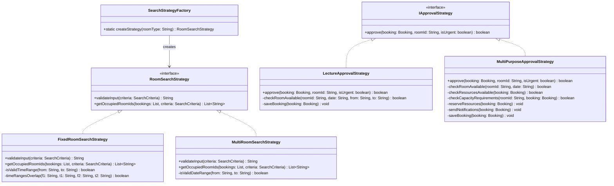
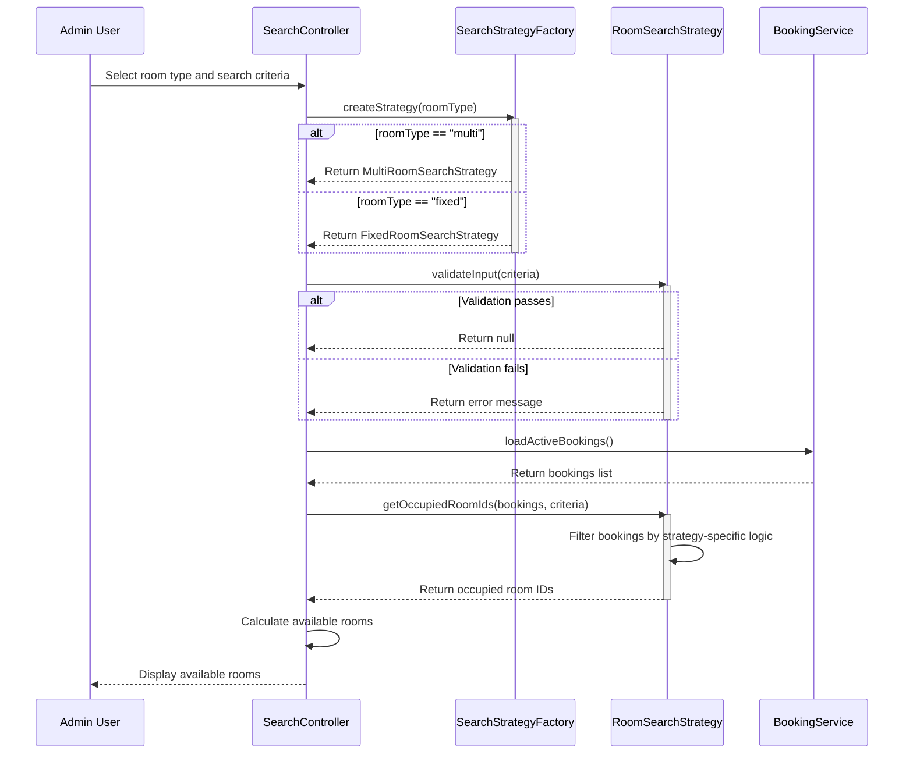
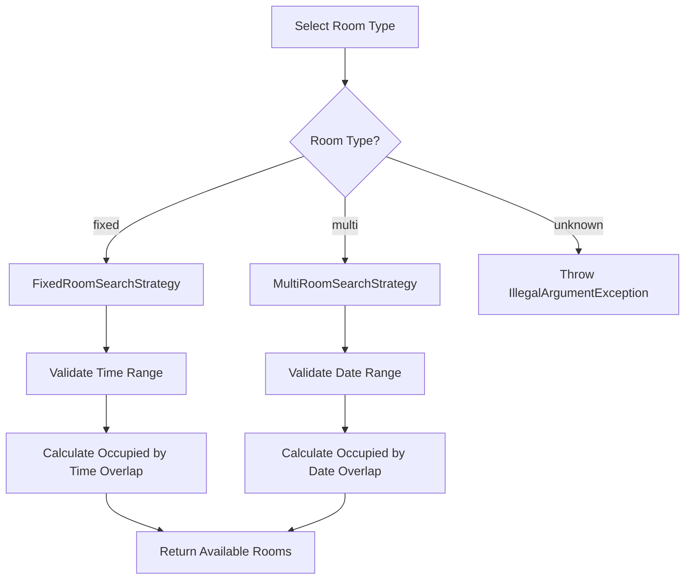
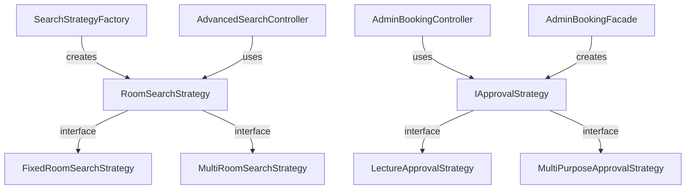

# Design Pattern: Strategy

## Pattern Overview
**Pattern Name:** Strategy  
**Category:** Behavioral Pattern  
**GoF Reference:** Define a family of algorithms, encapsulate each one, and make them interchangeable allowing the algorithm to vary independently from clients that use it.

---

## Problem This Pattern Solves

The SRD application needs different approval logic for different room types:
- **Fixed Rooms (Lecture)**: Simple approval based on time slot availability
- **Multi-Purpose Rooms**: Complex approval with resource conflicts check

Also different search strategies for finding available rooms:
- **Fixed Room Search**: Check lecture hall availability
- **Multi Room Search**: Check flexible room availability

**Without Strategy Pattern:**
- AdminDashboard has if-else chains deciding which approval logic to use
- Search controller has similar if-else chains for different room types
- Adding a new room type requires modifying existing controllers
- Cannot swap strategies at runtime

**With Strategy Pattern:**
- Each approval algorithm is a separate Strategy class
- Controller selects strategy based on room type
- New room types only require new strategy classes
- Strategies can be swapped dynamically

---

## Where It's Used in the Codebase

### 1. **Room Search Strategies**

#### **RoomSearchStrategy** - Strategy Interface
**Location:** `/src/main/java/com/aast/booking/admin/search/RoomSearchStrategy.java`

```java
public interface RoomSearchStrategy {

    /**
     * Validates the search parameters.
     * @return an Arabic error message if invalid, or null if valid.
     */
    String validateInput(SearchCriteria criteria);

    /**
     * Filters the active bookings list and returns only the IDs of rooms
     * that are OCCUPIED during the requested time window.
     */
    List<String> getOccupiedRoomIds(List<Booking> activeBookings, 
                                     SearchCriteria criteria);
}
```

#### **FixedRoomSearchStrategy** - Concrete Strategy
**Location:** `/src/main/java/com/aast/booking/admin/search/FixedRoomSearchStrategy.java`

```java
public class FixedRoomSearchStrategy implements RoomSearchStrategy {

    @Override
    public String validateInput(SearchCriteria criteria) {
        if (criteria.getTimeFrom() == null || criteria.getTimeFrom().isEmpty()) {
            return "من فضلك أدخل وقت البداية";  // "Please enter start time"
        }
        if (criteria.getTimeTo() == null || criteria.getTimeTo().isEmpty()) {
            return "من فضلك أدخل وقت النهاية";  // "Please enter end time"
        }
        // Validate time range
        if (!isValidTimeRange(criteria.getTimeFrom(), criteria.getTimeTo())) {
            return "وقت النهاية يجب أن يكون بعد وقت البداية";
        }
        return null;  // Valid
    }

    @Override
    public List<String> getOccupiedRoomIds(List<Booking> activeBookings, 
                                           SearchCriteria criteria) {
        List<String> occupied = new ArrayList<>();
        
        for (Booking booking : activeBookings) {
            if (booking.getRoomType().equals("fixed")) {
                // Check if time range overlaps
                if (timeRangesOverlap(
                    booking.getTimeFrom(), booking.getTimeTo(),
                    criteria.getTimeFrom(), criteria.getTimeTo())) {
                    occupied.add(booking.getRoomId());
                }
            }
        }
        
        return occupied;
    }

    private boolean isValidTimeRange(String from, String to) {
        // Implementation specific to fixed rooms
        return true;
    }

    private boolean timeRangesOverlap(String from1, String to1, 
                                      String from2, String to2) {
        // Check if two time ranges overlap
        return true;
    }
}
```

#### **MultiRoomSearchStrategy** - Concrete Strategy
**Location:** `/src/main/java/com/aast/booking/admin/search/MultiRoomSearchStrategy.java`

```java
public class MultiRoomSearchStrategy implements RoomSearchStrategy {

    @Override
    public String validateInput(SearchCriteria criteria) {
        // Multi-rooms have different validation rules
        if (criteria.getStartDate() == null || criteria.getStartDate().isEmpty()) {
            return "من فضلك اختر تاريخ البداية";  // "Please select start date"
        }
        if (criteria.getEndDate() == null || criteria.getEndDate().isEmpty()) {
            return "من فضلك اختر تاريخ النهاية";  // "Please select end date"
        }
        // Validate date range
        if (!isValidDateRange(criteria.getStartDate(), criteria.getEndDate())) {
            return "تاريخ النهاية يجب أن يكون بعد تاريخ البداية";
        }
        return null;  // Valid
    }

    @Override
    public List<String> getOccupiedRoomIds(List<Booking> activeBookings, 
                                           SearchCriteria criteria) {
        List<String> occupied = new ArrayList<>();
        LocalDate startDate = LocalDate.parse(criteria.getStartDate());
        LocalDate endDate = LocalDate.parse(criteria.getEndDate());
        
        for (Booking booking : activeBookings) {
            if (booking.getRoomType().equals("multi")) {
                LocalDate bookingDate = LocalDate.parse(booking.getDate());
                
                // Check if booking date falls in requested range
                if (!bookingDate.isBefore(startDate) && 
                    !bookingDate.isAfter(endDate)) {
                    occupied.add(booking.getRoomId());
                }
            }
        }
        
        return occupied;
    }

    private boolean isValidDateRange(String from, String to) {
        // Implementation specific to multi rooms
        return true;
    }
}
```

### 2. **SearchStrategyFactory** - Factory for Strategies
**Location:** `/src/main/java/com/aast/booking/admin/search/SearchStrategyFactory.java`

```java
public class SearchStrategyFactory {

    private SearchStrategyFactory() { /* utility — not instantiable */ }

    /**
     * @param roomType "fixed" or "multi"
     * @return the appropriate RoomSearchStrategy
     * @throws IllegalArgumentException for unknown room types
     */
    public static RoomSearchStrategy createStrategy(String roomType) {
        if ("multi".equals(roomType)) {
            return new MultiRoomSearchStrategy();
        }
        if ("fixed".equals(roomType)) {
            return new FixedRoomSearchStrategy();
        }
        throw new IllegalArgumentException("Unknown room type: " + roomType);
    }
}
```

### 3. **Approval Strategies**

#### **IApprovalStrategy** - Strategy Interface
**Location:** `/src/main/java/com/aast/booking/admin/strategies/IApprovalStrategy.java`

```java
public interface IApprovalStrategy {
    /**
     * Executes the approval logic for a booking.
     *
     * @param booking  The booking to approve.
     * @param roomId   The selected room ID.
     * @param isUrgent Whether the booking is marked as urgent.
     * @return true if successful, false otherwise.
     */
    boolean approve(Booking booking, String roomId, boolean isUrgent) throws Exception;
}
```

#### **LectureApprovalStrategy** - Concrete Strategy
**Location:** `/src/main/java/com/aast/booking/admin/strategies/LectureApprovalStrategy.java`

```java
public class LectureApprovalStrategy implements IApprovalStrategy {

    @Override
    public boolean approve(Booking booking, String roomId, boolean isUrgent) 
        throws Exception {
        
        // Fixed rooms have simple approval logic
        // 1. Check room availability
        if (!checkRoomAvailable(roomId, booking.getDate(), 
                               booking.getTimeFrom(), booking.getTimeTo())) {
            throw new Exception("Room not available for selected time");
        }
        
        // 2. Update booking with room assignment
        booking.setRoomId(roomId);
        booking.setStatus("approved");
        
        // 3. Save to database
        saveBooking(booking);
        
        return true;
    }

    private boolean checkRoomAvailable(String roomId, String date, 
                                      String timeFrom, String timeTo) {
        // Check if room is available
        return true;
    }

    private void saveBooking(Booking booking) {
        // Save to Firestore
    }
}
```

#### **MultiPurposeApprovalStrategy** - Concrete Strategy
**Location:** `/src/main/java/com/aast/booking/admin/strategies/MultiPurposeApprovalStrategy.java`

```java
public class MultiPurposeApprovalStrategy implements IApprovalStrategy {

    @Override
    public boolean approve(Booking booking, String roomId, boolean isUrgent) 
        throws Exception {
        
        // Multi-rooms have complex approval logic
        // 1. Check room availability
        if (!checkRoomAvailable(roomId, booking.getDate())) {
            throw new Exception("Room not available for selected date");
        }
        
        // 2. Check resource conflicts
        if (!checkResourcesAvailable(booking)) {
            throw new Exception("Required resources not available");
        }
        
        // 3. Check booking capacity
        if (!checkCapacityRequirements(roomId, booking)) {
            throw new Exception("Room capacity insufficient");
        }
        
        // 4. Update booking
        booking.setRoomId(roomId);
        booking.setStatus("approved");
        
        // 5. Reserve resources
        reserveResources(booking);
        
        // 6. Send notifications
        sendNotifications(booking);
        
        // 7. Save to database
        saveBooking(booking);
        
        return true;
    }

    private boolean checkRoomAvailable(String roomId, String date) {
        return true;
    }

    private boolean checkResourcesAvailable(Booking booking) {
        return true;
    }

    private boolean checkCapacityRequirements(String roomId, Booking booking) {
        return true;
    }

    private void reserveResources(Booking booking) {
        // Reserve equipment
    }

    private void sendNotifications(Booking booking) {
        // Send emails
    }

    private void saveBooking(Booking booking) {
        // Save to Firestore
    }
}
```

---

## Implementation Details

### Using Strategy Pattern in Controller

```java
public class AdminBookingController {
    
    @FXML
    private void handleApproveBooking() {
        Booking selectedBooking = bookingTable.getSelectionModel().getSelectedItem();
        String selectedRoomId = roomSelectionCombo.getValue();
        boolean isUrgent = urgentCheckbox.isSelected();
        
        try {
            // Select strategy based on room type
            IApprovalStrategy strategy = selectApprovalStrategy(selectedBooking);
            
            // Execute approval with selected strategy
            boolean success = strategy.approve(selectedBooking, selectedRoomId, isUrgent);
            
            if (success) {
                showSuccessAlert("Booking approved!");
                refreshBookingList();
            }
        } catch (Exception e) {
            showErrorAlert("Approval failed: " + e.getMessage());
        }
    }
    
    private IApprovalStrategy selectApprovalStrategy(Booking booking) {
        if ("multi".equals(booking.getRoomType())) {
            return new MultiPurposeApprovalStrategy();
        } else {
            return new LectureApprovalStrategy();
        }
    }
}
```

### Using Strategy with Factory

```java
public class AdvancedRoomSearchController {
    
    @FXML
    private void handleSearch() {
        String roomType = roomTypeCombo.getValue();  // "fixed" or "multi"
        
        // Get search criteria from UI
        SearchCriteria criteria = new SearchCriteria(
            timeFromField.getText(),
            timeToField.getText(),
            dateField.getValue().toString()
        );
        
        try {
            // Create strategy using factory
            RoomSearchStrategy strategy = SearchStrategyFactory.createStrategy(roomType);
            
            // Validate input with strategy
            String validationError = strategy.validateInput(criteria);
            if (validationError != null) {
                showErrorAlert(validationError);
                return;
            }
            
            // Get occupied rooms using strategy
            List<Booking> activeBookings = loadActiveBookings();
            List<String> occupiedRoomIds = strategy.getOccupiedRoomIds(
                activeBookings, criteria
            );
            
            // Display available rooms
            displayAvailableRooms(roomType, occupiedRoomIds);
            
        } catch (IllegalArgumentException e) {
            showErrorAlert("Invalid room type: " + e.getMessage());
        }
    }
}
```

---

## Mermaid Class Diagram



---

## Mermaid Sequence Diagram: Strategy Selection and Execution



---

## Code Examples from Real Usage

### Example 1: Room Search with Strategy

```java
public void searchAvailableRooms(String roomType, String date, String timeFrom, String timeTo) {
    try {
        SearchCriteria criteria = new SearchCriteria(date, timeFrom, timeTo);
        
        // Strategy pattern: choose algorithm based on room type
        RoomSearchStrategy strategy = SearchStrategyFactory.createStrategy(roomType);
        
        // Validate using strategy
        String error = strategy.validateInput(criteria);
        if (error != null) {
            showError(error);
            return;
        }
        
        // Get occupied rooms using strategy
        List<Booking> activeBookings = getBookingsForDate(date);
        List<String> occupied = strategy.getOccupiedRoomIds(activeBookings, criteria);
        
        // Display available rooms (rooms NOT in occupied list)
        List<Room> available = getAllRooms().stream()
            .filter(r -> r.getType().equals(roomType))
            .filter(r -> !occupied.contains(r.getId()))
            .collect(Collectors.toList());
        
        displayResults(available);
        
    } catch (IllegalArgumentException e) {
        showError("Invalid room type");
    }
}
```

### Example 2: Dynamic Strategy Selection for Approval

```java
public void approveBooking(Booking booking, String roomId, boolean isUrgent) {
    try {
        // Dynamic strategy selection
        IApprovalStrategy strategy;
        if ("multi".equals(booking.getRoomType())) {
            strategy = new MultiPurposeApprovalStrategy();
        } else {
            strategy = new LectureApprovalStrategy();
        }
        
        // Execute approval with appropriate strategy
        boolean success = strategy.approve(booking, roomId, isUrgent);
        
        if (success) {
            showMessage("Booking approved successfully");
            refreshUI();
        }
        
    } catch (Exception e) {
        showError("Approval failed: " + e.getMessage());
    }
}
```

---

## Validation Checklist

- [ ] **Strategy Interface**: All strategies implement the same interface
  - Test: Call interface methods on different strategy implementations
  
- [ ] **Strategy Interchange**: Can swap strategies without changing controller
  - Test: Change strategy selection logic and verify behavior changes
  
- [ ] **Validation Logic**: Each strategy has different validation rules
  - Test: Validate fixed room (time range) vs. multi room (date range)
  
- [ ] **Occupied Rooms**: Each strategy calculates occupied rooms correctly
  - Test: Fixed room overlaps by time, multi room overlaps by date
  
- [ ] **Approval Logic**: Each strategy has different approval steps
  - Test: Multi-purpose strategy checks resources, lecture doesn't
  
- [ ] **Factory Pattern**: Factory creates correct strategy for room type
  - Test: Pass "fixed", verify gets FixedRoomSearchStrategy
  
- [ ] **Error Handling**: Unknown room type throws appropriate exception
  - Test: Pass "invalid_type", verify IllegalArgumentException thrown

---

## Mermaid Diagram: Strategy Selection Decision Tree



---

## Design Pattern Relationships



---

## Potential Issues & Mitigations

### Issue 1: Strategy Selection Logic Scattered
**Problem:** Controllers decide which strategy to use

**Mitigation:** Use factory or context class:
```java
public class StrategySelector {
    public static RoomSearchStrategy selectSearchStrategy(String roomType) {
        return SearchStrategyFactory.createStrategy(roomType);
    }
    
    public static IApprovalStrategy selectApprovalStrategy(String roomType) {
        return roomType.equals("multi")
            ? new MultiPurposeApprovalStrategy()
            : new LectureApprovalStrategy();
    }
}
```

### Issue 2: Duplicate Code in Strategies
**Problem:** Common validation code repeated in each strategy

**Mitigation:** Extract common logic:
```java
public abstract class BaseRoomSearchStrategy implements RoomSearchStrategy {
    protected boolean isTimeSpecified(SearchCriteria criteria) {
        return criteria.getTimeFrom() != null && 
               !criteria.getTimeFrom().isEmpty();
    }
}
```

### Issue 3: Adding New Strategy Requires Restart
**Problem:** Strategies compiled into code, can't add new one without rebuild

**Mitigation:** Load strategies from configuration:
```java
public class ConfigurableStrategyFactory {
    private static Map<String, String> strategyMap = 
        loadFromConfig("strategies.properties");
    
    public static RoomSearchStrategy createStrategy(String roomType) {
        String className = strategyMap.get(roomType);
        return (RoomSearchStrategy) Class.forName(className).newInstance();
    }
}
```

---

## Notes on This Implementation

### Strengths
1. **Flexibility**: Different algorithms for different contexts
2. **Encapsulation**: Each strategy has its own logic
3. **Testability**: Can test each strategy independently
4. **Open/Closed**: Open for extension, closed for modification
5. **Runtime Selection**: Choose strategy based on runtime conditions

### Weaknesses
1. **Complexity**: More classes to understand
2. **Overhead**: Creating strategy objects
3. **Communication**: Strategies need to communicate results back
4. **Context**: Controller needs to understand which strategy to use
5. **Duplication**: Common code may be repeated across strategies

### Improvements
1. **Context Class**: Encapsulate strategy selection logic
2. **Composition**: Build strategies from smaller components
3. **Chain of Responsibility**: Try strategies in sequence
4. **Template Method**: Share common algorithm structure
5. **Lazy Initialization**: Create strategies on demand

---

## Related Patterns in This Codebase

- **Factory Pattern**: `SearchStrategyFactory` creates strategies
- **Template Method Pattern**: Could share algorithm structure
- **Composite Pattern**: Could combine strategies

---

## Recommended Best Practices

1. **Strategy Interface**: Keep interface small and focused
2. **Documentation**: Document what each strategy does differently
3. **Testing**: Test each strategy with same inputs
4. **Factory Method**: Use factory to create strategies
5. **Context Class**: Encapsulate strategy selection logic

---

**Last Updated:** 2024  
**Pattern Status:** ✅ Active - Used for room search and booking approval
