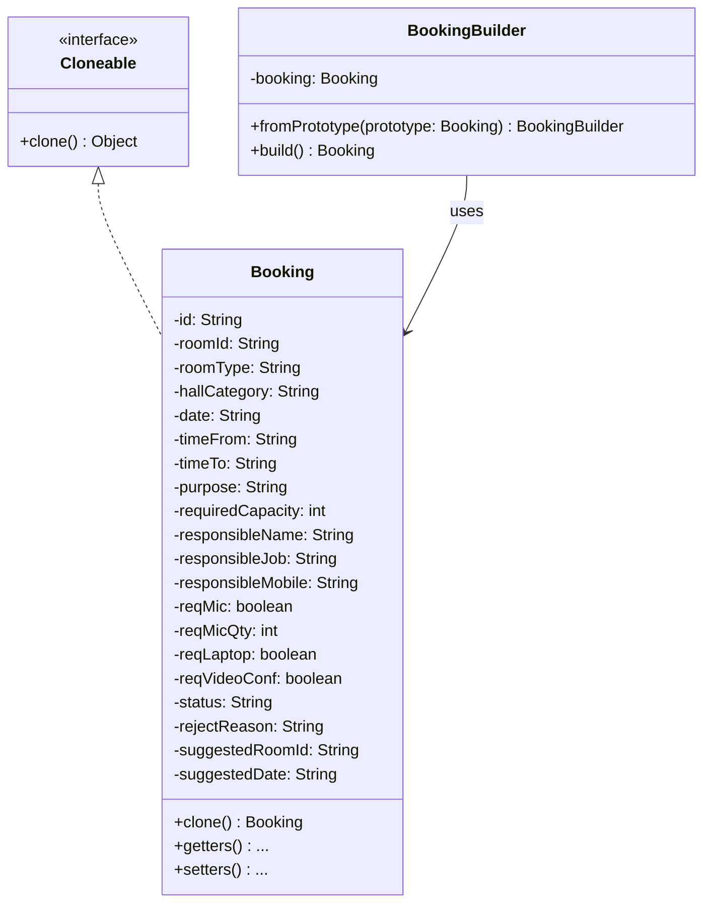
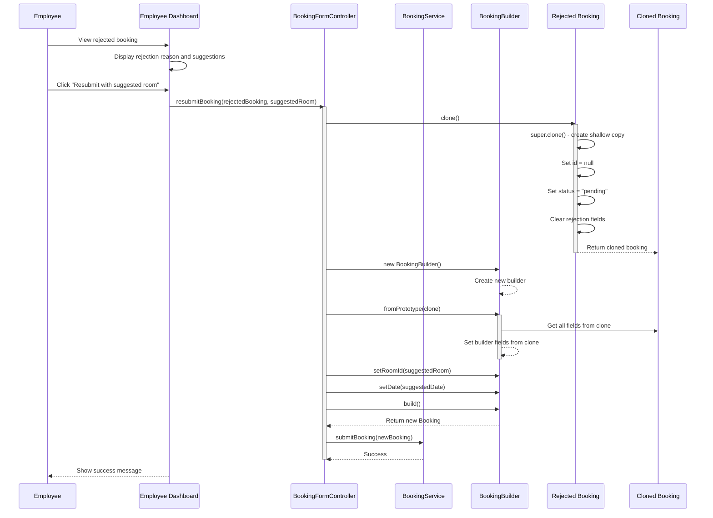

# Design Pattern: Prototype

## Pattern Overview
**Pattern Name:** Prototype (Clone)  
**Category:** Creational Pattern  
**GoF Reference:** Specify the kinds of objects to create using a prototypical instance and create new objects by copying this prototype.

---

## Problem This Pattern Solves

When an employee's booking is rejected, they can resubmit with a suggested alternative room/time. The system needs to:
- Copy the original booking's details (room type, purpose, capacity, etc.)
- Allow modification of specific fields (room ID, date, time)
- Create a new booking object without losing original data

**Without Prototype Pattern:**
```java
// Manually copy 20+ fields
Booking resubmittedBooking = new Booking();
resubmittedBooking.setRoomType(rejectedBooking.getRoomType());
resubmittedBooking.setHallCategory(rejectedBooking.getHallCategory());
resubmittedBooking.setPurpose(rejectedBooking.getPurpose());
resubmittedBooking.setRequiredCapacity(rejectedBooking.getRequiredCapacity());
// ... 16 more fields!
resubmittedBooking.setRoomId(suggestedRoom);  // Update suggested
resubmittedBooking.setDate(suggestedDate);     // Update suggested
```

**With Prototype Pattern:**
```java
Booking resubmittedBooking = rejectedBooking.clone();
resubmittedBooking.setRoomId(suggestedRoom);
resubmittedBooking.setDate(suggestedDate);
```

---

## Where It's Used in the Codebase

### **Booking** - Prototype Implementation
**Location:** `/src/main/java/com/aast/booking/models/Booking.java`

Implements the `Cloneable` interface for deep copying.

```java
public class Booking implements Cloneable {

    private String id;
    private String roomId;
    private String roomType;
    private String hallCategory;
    private String date;
    private String timeFrom;
    private String timeTo;
    private String purpose;
    private int requiredCapacity;
    private boolean isHolidayEvent;
    private boolean isOfficialOccasion;

    // Step 2: Responsible person
    private String responsibleName;
    private String responsibleJob;
    private String responsibleMobile;

    // Step 3: Requirements
    private boolean reqMic;
    private int reqMicQty;
    private boolean reqLaptop;
    private boolean reqVideoConf;
    private boolean reqOther;
    private String reqOtherDetails;

    // Metadata
    private String userId;
    private String userName;
    private String userRole;
    private String college;
    private String status;

    // Rejection fields
    private String rejectReason;
    private String suggestedRoomId;
    private String suggestedDate;
    private String suggestedTimeFrom;
    private String suggestedTimeTo;

    private Date createdAt;

    /**
     * Creates a deep copy of this booking.
     * Used when employee clicks "تقديم الطلب بالبديل" on a rejected booking.
     *
     * The clone will have:
     *  - All original fields copied
     *  - id = null (it's a NEW booking)
     *  - status = "pending" (reset)
     *  - rejectReason, suggested* fields cleared
     *  - createdAt = null (will be set by server)
     */
    @Override
    public Booking clone() {
        try {
            Booking cloned = (Booking) super.clone();
            
            // Reset fields that should be new for the resubmitted booking
            cloned.id = null;  // New booking, no ID yet
            cloned.status = "pending";  // Reset to pending
            cloned.rejectReason = null;  // Clear rejection reason
            cloned.suggestedRoomId = null;
            cloned.suggestedDate = null;
            cloned.suggestedTimeFrom = null;
            cloned.suggestedTimeTo = null;
            cloned.createdAt = null;  // Server will set new timestamp
            
            // All other fields are copied (shallow copy for immutable types is fine)
            return cloned;
            
        } catch (CloneNotSupportedException e) {
            throw new RuntimeException("Clone not supported", e);
        }
    }

    // ... getters and setters
}
```

---

## Implementation Details

### Shallow vs. Deep Copy

For the `Booking` class, a shallow copy (using `super.clone()`) is sufficient because:
- All fields are either primitive types (int, boolean) or immutable String objects
- String objects in Java are immutable, so sharing references is safe

If the Booking contained mutable objects like lists or custom objects, we'd need deep copy:

```java
@Override
public Booking clone() {
    try {
        Booking cloned = (Booking) super.clone();
        
        // Deep copy for mutable fields
        if (this.suggestions != null) {
            cloned.suggestions = new ArrayList<>(this.suggestions);
        }
        
        return cloned;
    } catch (CloneNotSupportedException e) {
        throw new RuntimeException(e);
    }
}
```

### Clone Combined with Builder Pattern

```java
public class BookingBuilder {
    
    private final Booking booking;
    
    // Pre-fill from existing booking (used with Prototype)
    public BookingBuilder fromPrototype(Booking prototype) {
        Booking clone = prototype.clone();
        
        booking.setRoomId(clone.getRoomId());
        booking.setRoomType(clone.getRoomType());
        booking.setHallCategory(clone.getHallCategory());
        booking.setDate(clone.getDate());
        booking.setTimeFrom(clone.getTimeFrom());
        booking.setTimeTo(clone.getTimeTo());
        booking.setPurpose(clone.getPurpose());
        booking.setRequiredCapacity(clone.getRequiredCapacity());
        booking.setHolidayEvent(clone.isHolidayEvent());
        booking.setOfficialOccasion(clone.isOfficialOccasion());
        booking.setResponsibleName(clone.getResponsibleName());
        booking.setResponsibleJob(clone.getResponsibleJob());
        booking.setResponsibleMobile(clone.getResponsibleMobile());
        booking.setReqMic(clone.isReqMic());
        booking.setReqMicQty(clone.getReqMicQty());
        booking.setReqLaptop(clone.isReqLaptop());
        booking.setReqVideoConf(clone.isReqVideoConf());
        booking.setReqOther(clone.isReqOther());
        booking.setReqOtherDetails(clone.getReqOtherDetails());
        
        return this;
    }
    
    public Booking build() {
        return booking;
    }
}
```

---

## Mermaid Class Diagram



---

## Mermaid Sequence Diagram: Prototype Clone Flow



---

## Code Examples from Real Usage

### Example 1: Resubmitting a Rejected Booking

```java
public class EmployeeDashboardController {
    
    @FXML
    private void handleResubmitBooking() {
        Booking rejectedBooking = bookingTable.getSelectionModel().getSelectedItem();
        
        if (rejectedBooking == null || !"rejected".equals(rejectedBooking.getStatus())) {
            showWarning("Please select a rejected booking");
            return;
        }
        
        try {
            // Clone the rejected booking for resubmission
            Booking clonedBooking = rejectedBooking.clone();
            
            // Apply suggested alternatives
            if (rejectedBooking.getSuggestedRoomId() != null) {
                clonedBooking.setRoomId(rejectedBooking.getSuggestedRoomId());
            }
            
            if (rejectedBooking.getSuggestedDate() != null) {
                clonedBooking.setDate(rejectedBooking.getSuggestedDate());
                clonedBooking.setTimeFrom(rejectedBooking.getSuggestedTimeFrom());
                clonedBooking.setTimeTo(rejectedBooking.getSuggestedTimeTo());
            }
            
            // Save as new booking
            bookingService.submitBooking(clonedBooking);
            showSuccessAlert("Booking resubmitted with suggested alternatives");
            
        } catch (Exception e) {
            showErrorAlert("Error resubmitting booking: " + e.getMessage());
        }
    }
}
```

### Example 2: Clone with Builder

```java
public void createVariantBooking(Booking originalBooking, String alternateRoom) {
    // Use prototype to create clone, then builder to customize
    Booking variantBooking = new BookingBuilder()
        .fromPrototype(originalBooking)  // Clone all fields
        .roomId(alternateRoom)             // Override room
        .build();
    
    bookingService.submitBooking(variantBooking);
}
```

### Example 3: Multiple Clones with Different Changes

```java
public void submitAlternativeBookings(Booking originalBooking, 
                                     List<String> alternateRoomIds) {
    
    List<Booking> alternatives = new ArrayList<>();
    
    for (String roomId : alternateRoomIds) {
        // Clone for each alternative room
        Booking alternative = originalBooking.clone();
        alternative.setRoomId(roomId);
        alternatives.add(alternative);
    }
    
    // Submit all alternatives
    for (Booking alt : alternatives) {
        bookingService.submitBooking(alt);
    }
}
```

---

## Validation Checklist

- [ ] **Clone Implementation**: Booking implements Cloneable and clone() method
  - Test: Call `booking.clone()` and verify no exception
  
- [ ] **Deep Copy**: Clone creates independent object, not reference
  - Test: Modify cloned booking, verify original unchanged
  
- [ ] **Field Reset**: ID, status, rejection fields reset in clone
  - Test: Clone rejected booking, verify id=null and status="pending"
  
- [ ] **Data Preservation**: Non-reset fields copied correctly
  - Test: Clone booking and verify room type, purpose, etc. match
  
- [ ] **Metadata Clear**: Created timestamp cleared for resubmission
  - Test: Clone and verify createdAt is null
  
- [ ] **Builder Integration**: BookingBuilder.fromPrototype() works with clone
  - Test: Use fromPrototype() to populate builder from clone
  
- [ ] **Immutable Fields**: Primitive and String fields safe to shallow copy
  - Test: Verify no issues with multiple clones sharing String references

---

## Mermaid Diagram: Clone State Changes

```mermaid
graph TD
    A["Original Booking<br/>id: 'booking-123'<br/>status: 'rejected'<br/>roomId: 'A-101'<br/>reason: 'Room unavailable'<br/>suggestedRoom: 'B-202'"]
    
    B["Cloned Booking<br/>id: null (NEW)<br/>status: 'pending'<br/>roomId: 'A-101' (copied)<br/>reason: null (cleared)<br/>suggestedRoom: null (cleared)"]
    
    C["Modified Clone<br/>id: null<br/>status: 'pending'<br/>roomId: 'B-202' (overridden)<br/>date: new date (overridden)<br/>time: new time (overridden)"]
    
    A -->|clone()| B
    B -->|setRoomId()<br/>setDate()<br/>setTime()| C
    
    style A fill:#fff3cd
    style B fill:#d4edda
    style C fill:#cfe2ff
```

---

## Design Pattern Relationships

```mermaid
graph TD
    Booking -->|implements| Cloneable
    BookingBuilder -->|uses| Booking
    BookingBuilder -->|fromPrototype| Booking
    
    EmployeeDashboardController -->|uses| Booking
    EmployeeDashboardController -->|calls clone()| Booking
    
    BookingService -->|stores| Booking
```

---

## Potential Issues & Mitigations

### Issue 1: Shallow Copy Misconception
**Problem:** Developers forget that shallow copy shares mutable object references

**Mitigation:** Document in javadoc:
```java
/**
 * Creates a deep copy of this booking (shallow copy suffices since all
 * fields are either primitives or immutable Strings).
 */
@Override
public Booking clone() { }
```

### Issue 2: Child Objects Not Cloned
**Problem:** If Booking contained a Suggestions object, clone would share reference

```java
// This would be wrong:
public class Booking {
    private Suggestions suggestions;
    
    @Override
    public Booking clone() {
        // suggestions still references original!
        return (Booking) super.clone();
    }
}
```

**Mitigation:** Deep copy mutable fields:
```java
@Override
public Booking clone() {
    Booking cloned = (Booking) super.clone();
    if (this.suggestions != null) {
        cloned.suggestions = this.suggestions.clone();  // Deep copy
    }
    return cloned;
}
```

### Issue 3: Clone Vs. Copy Constructor
**Problem:** Prototype pattern (clone) vs. copy constructor - which to use?

**Recommendation:** Use copy constructor if more readable:
```java
// Prototype pattern
Booking clone = original.clone();

// Copy constructor (alternative)
Booking copy = new Booking(original);
```

---

## Notes on This Implementation

### Strengths
1. **Efficiency**: Copying 20+ fields with one method call
2. **Flexibility**: Can customize clone after copying
3. **Safe Defaults**: Clone resets fields that should be new
4. **Immutability**: Strings in Java are safe to share

### Weaknesses
1. **Obscure Intent**: `clone()` less clear than `copyWithNewRoom()`
2. **Error Prone**: Easy to forget resetting fields
3. **No Type Safety**: Returns Object in Cloneable interface
4. **Shallow by Default**: Developers must remember shallow vs. deep

### Improvements
1. **Copy Constructor**: More explicit than clone
2. **Builder Pattern**: Combine with builder for flexibility
3. **Factory Method**: `createFromPrototype()` more explicit than `clone()`
4. **Immutable Objects**: Make bookings immutable after creation

---

## Alignment with Web Application

The web app may use similar prototype logic:

**Web App (React/TypeScript):**
```typescript
// Spread operator for shallow copy
const clonedBooking = { ...rejectedBooking };

// Reset fields
clonedBooking.id = undefined;
clonedBooking.status = "pending";
clonedBooking.rejectionReason = null;

// Apply suggestions
if (rejectedBooking.suggestedRoom) {
    clonedBooking.roomId = rejectedBooking.suggestedRoom;
}
```

**Java App (Prototype):**
```java
Booking clonedBooking = rejectedBooking.clone();
if (rejectedBooking.getSuggestedRoomId() != null) {
    clonedBooking.setRoomId(rejectedBooking.getSuggestedRoomId());
}
```

Both systems:
- Copy most fields from original
- Reset booking-specific fields
- Apply suggested alternatives
- Create independent new booking

---

## Related Patterns in This Codebase

- **Builder Pattern**: Used with Prototype via `fromPrototype()`
- **Memento Pattern**: Could store clones as snapshots
- **Factory Pattern**: Could use factory to create clones

---

## Recommended Best Practices

1. **Clear Intent**: Use copy() or copyFrom() instead of clone() for clarity
2. **Document Behavior**: Document which fields reset during clone
3. **Immutable Objects**: Consider making cloned objects immutable
4. **Factory Method**: Provide factory method alongside clone()
5. **Builder Integration**: Support both clone() and builder pattern

---

**Last Updated:** 2024  
**Pattern Status:** ✅ Active - Used for booking resubmission
