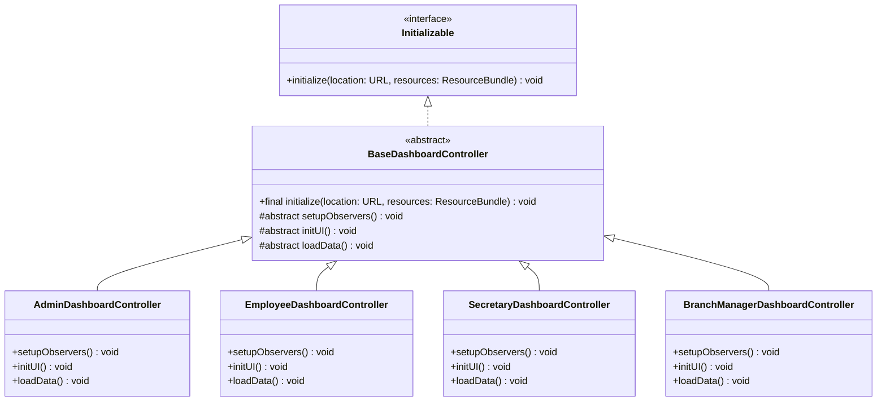
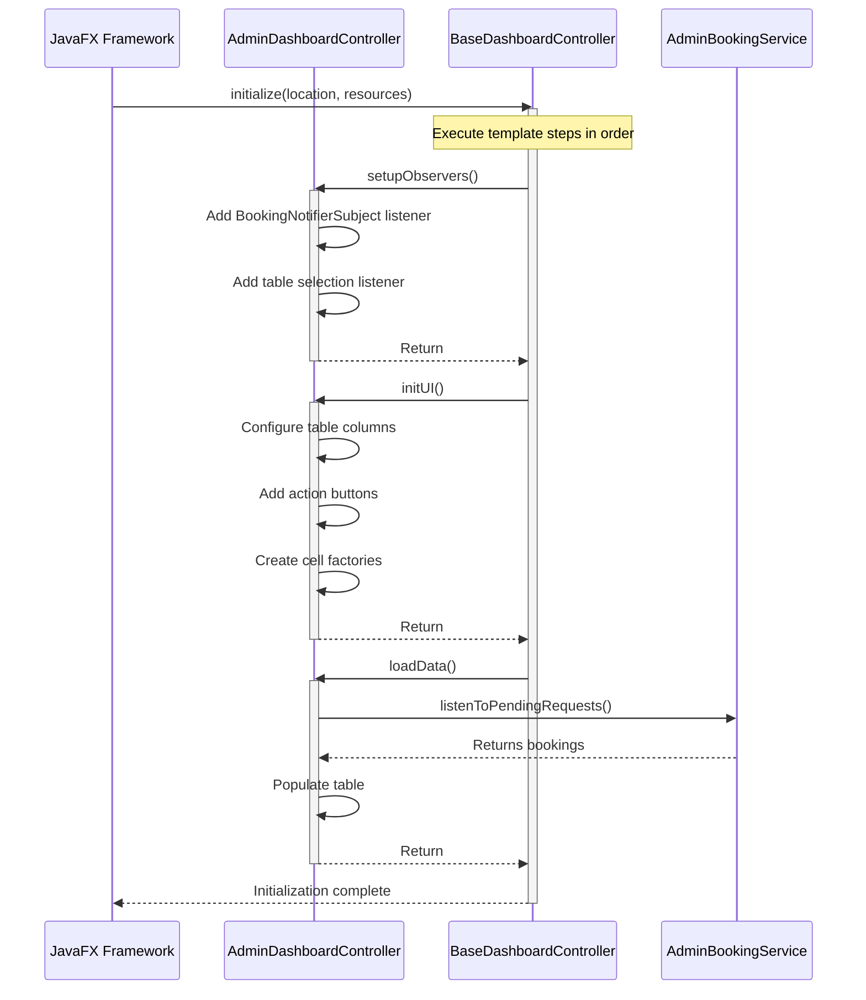
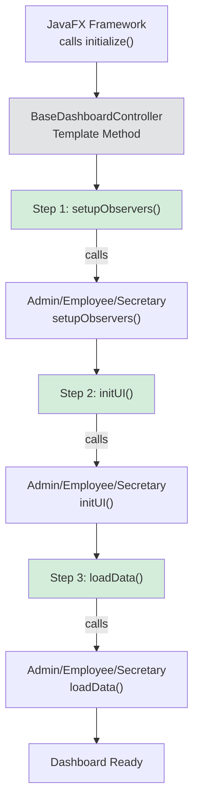
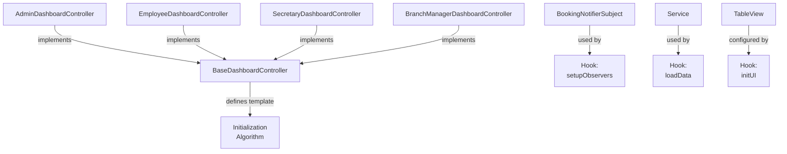

# Design Pattern: Template Method

## Pattern Overview
**Pattern Name:** Template Method  
**Category:** Behavioral Pattern  
**GoF Reference:** Define the skeleton of an algorithm in a method deferring some steps to subclasses allowing subclasses to redefine certain steps of an algorithm without changing the algorithm's structure.

---

## Problem This Pattern Solves

All dashboard controllers (Admin, Employee, Manager, Secretary) follow the same initialization sequence:
1. Setup event listeners and observers
2. Initialize UI components (tables, columns, factories)
3. Load initial data from the database

**Without Template Method Pattern:**
```java
// Admin Dashboard (duplicate code)
public class AdminDashboardController implements Initializable {
    @Override
    public void initialize(URL location, ResourceBundle resources) {
        setupObservers();      // Custom implementation
        initUI();              // Custom implementation
        loadData();            // Custom implementation
    }
}

// Employee Dashboard (duplicate code)
public class EmployeeDashboardController implements Initializable {
    @Override
    public void initialize(URL location, ResourceBundle resources) {
        setupObservers();      // Same steps
        initUI();              // Different details
        loadData();            // Different details
    }
}
```

All controllers repeat the same sequence, but with different implementations in each step.

**With Template Method Pattern:**
```java
public abstract class BaseDashboardController implements Initializable {
    @Override
    public final void initialize(URL location, ResourceBundle resources) {
        setupObservers();
        initUI();
        loadData();
    }
    
    protected abstract void setupObservers();
    protected abstract void initUI();
    protected abstract void loadData();
}

// Subclasses only implement the varying parts
public class AdminDashboardController extends BaseDashboardController {
    @Override
    protected void setupObservers() { /* Admin-specific */ }
    @Override
    protected void initUI() { /* Admin-specific UI */ }
    @Override
    protected void loadData() { /* Admin-specific data */ }
}
```

---

## Where It's Used in the Codebase

### **BaseDashboardController** - Template Method Base
**Location:** `/src/main/java/com/aast/booking/core/BaseDashboardController.java`

Defines the initialization template.

```java
public abstract class BaseDashboardController implements Initializable {

    @Override
    public final void initialize(URL location, ResourceBundle resources) {
        setupObservers();
        initUI();
        loadData();
    }

    /**
     * Hook for setting up event listeners and observers.
     */
    protected abstract void setupObservers();

    /**
     * Hook for initializing UI components (tables, columns, factories).
     */
    protected abstract void initUI();

    /**
     * Hook for loading data from the database.
     */
    protected abstract void loadData();
}
```

### Concrete Dashboard Controllers

#### **AdminDashboardController** - Admin Variant
**Location:** `/src/main/java/com/aast/booking/admin/AdminDashboardController.java`

```java
public class AdminDashboardController extends BaseDashboardController {

    @FXML private TableView<Booking> pendingBookingsTable;
    @FXML private TableColumn<Booking, String> roomIdColumn;
    // ... more UI components
    
    private AdminBookingFacade facade = new AdminBookingFacade();

    @Override
    protected void setupObservers() {
        // Admin-specific observer setup
        BookingNotifierSubject.getInstance().addObserver(this);
        
        pendingBookingsTable.getSelectionModel()
            .selectedItemProperty()
            .addListener((obs, oldVal, newVal) -> {
                updateAdminDetails(newVal);
            });
    }

    @Override
    protected void initUI() {
        // Admin-specific UI initialization
        roomIdColumn.setCellValueFactory(
            new PropertyValueFactory<>("roomId")
        );
        
        TableColumn<Booking, Void> actionsColumn = new TableColumn<>("Actions");
        actionsColumn.setCellFactory(col -> new AdminActionCell());
        
        pendingBookingsTable.getColumns().addAll(
            roomIdColumn, 
            actionsColumn
        );
    }

    @Override
    protected void loadData() {
        // Admin-specific data loading
        facade.listenToPendingRequests(
            bookings -> {
                pendingBookingsTable.setItems(
                    FXCollections.observableArrayList(bookings)
                );
            },
            error -> showErrorAlert(error.getMessage())
        );
    }
}
```

#### **EmployeeDashboardController** - Employee Variant
**Location:** `/src/main/java/com/aast/booking/employee/EmployeeDashboardController.java`

```java
public class EmployeeDashboardController extends BaseDashboardController {

    @FXML private TableView<Booking> myBookingsTable;
    @FXML private Label pendingCountLabel;
    @FXML private Label approvedCountLabel;
    // ... more UI components
    
    private EmployeeBookingService bookingService = 
        new EmployeeBookingService();

    @Override
    protected void setupObservers() {
        // Employee-specific observer setup
        BookingNotifierSubject.getInstance().addObserver(this);
        
        myBookingsTable.getSelectionModel()
            .selectedItemProperty()
            .addListener((obs, oldVal, newVal) -> {
                updateBookingDetails(newVal);
            });
    }

    @Override
    protected void initUI() {
        // Employee-specific UI initialization
        setupBookingTable();
        setupStatusCounts();
    }

    @Override
    protected void loadData() {
        // Employee-specific data loading
        User user = SessionManager.getInstance().getCurrentUser();
        bookingService.getMyBookings(user.getId())
            .thenAccept(bookings -> {
                Platform.runLater(() -> {
                    myBookingsTable.setItems(
                        FXCollections.observableArrayList(bookings)
                    );
                    updateStatusCounts(bookings);
                });
            });
    }
}
```

#### **SecretaryDashboardController** - Secretary Variant
**Location:** `/src/main/java/com/aast/booking/secretary/SecretaryDashboardController.java`

```java
public class SecretaryDashboardController extends BaseDashboardController {

    @FXML private TableView<Booking> allBookingsTable;
    @FXML private ComboBox<String> statusFilterCombo;
    // ... more UI components
    
    private SecretaryBookingService bookingService;

    @Override
    protected void setupObservers() {
        // Secretary-specific observer setup
        BookingNotifierSubject.getInstance().addObserver(this);
        
        statusFilterCombo.getSelectionModel()
            .selectedItemProperty()
            .addListener((obs, oldVal, newVal) -> {
                loadData();  // Reload with filter
            });
    }

    @Override
    protected void initUI() {
        // Secretary-specific UI initialization
        setupBookingTable();
        setupStatusFilter();
    }

    @Override
    protected void loadData() {
        // Secretary-specific data loading
        String selectedStatus = statusFilterCombo.getValue();
        bookingService.getBookings(selectedStatus)
            .thenAccept(bookings -> {
                Platform.runLater(() -> {
                    allBookingsTable.setItems(
                        FXCollections.observableArrayList(bookings)
                    );
                });
            });
    }
}
```

---

## Implementation Details

### Final Method Prevents Override

The `initialize()` method is marked `final` to prevent subclasses from overriding the template structure:

```java
@Override
public final void initialize(URL location, ResourceBundle resources) {
    setupObservers();  // Always step 1
    initUI();          // Always step 2
    loadData();        // Always step 3
}
```

This ensures all dashboard controllers follow the same initialization sequence.

### Hook Methods

The template defines three hook methods that subclasses must implement:

```java
protected abstract void setupObservers();
protected abstract void initUI();
protected abstract void loadData();
```

Using `protected abstract` ensures:
- Subclasses must provide implementation
- Implementation is hidden from outside classes
- Each step has a clear responsibility

---

## Mermaid Class Diagram



---

## Mermaid Sequence Diagram: Template Method Execution



---

## Code Examples from Real Usage

### Example 1: Adding a New Dashboard

To create a new dashboard (e.g., Department Head), just extend the template:

```java
public class DepartmentHeadDashboardController extends BaseDashboardController {
    
    @FXML private TableView<Booking> departmentBookingsTable;
    private DepartmentHeadService service = new DepartmentHeadService();
    
    @Override
    protected void setupObservers() {
        // Department head specific observers
        BookingNotifierSubject.getInstance().addObserver(this);
    }
    
    @Override
    protected void initUI() {
        // Department head specific UI
        // (doesn't need to worry about initialization order)
    }
    
    @Override
    protected void loadData() {
        // Department head specific data loading
    }
}
```

The new controller automatically gets the correct initialization sequence without reimplementing the template.

### Example 2: Consistent Initialization Order

```java
// All dashboard controllers initialize in same order:
// 1. setupObservers()       - Register listeners
// 2. initUI()               - Build UI components
// 3. loadData()             - Fetch and display data

// This ensures:
// - Data loading happens after UI is ready
// - Listeners are set up before data is loaded
// - Same pattern across all dashboards
```

---

## Validation Checklist

- [ ] **Template Method**: initialize() is final and cannot be overridden
  - Test: Try to override initialize() in subclass (should not compile)
  
- [ ] **Hook Methods**: All abstract methods must be implemented
  - Test: Create subclass without implementing all methods (should not compile)
  
- [ ] **Execution Order**: Methods execute in correct sequence
  - Test: Add logging and verify setupObservers→initUI→loadData order
  
- [ ] **Consistency**: All dashboard controllers follow same pattern
  - Test: Review all dashboard controllers and verify same structure
  
- [ ] **Initialization Complete**: Data loads and displays after all hooks
  - Test: Verify tables populated and UI ready after initialization
  
- [ ] **No Code Duplication**: Common initialization not repeated in subclasses
  - Test: Review subclass code and verify no duplicate template calls
  
- [ ] **Easy to Extend**: New dashboards only need to implement hooks
  - Test: Create new dashboard controller and verify it works with base template

---

## Mermaid Diagram: Initialization Flow



---

## Design Pattern Relationships



---

## Potential Issues & Mitigations

### Issue 1: Wrong Initialization Order
**Problem:** Without template method, developers might call hooks in wrong order

```java
// Bad: Without template method
public class EmployeeDashboardController {
    public void initialize() {
        loadData();       // Data loads before UI ready!
        initUI();         // UI built after data loaded!
        setupObservers(); // Listeners added after data changes!
    }
}
```

**Mitigation:** Template method enforces correct order:
```java
// Good: Template method enforces order
@Override
public final void initialize() {
    setupObservers();  // Always first
    initUI();          // Always second
    loadData();        // Always third
}
```

### Issue 2: Forgetting a Hook Implementation
**Problem:** Subclass forgets to implement one of the hook methods

**Mitigation:** Abstract methods force implementation:
```java
protected abstract void setupObservers();
protected abstract void initUI();
protected abstract void loadData();

// Compile error if any method not implemented!
```

### Issue 3: Too Many Hooks
**Problem:** Template becomes too complex with many hook methods

**Mitigation:** Keep hooks focused and minimal:
```java
// Good: 3 clear responsibilities
setupObservers()  // Configure listeners
initUI()          // Build UI
loadData()        // Load data

// Bad: Too many hooks
setupObservers()
initializeComboBoxes()
initializeTables()
configureColumns()
loadInitialData()
applyTheme()
// Too many responsibilities!
```

---

## Notes on This Implementation

### Strengths
1. **Consistency**: All dashboards follow same initialization pattern
2. **Encapsulation**: Template logic hidden in base class
3. **Extensibility**: Easy to add new dashboard controllers
4. **Maintainability**: Changes to sequence happen in one place
5. **Type Safety**: Abstract methods force implementation

### Weaknesses
1. **Rigidity**: Template order cannot be changed
2. **Complexity**: Inheritance hierarchy adds mental overhead
3. **Testing**: Base class makes unit testing harder
4. **Documentation**: Not obvious why base class exists
5. **Hook Proliferation**: Many hooks make template complex

### Improvements
1. **Optional Hooks**: Provide default no-op implementations
2. **Configurable Order**: Allow subclasses to override sequence (carefully)
3. **Lifecycle Events**: Support pre/post hooks for each step
4. **Strategy Selection**: Combine with strategy pattern for variations
5. **Composition**: Use composition over inheritance

---

## Alignment with Web Application

The web app may use similar initialization patterns:

**Web App (React):**
```javascript
// useEffect hook executes in sequence
useEffect(() => {
    setupListeners();     // Step 1
    initializeUI();       // Step 2
    fetchData();          // Step 3
}, []);
```

**Java App (Template Method):**
```java
@Override
public final void initialize(...) {
    setupObservers();     // Step 1
    initUI();             // Step 2
    loadData();           // Step 3
}
```

Both systems:
- Define initialization sequence
- Ensure consistent order
- Separate concerns into steps
- Allow specialization in each step

---

## Related Patterns in This Codebase

- **Observer Pattern**: Used in setupObservers() hook
- **Factory Pattern**: Used to create UI components in initUI() hook
- **Facade Pattern**: Services used in loadData() hook

---

## Recommended Best Practices

1. **Final Template Method**: Make template method final to prevent override
2. **Clear Responsibility**: Each hook has single, clear responsibility
3. **Minimal Hooks**: Keep number of hooks small (3-5)
4. **Default Implementations**: Provide no-op defaults for optional hooks
5. **Documentation**: Clearly document each hook's purpose

---

**Last Updated:** 2024  
**Pattern Status:** ✅ Active - Used for dashboard initialization
