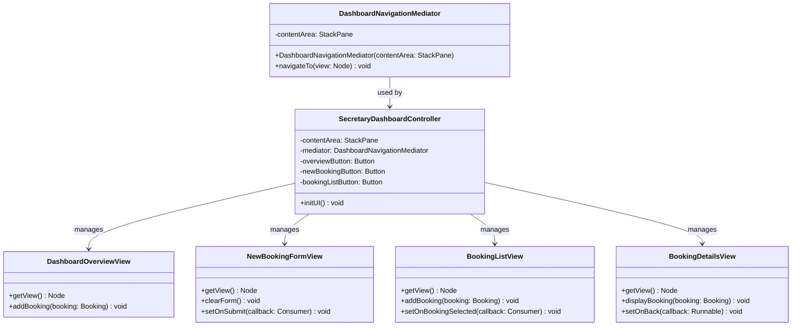
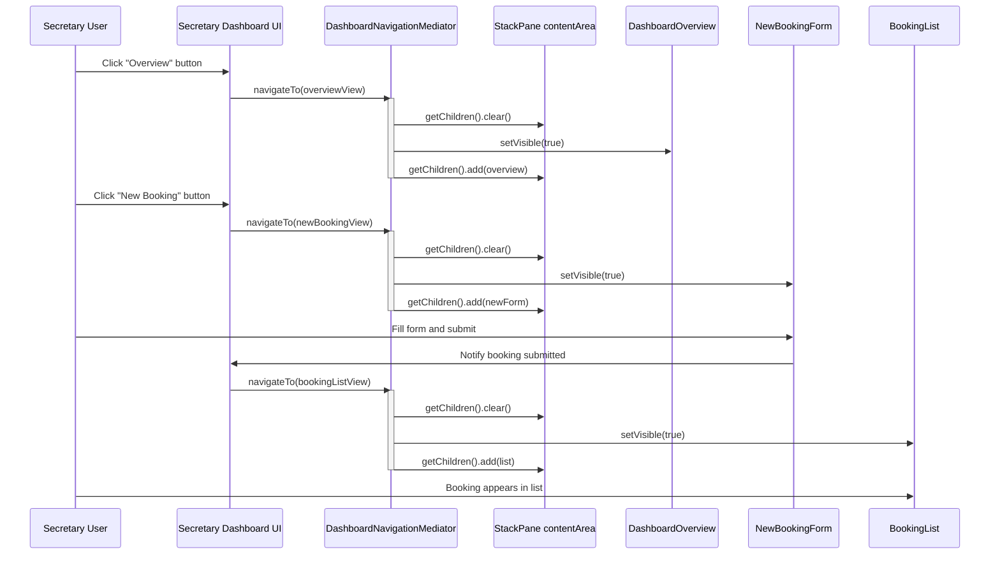
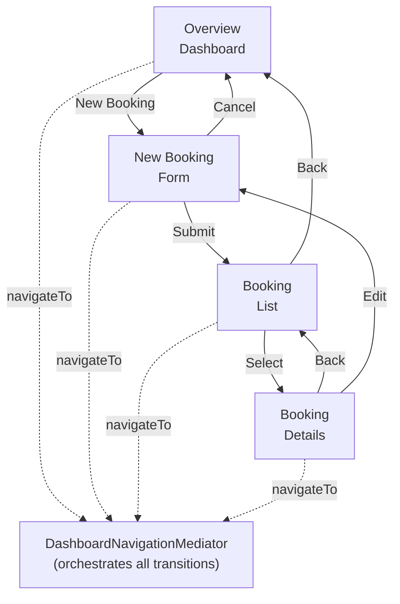
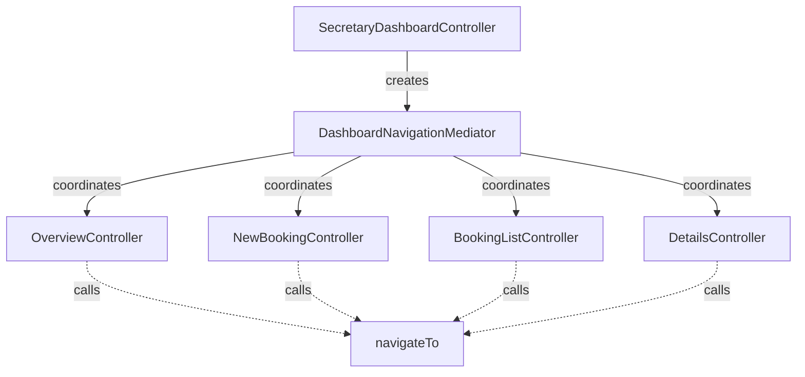

# Design Pattern: Mediator

## Pattern Overview
**Pattern Name:** Mediator (Dialog/Intermediary)  
**Category:** Behavioral Pattern  
**GoF Reference:** Define an object that encapsulates how a set of objects interact promoting loose coupling by keeping objects from referring to each other explicitly and letting you vary their interaction independently.

---

## Problem This Pattern Solves

In the Secretary Dashboard, multiple UI components need to communicate:
- **New Booking Button** → Create new booking view
- **Booking List** → Show list of bookings
- **Booking Details Panel** → Show selected booking details
- **Overview Dashboard** → Show statistics and summaries
- **Navigation Menu** → Switch between views

**Without Mediator Pattern:**
- New Booking button calls `bookingListController.clear()`, `detailsController.clear()`, `statisticsController.clear()`
- Booking list calls `overviewController.update()`, `detailsController.display()`
- Components tightly coupled - changes to one affect many others

**With Mediator Pattern:**
- Components only know about the Mediator
- Mediator coordinates all interactions
- Components loose coupling - can change independently

---

## Where It's Used in the Codebase

### **DashboardNavigationMediator** - Central Mediator
**Location:** `/src/main/java/com/aast/booking/secretary/ui/DashboardNavigationMediator.java`

Manages transitions between different views in the main content area.

```java
public class DashboardNavigationMediator {
    private final StackPane contentArea;

    public DashboardNavigationMediator(StackPane contentArea) {
        this.contentArea = contentArea;
    }

    public void navigateTo(Node view) {
        contentArea.getChildren().clear();
        view.setVisible(true);
        contentArea.getChildren().add(view);
    }
}
```

### Usage in Secretary Dashboard

```java
public class SecretaryDashboardController extends BaseDashboardController {
    
    @FXML private StackPane contentArea;
    @FXML private VBox dashboardOverview;
    @FXML private VBox newBookingForm;
    @FXML private VBox bookingList;
    
    private DashboardNavigationMediator mediator;
    
    @Override
    protected void initUI() {
        // Create mediator with central content area
        mediator = new DashboardNavigationMediator(contentArea);
        
        // Navigation button handlers (via mediator)
        overviewButton.setOnAction(e -> 
            mediator.navigateTo(dashboardOverview)
        );
        
        newBookingButton.setOnAction(e -> 
            mediator.navigateTo(newBookingForm)
        );
        
        bookingListButton.setOnAction(e -> 
            mediator.navigateTo(bookingList)
        );
    }
}
```

---

## Implementation Details

### Simple Mediator for View Navigation

```java
public class DashboardNavigationMediator {
    private final StackPane contentArea;

    public DashboardNavigationMediator(StackPane contentArea) {
        this.contentArea = contentArea;
    }

    /**
     * Navigate to a specific view by clearing current content
     * and displaying the new view.
     */
    public void navigateTo(Node view) {
        // Clear existing views
        contentArea.getChildren().clear();
        
        // Show new view
        view.setVisible(true);
        contentArea.getChildren().add(view);
        
        // Optionally trigger view initialization
        if (view instanceof Initializable) {
            // View is already initialized by FXML loader
        }
    }
}
```

### Advanced Mediator with Multiple Interactions

```java
public class DashboardMediator {
    private final DashboardOverviewController overview;
    private final NewBookingController newBooking;
    private final BookingListController bookingList;
    private final BookingDetailsController details;
    private final DashboardNavigationMediator navigator;

    public DashboardMediator(
        DashboardOverviewController overview,
        NewBookingController newBooking,
        BookingListController bookingList,
        BookingDetailsController details,
        DashboardNavigationMediator navigator) {
        
        this.overview = overview;
        this.newBooking = newBooking;
        this.bookingList = bookingList;
        this.details = details;
        this.navigator = navigator;
        
        // Register callbacks
        setupInteractions();
    }

    private void setupInteractions() {
        // When user clicks "New Booking"
        newBooking.setOnCreateClick(() -> {
            newBooking.clearForm();
            navigator.navigateTo(newBooking.getView());
        });
        
        // When user submits a booking
        newBooking.setOnSubmit(booking -> {
            overview.addBooking(booking);
            bookingList.addBooking(booking);
            navigator.navigateTo(overview.getView());
        });
        
        // When user selects booking from list
        bookingList.setOnBookingSelected(booking -> {
            details.displayBooking(booking);
            navigator.navigateTo(details.getView());
        });
        
        // When user clicks back from details
        details.setOnBack(() -> {
            navigator.navigateTo(bookingList.getView());
        });
    }

    public void showOverview() {
        navigator.navigateTo(overview.getView());
    }

    public void showNewBooking() {
        newBooking.clearForm();
        navigator.navigateTo(newBooking.getView());
    }

    public void showBookingList() {
        navigator.navigateTo(bookingList.getView());
    }

    public void showBookingDetails(String bookingId) {
        Booking booking = bookingList.getBooking(bookingId);
        details.displayBooking(booking);
        navigator.navigateTo(details.getView());
    }
}
```

---

## Mermaid Class Diagram



---

## Mermaid Sequence Diagram: Mediator-Based Navigation



---

## Code Examples from Real Usage

### Example 1: Simple View Navigation

```java
public class SecretaryDashboardController extends BaseDashboardController {
    
    @FXML private StackPane contentArea;
    @FXML private Button overviewButton;
    @FXML private Button newBookingButton;
    @FXML private Button bookingListButton;
    @FXML private Button settingsButton;
    
    @FXML private VBox overviewView;
    @FXML private VBox newBookingView;
    @FXML private VBox bookingListView;
    @FXML private VBox settingsView;
    
    private DashboardNavigationMediator mediator;
    
    @Override
    protected void initUI() {
        // Initialize mediator
        mediator = new DashboardNavigationMediator(contentArea);
        
        // Setup navigation buttons
        overviewButton.setOnAction(e -> mediator.navigateTo(overviewView));
        newBookingButton.setOnAction(e -> mediator.navigateTo(newBookingView));
        bookingListButton.setOnAction(e -> mediator.navigateTo(bookingListView));
        settingsButton.setOnAction(e -> mediator.navigateTo(settingsView));
        
        // Show overview by default
        mediator.navigateTo(overviewView);
    }
    
    @Override
    protected void setupObservers() {
        // Observers handle data changes
    }
    
    @Override
    protected void loadData() {
        // Load initial data
    }
}
```

### Example 2: Complex Mediator with Component Coordination

```java
public class BookingWorkflowMediator {
    private final BookingFormController form;
    private final BookingListController list;
    private final ConfirmationController confirmation;
    private final StackPane viewContainer;
    
    public BookingWorkflowMediator(
        BookingFormController form,
        BookingListController list,
        ConfirmationController confirmation,
        StackPane viewContainer) {
        
        this.form = form;
        this.list = list;
        this.confirmation = confirmation;
        this.viewContainer = viewContainer;
        
        coordinateComponents();
    }
    
    private void coordinateComponents() {
        // Form -> List
        form.setOnBookingCreated(booking -> {
            list.addBooking(booking);
            showBookingList();
        });
        
        // List -> Confirmation
        list.setOnDeleteClick(booking -> {
            confirmation.setMessage("Delete " + booking.getTitle() + "?");
            confirmation.setOnConfirm(() -> {
                list.removeBooking(booking);
                showBookingList();
            });
            showConfirmation();
        });
        
        // All -> Form
        form.setOnCancel(this::showBookingList);
    }
    
    public void showBookingForm() {
        form.resetForm();
        showView(form.getRoot());
    }
    
    public void showBookingList() {
        list.refreshList();
        showView(list.getRoot());
    }
    
    public void showConfirmation() {
        showView(confirmation.getRoot());
    }
    
    private void showView(Node view) {
        viewContainer.getChildren().clear();
        viewContainer.getChildren().add(view);
    }
}
```

### Example 3: Mediator with Data Synchronization

```java
public class AdminDashboardMediator {
    private final PendingBookingsController pendingBookings;
    private final ApprovalFormController approvalForm;
    private final BookingHistoryController history;
    private final DashboardNavigationMediator navigator;
    
    public AdminDashboardMediator(...) {
        // Setup cross-component communication
        setupMediationRules();
    }
    
    private void setupMediationRules() {
        // When booking selected in pending list
        pendingBookings.setOnBookingSelected(booking -> {
            // Update approval form with booking details
            approvalForm.loadBooking(booking);
            
            // Navigate to approval form
            navigator.navigateTo(approvalForm.getView());
        });
        
        // When booking approved
        approvalForm.setOnApproved(booking -> {
            // Remove from pending list
            pendingBookings.removeBooking(booking);
            
            // Add to history
            history.addApprovedBooking(booking);
            
            // Show confirmation and return to list
            navigator.navigateTo(pendingBookings.getView());
        });
        
        // When booking rejected
        approvalForm.setOnRejected(booking -> {
            pendingBookings.removeBooking(booking);
            history.addRejectedBooking(booking);
            navigator.navigateTo(pendingBookings.getView());
        });
    }
}
```

---

## Validation Checklist

- [ ] **Single Point of Control**: Mediator controls all view transitions
  - Test: Search for navigation logic outside mediator (should not exist)
  
- [ ] **Loose Coupling**: Components don't reference each other directly
  - Test: Components only know about mediator, not each other
  
- [ ] **Navigation Works**: Can navigate between all views
  - Test: Click all navigation buttons and verify views change
  
- [ ] **State Preserved**: Component state maintained during navigation
  - Test: Enter form data, navigate away, navigate back (data unchanged)
  
- [ ] **Callbacks Execute**: Mediator callbacks fire on component actions
  - Test: Component action triggers callback, mediator responds
  
- [ ] **Transitions Smooth**: No flicker or visual artifacts during transitions
  - Test: Watch UI during navigation, verify smooth transitions
  
- [ ] **New Views Easy**: Adding new view only requires registering with mediator
  - Test: Create new view and add to mediator (minimal changes)

---

## Mermaid Diagram: Navigation Interactions



---

## Design Pattern Relationships



---

## Comparison: With and Without Mediator

### Without Mediator (Tight Coupling)
```java
public class BookingListController {
    public void onBookingSelected(Booking booking) {
        // Directly call detail controller
        detailsController.displayBooking(booking);
        
        // Directly manipulate UI
        mainContainer.getChildren().clear();
        mainContainer.getChildren().add(detailsView);
    }
}

public class DetailsController {
    public void onBack() {
        // Directly call list controller
        listController.refreshList();
        
        // Directly manipulate UI
        mainContainer.getChildren().clear();
        mainContainer.getChildren().add(listView);
    }
}
```

### With Mediator (Loose Coupling)
```java
// Setup (one time)
mediator.setOnBookingSelected(booking -> {
    mediator.showDetails(booking);
});
mediator.setOnDetailsBack(() -> {
    mediator.showList();
});

// Controllers only know about mediator
bookingList.setOnBookingSelected(booking -> {
    mediator.notifyBookingSelected(booking);
});

details.setOnBack(() -> {
    mediator.notifyDetailsBack();
});
```

---

## Potential Issues & Mitigations

### Issue 1: Mediator Becomes God Object
**Problem:** Mediator coordinates too many components

**Mitigation:** Split into multiple mediators:
```java
public class ViewNavigationMediator { }  // Navigation only
public class DataSyncMediator { }        // Data synchronization
public class FormMediator { }            // Form interactions
```

### Issue 2: Complex Callback Hell
**Problem:** Too many lambda callbacks make mediator hard to read

**Mitigation:** Extract to separate methods:
```java
private void coordinateComponents() {
    form.setOnSubmit(this::handleFormSubmit);
    list.setOnDelete(this::handleListDelete);
}

private void handleFormSubmit(Booking booking) {
    // Clear logic
}

private void handleListDelete(Booking booking) {
    // Clear logic
}
```

### Issue 3: State Not Preserved During Navigation
**Problem:** View state lost when switching between views

**Mitigation:** Don't destroy views, just hide:
```java
public void navigateTo(Node view) {
    // Just change visibility, don't clear content
    for (Node child : container.getChildren()) {
        child.setVisible(false);
    }
    view.setVisible(true);
}
```

---

## Notes on This Implementation

### Strengths
1. **Decoupling**: Components don't know about each other
2. **Centralized Control**: All navigation logic in one place
3. **Easy to Test**: Can test mediator independently
4. **Reusable**: Mediator can be reused in other contexts
5. **Flexibility**: Easy to change interaction rules

### Weaknesses
1. **God Object**: Mediator can become too large
2. **Complexity**: Indirection makes code harder to follow
3. **Debugging**: Hard to trace flow through mediator
4. **Performance**: Extra indirection has minimal overhead
5. **Learning Curve**: More complexity to understand

### Improvements
1. **Event Bus**: Use event bus instead of callbacks
2. **State Machine**: Model interactions as state machine
3. **Observer Mediator**: Make mediator observable
4. **Command Pattern**: Use commands for transitions
5. **Reactive Streams**: Use RxJava/Reactor for reactive flow

---

## Related Patterns in This Codebase

- **Observer Pattern**: Mediator uses callbacks similar to observers
- **Command Pattern**: Could use commands for transitions
- **Facade Pattern**: Both simplify complex subsystems

---

## Recommended Best Practices

1. **Keep Mediator Focused**: One mediator per major workflow
2. **Clear Naming**: Name mediator by what it mediates
3. **Documentation**: Document all interactions in mediator
4. **Testing**: Test mediator logic independently
5. **Avoid Cycles**: Ensure no circular dependencies

---

**Last Updated:** 2024  
**Pattern Status:** ✅ Active - Used for view navigation in secretary dashboard
